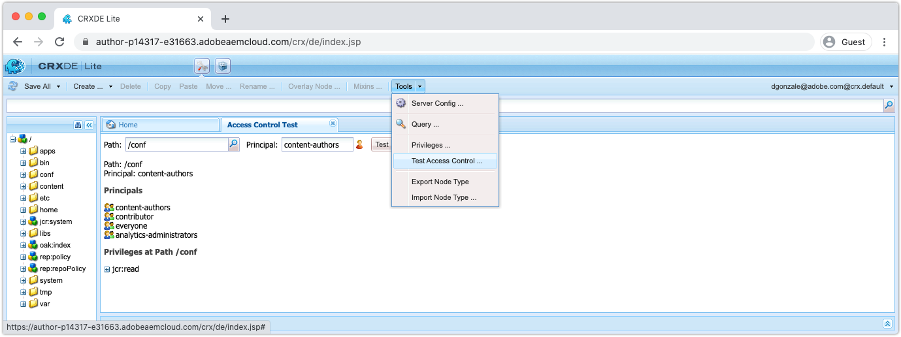

# 以CRXDE LiteAEM為Cloud Service進行除錯

CRXDE Lite是&#x200B;__ONLY__，適用於AEMCloud Service開發環境(以及本機AEMSDK)。

## 存取AEM作者的CRXDE Lite

CRXDE Lite是&#x200B;__僅__&#x200B;可作為Cloud Service開發環境訪AEM問，__不__&#x200B;可用於舞台或生產環境。

若要存取AEM作者的CRXDE Lite:

1. 以Cloud ServiceAEMAEM作者服務的身分登入。
1. 導覽至「工具>一般>CRXDE Lite」

這會使用用來登入AEM Author的認證和權限開啟CRXDE Lite。

## 除錯內容

CRXDE Lite可直接存取JCR。 透過CRXDE Lite顯示的內容受授予使用者的權限限制，這表示您可能無法依存取權限檢視或修改JCR中的所有內容。

請注意，`/apps`、`/libs`和`/oak:index`是不可變的，這表示任何使用者都無法在執行時期變更它們。 JCR中的這些位置只能透過程式碼部署加以修改。

+ 使用左側導覽窗格導覽和操控JCR結構
+ 在左側導航窗格中選擇節點，將在底部窗格中顯示節點屬性。
   + 屬性可從窗格中新增、移除或變更
+ 連按兩下左側導覽中的檔案節點，在右上方窗格中開啟檔案內容
+ 點選左上角的「全部儲存」按鈕以持續變更，或點選「全部儲存以回復任何未儲存的變更」旁的向下箭頭。

在執行時期透過CRXDE Lite變更可變AEM內容，做為Cloud Service開發環境，必須謹慎進行。
任何透過CRXDE Lite直接AEM進行的變更，都可能難以追蹤和管理。 視情況，確保透過CRXDE Lite所做的變更返回專案的可變內容套件(AEM`ui.content`)並提交至Git，以確保問題已解決。 理想情況下，所有應用程式內容變更都源自程式碼庫，並透過部AEM署流入，而非直接透過CRXDE Lite進行AEM變更。

### 除錯存取控制

CRXDE Lite提供了測試和評估特定用戶或組（又稱承擔者）對特定節點的訪問控制的方法。

要在CRXDE Lite中訪問測試訪問控制控制台，請導航到：

+ CRXDE Lite>工具>測試存取控制……

1. 使用「路徑」欄位，選擇要評估的JCR路徑
1. 使用「承擔者」(Principal)欄位，選擇用戶或組以根據
1. 點選「測試」按鈕

結果顯示如下：

+ ____ Pathreens the path that was exparted the path that was exparted
+ __Principal__ 重申路徑評估的用戶或組
+ __原__ 理者將選定的承擔者所屬的所有承擔者滑動。
   + 這有助於瞭解透過繼承提供權限的傳遞性群組成員資格
+ __路徑上的__ 權限列出所選承擔者在評估路徑上擁有的所有JCR權限

### 不支援的除錯活動

以下是可在CRXDE Lite中執行&#x200B;__not__&#x200B;的除錯活動。

### 調試OSGi配置

部署的OSGi配置無法通過CRXDE Lite進行查看。 OSGi配置在AEMProject的`ui.apps`代碼包中維護在`/apps/example/config.xxx`，但是，當部署到Cloud Service環境時，OSGi配置資源不會保存在JCR中，因此不會通過CRXDE Lite顯示。

請改用[開發人員控制台>組態](./developer-console.md#configurations)來檢視已部署的OSGi組態。
