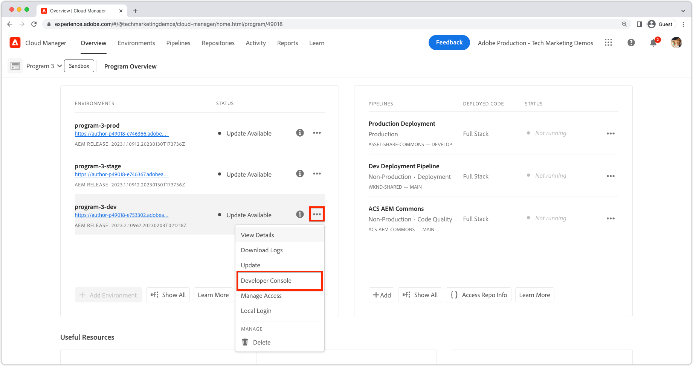

# 使用開發人員控制檯除錯AEMas a Cloud Service

AEMas a Cloud Service會為每個環境提供開發人員主控台，以公開執行AEM服務的各種詳細資訊，這些資訊有助於除錯。

每個AEMas a Cloud Service環境都有各自的開發人員主控台。

## 導覽至開發人員主控台

透過Cloud Manager在每個AEMas a Cloud Service環境存取開發人員主控台。

1. 瀏覽至 __[Cloud Manager](https://my.cloudmanager.adobe.com/)__
2. 開啟 __計畫__ 包含AEMas a Cloud Service環境以開啟開發人員主控台。
3. 找到 __環境__，然後選取 `...`.
4. 選取 __開發人員主控台__ 下拉式清單中的。

## 開發人員控制檯存取

若要存取和使用Developer Console，必須透過向開發人員的Adobe ID授與以下許可權 [AdobeAdmin Console](https://adminconsole.adobe.com).

1. 確認影響Cloud Manger和AEMas a Cloud Service產品的Adobe組織在Adobe組織切換器中處於作用中狀態。
1. 開發人員必須是 [Cloud Manager產品的 __開發人員 — Cloud Service__ 產品設定檔](https://experienceleague.adobe.com/docs/experience-manager-cloud-service/content/onboarding/journey/assign-profiles-cloud-manager.html#assign-developer).
   + 如果此成員資格不存在，開發人員將無法登入開發人員主控台。
1. 開發人員必須是 [__AEM使用者__ 或 __AEM管理員__ AEM作者和/或發佈的產品設定檔](https://experienceleague.adobe.com/docs/experience-manager-cloud-service/content/onboarding/journey/assign-profiles-aem.html#aem-product-profiles).
   + 如果此成員資格不存在， [狀態](#status) 傾印將因為401未授權錯誤而逾時。

### 疑難排解開發人員控制檯存取

#### 401傾印狀態時發生未獲授權的錯誤

如果回報任何傾印狀態「401未授權錯誤」，表示您的使用者尚未存在，且AEMas a Cloud Service中有必要許可權，或是登入權杖使用的無效或已過期。

若要解決401 Unauthorized問題：

1. 確保您的使用者是Developer Console相關聯AEMas a Cloud Service產品執行個體的適當Adobe IMS產品設定檔(AEM管理員或AEM使用者)的成員。
   + 請記住，開發人員控制檯存取2個Adobe IMS產品執行個體；AEMas a Cloud Service的製作和發佈產品執行個體，因此請確保根據需要透過開發人員控制檯存取的服務層級使用正確的產品設定檔。
1. 登入AEMas a Cloud Service（製作或發佈）並確保您的使用者和群組已正確同步到AEM。
   + 開發人員控制檯需要在對應的AEM服務層級中建立您的使用者記錄，以便它對該服務層級進行驗證。
1. 清除您的瀏覽器Cookie以及應用程式狀態（本機儲存）並重新登入開發人員主控台，確保開發人員主控台使用的存取權杖正確且未過期。

## Pod

AEMas a Cloud Service的製作和發佈服務分別由多個例項組成，以處理流量變異和滾動更新，避免停機時間。 這些例項稱為Pod。 開發人員控制檯中的Pod選取範圍定義了透過其他控制項公開的資料範圍。

+ Pod是屬於AEM服務（製作或發佈）一部分的獨立例項
+ Pod是暫時性的，表示AEMas a Cloud Service會視需要建立和毀壞
+ 只有屬於相關AEMas a Cloud Service環境的Pod，才會列出該環境的開發人員控制檯的Pod切換器。
+ 在Pod切換器底部，方便選項可依服務型別選取Pod：
   + 所有作者
   + 所有發行者
   + 所有執行個體

## 狀態

狀態提供以文字或JSON輸出輸出特定AEM執行階段狀態的選項。 開發人員控制檯提供類似於AEM SDK本機Quickstart的OSGi Web控制檯的資訊，其顯著差異為開發人員控制檯為唯讀。

### 組合

套件組合列出AEM中的所有OSGi套件組合。 此功能類似於 [AEM SDK的本機Quickstart的OSGi套件組合](http://localhost:4502/system/console/bundles) 在 `/system/console/bundles`.

套件組合可協助您進行除錯，方法如下：

+ 列出部署至AEM as a Service的所有OSGi套件組合
+ 列出每個OSGi套件組合的狀態；包括它們是否作用中
+ 針對導致OSGi套件組合無法作用中的未解析相依性提供詳細資訊

### 元件

「元件」會列出AEM中的所有OSGi元件。 此功能類似於 [AEM SDK的本機Quickstart的OSGi元件](http://localhost:4502/system/console/components) 在 `/system/console/components`.

元件可協助您透過下列方式執行偵錯：

+ 列出部署至AEMas a Cloud Service的所有OSGi元件
+ 提供每個OSGi元件的狀態；包括元件是作用中還是不滿意
+ 將詳細資訊提供給不滿意的服務參考可能會導致OSGi元件變成作用中
+ 列出繫結至OSGi元件的OSGi屬性及其值。
   + 這會顯示透過插入的實際值 [OSGi環境設定變數](https://experienceleague.adobe.com/docs/experience-manager-cloud-service/content/implementing/deploying/configuring-osgi.html#environment-specific-configuration-values).

### 設定

設定會列出所有OSGi元件的設定（OSGi屬性和值）。 此功能類似於 [AEM SDK的本機Quickstart的OSGi Configuration Manager](http://localhost:4502/system/console/configMgr) 在 `/system/console/configMgr`.

設定可協助您透過以下方式偵錯：

+ 依OSGi元件列出OSGi屬性及其值
   + 這不會顯示透過插入的實際值 [OSGi環境設定變數](https://experienceleague.adobe.com/docs/experience-manager-cloud-service/content/implementing/deploying/configuring-osgi.html#environment-specific-configuration-values). 另請參閱 [元件](#components) 以上，針對插入的值。
+ 尋找和識別設定錯誤的屬性

### Oak索引

Oak索引提供下方定義的節點傾印 `/oak:index`. 請記住，這不會顯示合併的索引，這在修改AEM索引時發生。

Oak索引可協助進行偵錯，方法如下：

+ 列出所有Oak索引定義，提供如何在AEM中執行搜尋查詢的深入分析。 請記住，修改成AEM索引的內容不會反映在這裡。 此檢視僅對由AEM單獨提供，或僅由自訂程式碼提供的索引有幫助。

### OSGi服務

元件會列出所有OSGi服務。 此功能類似於 [AEM SDK的本機Quickstart的OSGi服務](http://localhost:4502/system/console/services) 在 `/system/console/services`.

OSGi Services偵錯說明，依據：

+ 列出AEM中的所有OSGi服務，以及其提供的OSGi套件組合，以及使用該套件的所有OSGi套件組合

### Sling 工作

Sling作業會列出所有Sling作業佇列。 此功能類似於 [AEM SDK的本機Quickstart的工作](http://localhost:4502/system/console/slingevent) 在 `/system/console/slingevent`.

Sling Jobs可協助您依照以下方式偵錯：

+ Sling工作佇列及其設定的清單
+ 提供對作用中、已佇列和已處理Sling工作數量的深入分析，這有助於偵錯工作流程、暫時性工作流程和AEM中Sling工作執行的其他工作的問題。

## Java套件

Java套件可讓您檢查Java套件和版本是否可以在AEMas a Cloud Service中使用。 此功能與 [AEM SDK的本機Quickstart相依性尋找器](http://localhost:4502/system/console/depfinder) 在 `/system/console/depfinder`.

Java Packages用於疑難排解由於未解析的匯入或指令碼（HTL、JSP等）中的未解析類別而未啟動的套件組合。 如果Java套件報告沒有套件組合匯出Java套件（或版本不符合OSGi套件組合匯入的版本）：

+ 確保您的專案的AEM API Maven相依性的版本與環境的AEM版本相符（並在可能的情況下將所有內容更新到最新版本）。
+ 如果在Maven專案中使用額外的Maven相依性
   + 決定是否可改用AEM SDK API相依性提供的替代API。
   + 如果需要額外的相依性，請確保提供它作為OSGi套件（而不是普通Jar），並將其內嵌在您的專案的程式碼套件中，(`ui.apps`)，類似於核心OSGi套件組合如何內嵌在 `ui.apps` 封裝。

## Servlet

Servlet可用來提供AEM如何將URL解析為最終處理請求的Java servlet或指令碼(HTL、JSP)的分析。 此功能與 [AEM SDK的本機Quickstart的Sling Servlet解析器](http://localhost:4502/system/console/servletresolver) 在 `/system/console/servletresolver`.

Servlet有助於偵錯判斷：

+ URL如何分解成其可定址部分（資源、選擇器、副檔名）。
+ URL解析到的servlet或指令碼，有助於識別格式錯誤的URL或註冊錯誤的servlet/指令碼。

## 查詢

查詢有助於提供在AEM上執行搜尋查詢的內容和方式的深入分析。 此功能與  [AEM SDK的本機Quickstart的「工具>查詢效能」](http://localhost:4502/libs/granite/operations/content/diagnosistools/queryPerformance.html) 主控台。

只有在選取特定pod時，查詢才能運作，因為它會開啟該pod的查詢效能Web主控台，要求開發人員具有登入AEM服務的存取權。

查詢可透過以下方式協助偵錯：

+ 說明Oak如何解譯、分析和執行查詢。 在追蹤查詢緩慢的原因以及瞭解如何加快查詢速度時，這一點非常重要。
+ 列出在AEM中執行的最受歡迎查詢，並可加以說明。
+ 列出AEM中執行速度最慢的查詢，並可加以說明。
