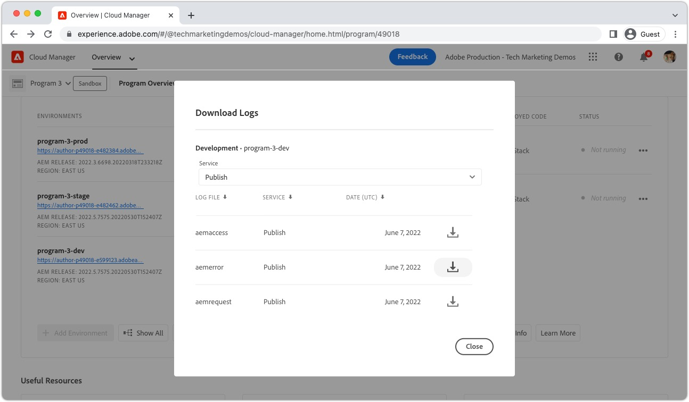

# 周遊警告

>[!TIP]
>請將此頁面新增為書籤以供將來參考。

_什麼是周遊警告？_

周遊警告包括 __aemerror__ 記錄陳述式指出在AEM Publish服務上執行之查詢的效能不佳。 周遊警告通常會以兩種方式顯示在AEM中：

1. __緩慢查詢__ 不使用索引，導致回應時間緩慢。
1. __失敗的查詢__，會擲回 `RuntimeNodeTraversalException`，導致中斷的體驗。

允許未勾選周遊警告會減慢AEM效能，並可能導致使用者的體驗中斷。

## 如何解決周遊警告

您可以使用三個簡單的步驟來緩解周遊警告：分析、調整和驗證。 在識別最佳調整之前，預計會進行幾次調整和驗證。

<div class="columns is-multiline">

<!-- Analyze -->
<div class="column is-half-tablet is-half-desktop is-one-third-widescreen" aria-label="Analyze" tabindex="0">
   <div class="x-card">
       <div class="card-image">
           <figure class="image is-16by9">
               <a href="#analyze" title="分析" tabindex="-1">
                   
               </a>
           </figure>
       </div>
       <div class="card-content is-padded-small">
           <div class="content">
                <p class="headline is-size-5 has-text-weight-bold">分析問題</p>
               <p class="is-size-6">識別並瞭解正在周遊的查詢。</p>
               <a href="#analyze" class="spectrum-Button spectrum-Button--outline spectrum-Button--primary spectrum-Button--sizeM">
                   <span class="spectrum-Button-label has-no-wrap has-text-weight-bold">分析</span>
               </a>
           </div>
       </div>
   </div>
</div>

<!-- Adjust -->
<div class="column is-half-tablet is-half-desktop is-one-third-widescreen" aria-label="Adjust" tabindex="0">
   <div class="x-card">
       <div class="card-image">
           <figure class="image is-16by9">
               <a href="#adjust" title="調整" tabindex="-1">
                   
               </a>
           </figure>
       </div>
       <div class="card-content is-padded-small">
           <div class="content">
                <p class="headline is-size-5 has-text-weight-bold">調整程式碼或設定</p>
               <p class="is-size-6">更新查詢和索引以避免查詢周遊。</p>
               <a href="#adjust" class="spectrum-Button spectrum-Button--outline spectrum-Button--primary spectrum-Button--sizeM">
                   <span class="spectrum-Button-label has-no-wrap has-text-weight-bold">調整</span>
               </a>
           </div>
       </div>
   </div>
</div>

<!-- Verify -->
<div class="column is-half-tablet is-half-desktop is-one-third-widescreen" aria-label="Verify" tabindex="0">
   <div class="x-card">
       <div class="card-image">
           <figure class="image is-16by9">
               <a href="#verify" title="驗證" tabindex="-1">
                   
               </a>
           </figure>
       </div>
       <div class="card-content is-padded-small">
           <div class="content">
                <p class="headline is-size-5 has-text-weight-bold">驗證調整是否有效</p>                       
               <p class="is-size-6">驗證查詢和索引的變更會移除周遊。</p>
               <a href="#verify" class="spectrum-Button spectrum-Button--outline spectrum-Button--primary spectrum-Button--sizeM">
                   <span class="spectrum-Button-label has-no-wrap has-text-weight-bold">驗證</span>
               </a>
           </div>
       </div>
   </div>
</div>

</div>

## 1.分析{#analyze}

首先，識別哪些AEM Publish服務顯示周遊警告。 若要這麼做，請從Cloud Manager， [下載發佈服務 `aemerror` 記錄檔](https://experienceleague.adobe.com/docs/experience-manager-learn/cloud-service/debugging/debugging-aem-as-a-cloud-service/logs.html#cloud-manager){target="_blank"} 過去所有環境（開發、測試和生產）中的 __三天__.



開啟記錄檔並搜尋Java™類別 `org.apache.jackrabbit.oak.plugins.index.Cursors$TraversingCursor`. 包含周遊警告的記錄包含一連串類似下列內容的陳述式：

```log
24.05.2022 14:18:46.146 [cm-p123-e456-aem-author-9876-edcba] *WARN* [192.150.10.214 [1653401908419] GET /content/wknd/us/en/example.html HTTP/1.1] 
org.apache.jackrabbit.oak.plugins.index.Cursors$TraversingCursor Traversed 5000 nodes with filter 
Filter(query=select [jcr:path], [jcr:score], * from [nt:base] as a where [xyz] = 'abc' and isdescendantnode(a, '/content') 
/* xpath: /jcr:root/content//element(*, nt:base)[(@xyz = 'abc')] */, path=/content//*, property=[xyz=[abc]]) 
called by apps.wknd.components.search.example__002e__jsp._jspService; 
consider creating an index or changing the query
```

根據查詢執行的內容，記錄陳述式可能包含有關查詢建立者的有用資訊：

+ 與查詢執行相關聯的HTTP要求URL

   + 範例： `GET /content/wknd/us/en/example.html HTTP/1.1`

+ Oak查詢語法

   + 範例： `select [jcr:path], [jcr:score], * from [nt:base] as a where [xyz] = 'abc' and isdescendantnode(a, '/content')`

+ XPath查詢

   + 範例： `/jcr:root/content//element(*, nt:base)[(@xyz = 'abc')] */, path=/content//*, property=[xyz=[abc]])`

+ 執行查詢的程式碼

   + 範例：  `apps.wknd.components.search.example__002e__jsp._jspService` → `/apps/wknd/components/search/example.html`

__失敗的查詢__ 後面接著 `RuntimeNodeTraversalException` 陳述式，類似於：

```log
24.05.2022 14:18:47.240 [cm-p123-e456-aem-author-9876-edcba] *WARN* [192.150.10.214 [1653401908419] GET /content/wknd/us/en/example.html HTTP/1.1] 
org.apache.jackrabbit.oak.query.FilterIterators The query read or traversed more than 100000 nodes.
org.apache.jackrabbit.oak.query.RuntimeNodeTraversalException: 
    The query read or traversed more than 100000 nodes. To avoid affecting other tasks, processing was stopped.
    ...
```

## 2.調整{#adjust}

一旦發現違規查詢及其叫用程式碼，就必須進行調整。 可以進行兩種型別的調整來緩解周遊警告：

### 調整查詢

__變更查詢__ 新增可解析成現有索引限制的新查詢限制。 可能的話，偏好變更查詢而非變更索引。

+ [瞭解如何調整查詢效能](https://experienceleague.adobe.com/docs/experience-manager-65/developing/bestpractices/troubleshooting-slow-queries.html#query-performance-tuning){target="_blank"}

### 調整索引

__變更（或建立） AEM索引__ 以使現有查詢限制可解析為索引更新。

+ [瞭解如何調整現有索引](https://experienceleague.adobe.com/docs/experience-manager-65/developing/bestpractices/troubleshooting-slow-queries.html#query-performance-tuning){target="_blank"}
+ [瞭解如何建立索引](https://experienceleague.adobe.com/docs/experience-manager-65/developing/bestpractices/troubleshooting-slow-queries.html#create-a-new-index){target="_blank"}

## 3.確認{#verify}

對查詢、索引或兩者進行的調整必須經過驗證，以確保它們可減少周遊警告的影響。


若僅限 [查詢調整](#adjust-the-query) 做出，可以透過開發人員控制檯在AEMas a Cloud Service上直接測試查詢 [說明查詢](https://experienceleague.adobe.com/docs/experience-manager-learn/cloud-service/debugging/debugging-aem-as-a-cloud-service/developer-console.html#queries){target="_blank"}. 說明查詢會針對AEM Author服務執行，但由於索引定義在Author和Publish服務中是相同的，因此針對AEM Author服務驗證查詢就足夠了。

如果 [索引調整](#adjust-the-index) 完成，索引必須部署到AEMas a Cloud Service。 部署索引調整後，開發人員控制檯將可 [說明查詢](https://experienceleague.adobe.com/docs/experience-manager-learn/cloud-service/debugging/debugging-aem-as-a-cloud-service/developer-console.html#queries){target="_blank"} 可用來進一步執行和調整查詢。

最終，所有變更（查詢和程式碼）都會提交到Git並使用Cloud Manager部署到AEMas a Cloud Service。 部署後，測試與原始周遊警告相關聯的程式碼路徑會重新測試，並驗證周遊警告不再出現在 `aemerror` 記錄。

## 其他資源

檢視這些其他有用的資源，以瞭解AEM索引、搜尋和周遊警告。

<div class="columns is-multiline">

<!-- Cloud 5 - Search &amp; Indexing -->
<div class="column is-half-tablet is-half-desktop is-one-third-widescreen" aria-label="Cloud 5 - Search &amp; Indexing" tabindex="0">
   <div class="card">
       <div class="card-image">
           <figure class="image is-16by9">
               <a href="https://experienceleague.adobe.com/docs/experience-manager-learn/cloud-service/expert-resources/cloud-5/cloud5-aem-search-and-indexing.html" title="Cloud 5 — 搜尋和索引" tabindex="-1"></a>
           </figure>
       </div>
       <div class="card-content is-padded-small">
           <div class="content">
               <p class="headline is-size-6 has-text-weight-bold"><a href="https://experienceleague.adobe.com/docs/experience-manager-learn/cloud-service/expert-resources/cloud-5/cloud5-aem-search-and-indexing.html" title="Cloud 5 — 搜尋和索引">Cloud 5 — 搜尋和索引</a></p>
               <p class="is-size-6">Cloud 5團隊會顯示在AEMas a Cloud Service上探索搜尋和索引的來龍去脈。</p>
               <a href="https://experienceleague.adobe.com/docs/experience-manager-learn/cloud-service/expert-resources/cloud-5/cloud5-aem-search-and-indexing.html" class="spectrum-Button spectrum-Button--outline spectrum-Button--primary spectrum-Button--sizeM">
                   <span class="spectrum-Button-label has-no-wrap has-text-weight-bold">瞭解更多</span>
               </a>
           </div>
       </div>
   </div>
</div>

<!-- Content Search and Indexing -->
<div class="column is-half-tablet is-half-desktop is-one-third-widescreen" aria-label="Content Search and Indexing
" tabindex="0">
   <div class="card">
       <div class="card-image">
           <figure class="image is-16by9">
               <a href="https://experienceleague.adobe.com/docs/experience-manager-cloud-service/content/operations/indexing.html" title="內容搜尋與索引" tabindex="-1">
                   
               </a>
           </figure>
       </div>
       <div class="card-content is-padded-small">
           <div class="content">
               <p class="headline is-size-6 has-text-weight-bold"><a href="https://experienceleague.adobe.com/docs/experience-manager-cloud-service/content/operations/indexing.html" title="內容搜尋與索引">內容搜尋和索引檔案</a></p>
               <p class="is-size-6">瞭解如何在AEMas a Cloud Service中建立和管理索引。</p>
               <a href="https://experienceleague.adobe.com/docs/experience-manager-cloud-service/content/operations/indexing.html" class="spectrum-Button spectrum-Button--outline spectrum-Button--primary spectrum-Button--sizeM">
                   <span class="spectrum-Button-label has-no-wrap has-text-weight-bold">瞭解更多</span>
               </a>
           </div>
       </div>
   </div>
</div>

<!-- Modernizing your Oak indexes -->
<div class="column is-half-tablet is-half-desktop is-one-third-widescreen" aria-label="Modernizing your Oak indexes" tabindex="0">
   <div class="card">
       <div class="card-image">
           <figure class="image is-16by9">
               <a href="https://experienceleague.adobe.com/docs/experience-manager-learn/cloud-service/migration/moving-to-aem-as-a-cloud-service/search-and-indexing.html" title="更新Oak索引" tabindex="-1">
                   
               </a>
           </figure>
       </div>
       <div class="card-content is-padded-small">
           <div class="content">
               <p class="headline is-size-6 has-text-weight-bold"><a href="https://experienceleague.adobe.com/docs/experience-manager-learn/cloud-service/migration/moving-to-aem-as-a-cloud-service/search-and-indexing.html" title="更新Oak索引">更新Oak索引</a></p>
               <p class="is-size-6">瞭解如何將AEM 6 Oak索引定義轉換為AEMas a Cloud Service相容的定義，並維護未來的索引。</p>
               <a href="https://experienceleague.adobe.com/docs/experience-manager-learn/cloud-service/migration/moving-to-aem-as-a-cloud-service/search-and-indexing.html" class="spectrum-Button spectrum-Button--outline spectrum-Button--primary spectrum-Button--sizeM">
                   <span class="spectrum-Button-label has-no-wrap has-text-weight-bold">瞭解更多</span>
               </a>
           </div>
       </div>
   </div>
</div>

<!-- Index definition documentation -->
<div class="column is-half-tablet is-half-desktop is-one-third-widescreen" aria-label="Index definition documentation" tabindex="0">
   <div class="card">
       <div class="card-image">
           <figure class="image is-16by9">
               <a href="https://jackrabbit.apache.org/oak/docs/query/lucene.html" title="索引定義檔案" tabindex="-1">
                   
               </a>
           </figure>
       </div>
       <div class="card-content is-padded-small">
           <div class="content">
               <p class="headline is-size-6 has-text-weight-bold"><a href="https://jackrabbit.apache.org/oak/docs/query/lucene.html" title="索引定義檔案">Lucene索引檔案</a></p>
               <p class="has-ellipsis is-size-6">Apache Oak Jackrabbit Lucene索引參考會記錄所有支援的Lucene索引設定。</p>
               <a href="https://jackrabbit.apache.org/oak/docs/query/lucene.html" class="spectrum-Button spectrum-Button--outline spectrum-Button--primary spectrum-Button--sizeM">
                   <span class="spectrum-Button-label has-no-wrap has-text-weight-bold">瞭解更多</span>
               </a>
           </div>
       </div>
   </div>
</div>

</div>
