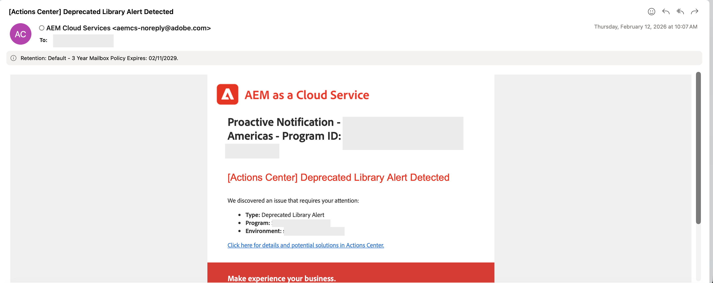
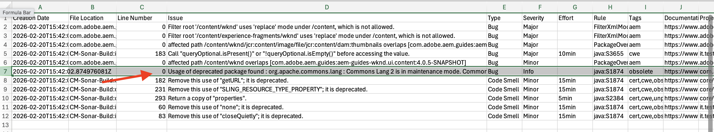

# 尋找並移除AEM as a Cloud Service中已棄用的API

瞭解如何在AEM as a Cloud Service中尋找及移除已棄用的API。

## 概觀

為確保您的應用程式安全且效能，以及您能夠繼續使用Cloud Manager管道部署程式碼，請從您的專案中移除已棄用的API。

在本教學課程中，您將瞭解如何使用[AEM Analyzer Maven外掛程式](https://github.com/adobe/aemanalyser-maven-plugin/blob/main/aemanalyser-maven-plugin/README.md)，在您的AEM as a Cloud Service環境中尋找及移除已棄用的API。

## 關於已棄用API的通知

關於已過時的API使用情形和修正注意事項會定期回報，讓我們檢閱一些範例。

- AEM as a Cloud Service **動作中心**&#x200B;會通知您專案中&#x200B;_已棄用的API_。
  

- Cloud Manager管道中的&#x200B;**程式碼掃描**&#x200B;步驟會報告專案中已被取代的API，請檢閱&#x200B;**下載詳細資料**&#x200B;報告以檢視已被取代的API完整清單。
  

- Cloud Manager管道中的&#x200B;**成品準備**&#x200B;步驟會報告專案中已被取代的API、**下載記錄檔**&#x200B;並在記錄檔中尋找&#x200B;_分析器警告_。

  ```
  2026-02-20 15:40:48.376 Analyser warnings have been found 
  2026-02-20 15:40:48.376 The analyser found the following warnings for author and publish : 
  2026-02-20 15:40:48.376 [region-deprecated-api] com.adobe.aem.guides:aem-guides-wknd.core:4.0.5-SNAPSHOT: Usage of deprecated package found : org.apache.commons.lang : Commons Lang 2 is in maintenance mode. Commons Lang 3 should be used instead. Deprecated since 2021-04-30 For removal : 2021-12-31 (com.adobe.aem.guides:aem-guides-wknd.all:4.0.5-SNAPSHOT)
  2026-02-20 15:40:56.458 Convert Merge Analyse finished.
  ```


## 如何尋找已過時的API

請依照下列步驟，在您的AEM as a Cloud Service專案中尋找已棄用的API。

1. **使用最新的AEM Analyzer Maven外掛程式**

   在您的AEM專案中，使用最新版本的[AEM Analyzer Maven外掛程式](https://github.com/adobe/aemanalyser-maven-plugin/blob/main/aemanalyser-maven-plugin/README.md)。

   - 在主要`pom.xml`中，通常會宣告外掛程式版本。 比較您的版本與最新的[發行版本](https://mvnrepository.com/artifact/com.adobe.aem/aemanalyser-maven-plugin)。

     ```xml
     ...
     <aemanalyser.version>1.6.16</aemanalyser.version> <!-- Latest released version as of 20-Feb-2026 -->
     ...
     <!-- AEM Analyser Plugin -->
     <plugin>
         <groupId>com.adobe.aem</groupId>
         <artifactId>aemanalyser-maven-plugin</artifactId>
         <version>${aemanalyser.version}</version>
         <extensions>true</extensions>
     </plugin>
     ...
     ```

   - 外掛程式會根據最新可用的AEM SDK進行檢查。 在您的專案的`pom.xml`檔案中使用最新的AEM SDK版本。 將已棄用的API顯示為IDE警告會有所幫助。

     ```xml
     ...
     <aem.sdk.api>2026.2.24464.20260214T050318Z-260100</aem.sdk.api> <!-- Latest available AEM SDK version as of 20-Feb-2026 -->
     ...
     ```

   - 請確定`all`模組在`verify`階段中執行外掛程式。

     ```xml
     ...
     <build>
         <plugins>
             ...
             <plugin>
                 <groupId>com.adobe.aem</groupId>
                 <artifactId>aemanalyser-maven-plugin</artifactId>
                 <extensions>true</extensions>
                 <executions>
                     <execution>
                         <id>analyse-project</id>
                         <phase>verify</phase>
                         <goals>
                             <goal>project-analyse</goal>
                         </goals>
                     </execution>
                 </executions>
             </plugin>
             ...
         </plugins>
     </build>
     ...
     ```

2. **執行組建並檢查警告**

   當您執行`mvn clean install`時，分析器會在輸出中將已棄用的API回報為&#x200B;**[WARNING]**&#x200B;訊息。 例如：

   ```shell
   ...
   [WARNING] The analyser found the following warnings for author and publish :
   [WARNING] [region-deprecated-api] com.adobe.aem.guides:aem-guides-wknd.core:4.0.5-SNAPSHOT: Usage of deprecated package found : org.apache.commons.lang : Commons Lang 2 is in maintenance mode. Commons Lang 3 should be used instead. Deprecated since 2021-04-30 For removal : 2021-12-31 (com.adobe.aem.guides:aem-guides-wknd.all:4.0.5-SNAPSHOT)
   ...
   ```

   專注於建置成功或失敗時，很容易忽略這些訊息。

3. **取得已棄用的API的清除清單**

   上述步驟也提供相同資訊。 但是，請在`verify`模組上執行`all`階段，以在一個位置檢視所有&#x200B;**[警告]**&#x200B;訊息。 例如：

   ```shell
   $ mvn clean verify -pl all
   ```

   組建輸出中的&#x200B;**[WARNING]**&#x200B;訊息會列出專案中已棄用的API。

## 如何移除已過時的API

AEM分析器報告&#x200B;**哪些**&#x200B;已過時，並提供如何修正的&#x200B;**建議**。 不過，請使用下表來選擇正確的動作，並在您需要更多詳細資訊時遵循連結的檔案。

### 已棄用的API補救策略

| 分析器警告型別 | 其表示方式 | 建議的動作 | 參照 |
| --------------------- | ----------------- | ------------------ | --------- |
| 已過時的AEM API | API即將從AEM as a Cloud Service中移除 | 以支援的公用API取代用法 | [API移除指南](https://experienceleague.adobe.com/en/docs/experience-manager-cloud-service/content/release-notes/deprecated-removed-features#api-removal-guidance) |
| 已棄用的AEM套件或類別 | 不再支援套件或類別 | 重構程式碼以使用建議的替代方案 | [已棄用的API](https://experienceleague.adobe.com/en/docs/experience-manager-cloud-service/content/release-notes/deprecated-removed-features#aem-apis) |
| 已棄用的第三方程式庫 | 未來的SDK將不支援程式庫 | 升級相依性並重構使用方式 | [一般准則](https://experienceleague.adobe.com/en/docs/experience-manager-cloud-service/content/release-notes/deprecated-removed-features#api-removal-guidance) |
| 已遭取代的Sling / OSGi模式 | 偵測到舊版註解或API | 移轉至新式Sling和OSGi API | [移除Sling / OSGi模式](https://experienceleague.adobe.com/en/docs/experience-manager-cloud-service/content/release-notes/deprecated-removed-features#api-removal-guidance) |
| 計畫移除（未來日期） | API仍然有效，但稍後會強制移除 | 在管道執行之前排程清理 | [發行說明](https://experienceleague.adobe.com/zh-hant/docs/experience-manager-cloud-service/content/release-notes/home) |

### 實用指引

- 將分析器警告視為&#x200B;**未來的管道失敗**，而不是選擇性訊息。
- 使用&#x200B;**最新的AEM SDK**&#x200B;在本機修正已棄用的API。
- 保持分析器輸出整潔，以避免在未來AEM升級期間出現問題。

及早修正已棄用的API可讓您的專案&#x200B;**升級安全且部署準備就緒**。

## 其他資源

- [AEM Analyzer Maven外掛程式](https://github.com/adobe/aemanalyser-maven-plugin/blob/main/aemanalyser-maven-plugin/README.md)
- [已過時和已移除的功能和API](https://experienceleague.adobe.com/en/docs/experience-manager-cloud-service/content/release-notes/deprecated-removed-features#api-removal-guidance)
