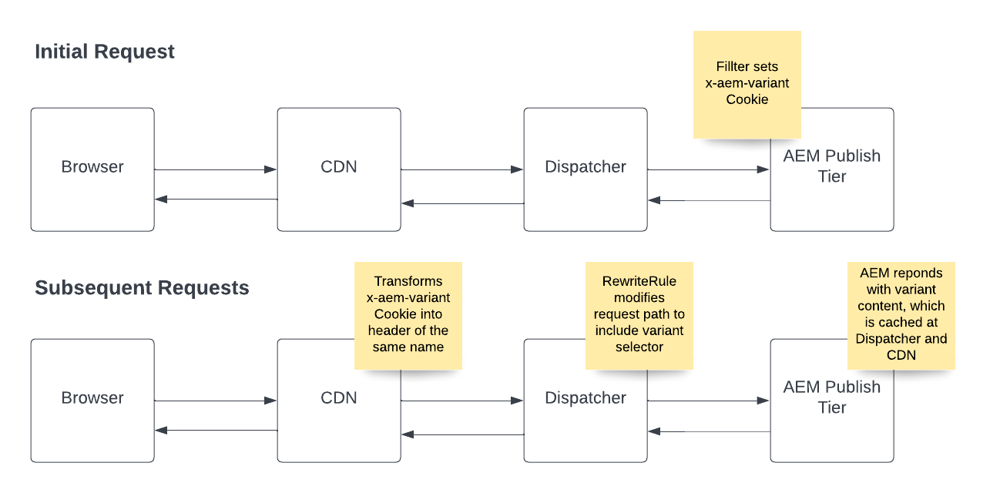

# 快取頁面變體

瞭解如何設定和使用AEM as a Cloud Service來支援快取頁面變體。

## 範例使用案例

+ 任何服務提供者，如果根據使用者的地理位置和具有動態內容的頁面快取，提供不同的服務方案和對應的定價選項，應在CDN和Dispatcher進行管理。

+ 零售客戶在全國/地區都有商店，而每個商店會根據其所在位置提供不同優惠方案，且含動態內容的頁面快取應在CDN和Dispatcher中進行管理。

## 解決方案概覽

+ 識別變體索引鍵及其可能有的值數量。 在我們的範例中，我們因美國各州而異，因此數字上限為50。 這足夠小，不會導致CDN的變體限制發生問題。 [檢閱變體限制區段](#variant-limitations).

+ AEM程式碼必須設定Cookie __&quot;x-aem-variant&quot;__ 至訪客的偏好狀態(例如 `Set-Cookie: x-aem-variant=NY`)時，HTTP請求對應的回應。

+ 訪客的後續請求會傳送該Cookie (例如 `"Cookie: x-aem-variant=NY"`)，而Cookie則會在CDN層級轉換為預先定義的標題(即 `x-aem-variant:NY`)，這會傳遞給Dispatcher。

+ Apache重寫規則會修改請求路徑，以在頁面URL中包含標頭值作為Apache Sling選擇器(例如 `/page.variant=NY.html`)。 這可讓AEM Publish根據選擇器和排程程式提供不同的內容，以便針對每個變體快取一個頁面。

+ AEM Dispatcher傳送的回應必須包含HTTP回應標頭 `Vary: x-aem-variant`. 這會指示CDN為不同的標頭值儲存不同的快取復本。

>[!TIP]
>
>每當設定Cookie時(例如 Set-Cookie： x-aem-variant=NY)回應不應可快取（應該有Cache-Control： private或Cache-Control： no-cache）

## HTTP要求流程



>[!NOTE]
>
>上述初始HTTP請求流程必須在請求任何使用變體的內容之前發生。

## 使用情況

1. 為了示範此功能，我們將使用 [WKND](https://experienceleague.adobe.com/docs/experience-manager-learn/getting-started-wknd-tutorial-develop/overview.html)以的實作為例。

1. 實作 [SlingServletFilter](https://sling.apache.org/documentation/the-sling-engine/filters.html) 在AEM中設定 `x-aem-variant` HTTP回應上的Cookie，具有變數值。

1. AEM CDN自動轉換 `x-aem-variant` Cookie匯入相同名稱的HTTP標頭。

1. 將Apache Web Server mod_rewrite規則新增至 `dispatcher` 專案，修改請求路徑以包含變體選擇器。

1. 使用Cloud Manager部署篩選器並重寫規則。

1. 測試整體請求流程。

## 程式碼範例

+ 要設定的SlingServletFilter範例 `x-aem-variant` AEM中有值的Cookie。

  ```
  package com.adobe.aem.guides.wknd.core.servlets.filters;
  
  import javax.servlet.*;
  import java.io.IOException;
  
  import org.apache.sling.api.SlingHttpServletRequest;
  import org.apache.sling.api.SlingHttpServletResponse;
  import org.apache.sling.servlets.annotations.SlingServletFilter;
  import org.apache.sling.servlets.annotations.SlingServletFilterScope;
  import org.osgi.service.component.annotations.Component;
  import org.slf4j.Logger;
  import org.slf4j.LoggerFactory;
  
  
  // Invoke filter on  HTTP GET /content/wknd.*.foo|bar.html|json requests.
  // This code and scope is for example purposes only, and will not interfere with other requests.
  @Component
  @SlingServletFilter(scope = {SlingServletFilterScope.REQUEST},
          resourceTypes = {"cq:Page"},
          pattern = "/content/wknd/.*",
          extensions = {"html", "json"},
          methods = {"GET"})
  public class PageVariantFilter implements Filter {
      private static final Logger log = LoggerFactory.getLogger(PageVariantFilter.class);
      private static final String VARIANT_COOKIE_NAME = "x-aem-variant";
  
      @Override
      public void init(FilterConfig filterConfig) throws ServletException { }
  
      @Override
      public void doFilter(ServletRequest servletRequest, ServletResponse servletResponse, FilterChain filterChain) throws IOException, ServletException {
          SlingHttpServletResponse slingResponse = (SlingHttpServletResponse) servletResponse;
          SlingHttpServletRequest slingRequest = (SlingHttpServletRequest) servletRequest;
  
          // Check is the variant was previously set
          final String existingVariant = slingRequest.getCookie(VARIANT_COOKIE_NAME).getValue();
  
          if (existingVariant == null) {
              // Variant has not been set, so set it now
              String newVariant = "NY"; // Hard coding as an example, but should be a calculated value
              slingResponse.setHeader("Set-Cookie", VARIANT_COOKIE_NAME + "=" + newVariant + "; Path=/; HttpOnly; Secure; SameSite=Strict");
              log.debug("x-aem-variant cookie is set with the value {}", newVariant);
          } else {
              log.debug("x-aem-variant previously set with value {}", existingVariant);
          }
  
          filterChain.doFilter(servletRequest, slingResponse);
      }
  
      @Override
      public void destroy() { }
  }
  ```

+ 中的範例重寫規則 __dispatcher/src/conf.d/rewrite.rules__ 在Git中作為原始程式碼管理，並使用Cloud Manager部署的檔案。

  ```
  ...
  
  RewriteCond %{REQUEST_URI} ^/us/.*  
  RewriteCond %{HTTP:x-aem-variant} ^.*$  
  RewriteRule ^([^?]+)\.(html.*)$ /content/wknd$1.variant=%{HTTP:x-aem-variant}.$2 [PT,L] 
  
  ...
  ```

## 變數限制

+ AEM CDN最多可管理200個變數。 這表示 `x-aem-variant` 標頭最多可以有200個不重複值。 如需詳細資訊，請檢閱 [CDN設定限制](https://docs.fastly.com/en/guides/resource-limits).

+ 務必謹慎確保您選擇的變體金鑰不會超過此數字。  舉例來說，使用者ID並非好鍵，因為大多數網站很容易超過200個值，而某個國家/地區少於200個國家/地區會更適合使用。

>[!NOTE]
>
>當變體超過200個時，CDN會以「變體太多」的回應（而非頁面內容）回應。
