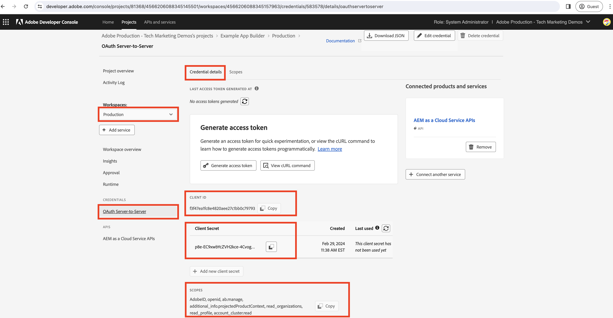

# 在App Builder動作中產生伺服器對伺服器存取權杖

App Builder動作可能需要與支援&#x200B;**OAuth伺服器對伺服器認證**&#x200B;且與App Builder應用程式部署的Adobe Developer Console專案相關聯的Adobe API互動。

本指南說明如何使用&#x200B;_OAuth伺服器對伺服器認證_&#x200B;產生存取權杖，以用於App Builder動作。

>[!IMPORTANT]
>
> 服務帳戶(JWT)憑證已遭取代，改用OAuth伺服器對伺服器憑證。 不過，仍有部分AdobeAPI僅支援服務帳戶(JWT)憑證，且正在移轉至OAuth伺服器對伺服器。 請檢閱Adobe API檔案，以瞭解支援的認證。

## Adobe Developer Console專案設定

將所需的AdobeAPI新增至Adobe Developer Console專案時，請在&#x200B;_設定API_&#x200B;步驟中，選取&#x200B;**OAuth伺服器對伺服器**&#x200B;驗證型別。


若要指派上述自動建立的整合服務帳戶，請選取所需的產品設定檔。 因此，透過產品設定檔，可控制服務帳戶許可權。


## .env檔案

在App Builder專案的`.env`檔案中，附加Adobe Developer Console專案的OAuth伺服器對伺服器憑證的自訂金鑰。 對於指定的工作區，可從Adobe Developer Console專案的&#x200B;__認證__ > __OAuth伺服器對伺服器__&#x200B;取得OAuth伺服器對伺服器認證值。



```
...
OAUTHS2S_CLIENT_ID=58b23182d80a40fea8b12bc236d71167
OAUTHS2S_CLIENT_SECRET=p8e-EIRF6kY6EHLBSdw2b-pLUWKodDqJqSz3
OAUTHS2S_CECREDENTIALS_METASCOPES=AdobeID,openid,ab.manage,additional_info.projectedProductContext,read_organizations,read_profile,account_cluster.read
```

可以從Adobe Developer Console專案的「OAuth伺服器對伺服器認證」畫面直接複製`OAUTHS2S_CLIENT_ID`、`OAUTHS2S_CLIENT_SECRET`、`OAUTHS2S_CECREDENTIALS_METASCOPES`的值。

## 輸入對應

在`.env`檔案中設定OAuth伺服器對伺服器認證值時，必須將它們對應至AppBuilder動作輸入，才能在動作本身中讀取。 若要這麼做，請在`ext.config.yaml`動作`inputs`中為每個變數新增專案，格式為： `PARAMS_INPUT_NAME: $ENV_KEY`。

例如：

```yaml
operations:
  view:
    - type: web
      impl: index.html
actions: actions
runtimeManifest:
  packages:
    dx-excshell-1:
      license: Apache-2.0
      actions:
        generic:
          function: actions/generic/index.js
          web: 'yes'
          runtime: nodejs:16
          inputs:
            LOG_LEVEL: debug
            OAUTHS2S_CLIENT_ID: $OAUTHS2S_CLIENT_ID
            OAUTHS2S_CLIENT_SECRET: $OAUTHS2S_CLIENT_SECRET
            OAUTHS2S_CECREDENTIALS_METASCOPES: $OAUTHS2S_CECREDENTIALS_METASCOPES
          annotations:
            require-adobe-auth: false
            final: true
```

在`inputs`下定義的金鑰可在提供給App Builder動作的`params`物件上使用。

## 用於存取Token的OAuth伺服器對伺服器認證

在App Builder動作中，`params`物件中有OAuth伺服器對伺服器認證。 使用這些認證，可以使用[OAuth 2.0資料庫](https://oauth.net/code/)產生存取權杖。 或者，您可以使用[節點擷取程式庫](https://www.npmjs.com/package/node-fetch)，向Adobe IMS權杖端點發出POST請求以取得存取權杖。

下列範例示範如何使用`node-fetch`資料庫向Adobe IMS權杖端點發出POST要求以取得存取權杖。

```javascript
const fetch = require("node-fetch");
const { Core } = require("@adobe/aio-sdk");
const { errorResponse, stringParameters, checkMissingRequestInputs } = require("../utils");

async function main(params) {
  const logger = Core.Logger("main", { level: params.LOG_LEVEL || "info" });

  try {
    // Perform any necessary input error checking
    const systemErrorMessage = checkMissingRequestInputs(params, ["OAUTHS2S_CLIENT_ID", "OAUTHS2S_CLIENT_SECRET", "OAUTHS2S_CECREDENTIALS_METASCOPES"], []);

    // The Adobe IMS token endpoint URL
    const adobeIMSV3TokenEndpointURL = 'https://ims-na1.adobelogin.com/ims/token/v3';

    // The POST request options
    const options = {
        method: 'POST',
        headers: {
        'Content-Type': 'application/x-www-form-urlencoded',
        },
        body: `grant_type=client_credentials&client_id=${params.OAUTHS2S_CLIENT_ID}&client_secret=${params.OAUTHS2S_CLIENT_SECRET}&scope=${params.OAUTHS2S_CECREDENTIALS_METASCOPES}`,
    };

    // Make a POST request to the Adobe IMS token endpoint to get the access token
    const tokenResponse = await fetch(adobeIMSV3TokenEndpointURL, options);
    const tokenResponseJSON = await tokenResponse.json();

    // The 24-hour IMS Access Token is used to call the AEM Data Service API
    // Can look at caching this token for 24 hours to reduce calls
    const accessToken = tokenResponseJSON.access_token;

    // Invoke an AEM Data Service API using the access token
    const aemDataResponse = await fetch(`https://api.adobeaemcloud.com/adobe/stats/statistics/contentRequestsQuota?imsOrgId=${IMS_ORG_ID}&current=true`, {
      headers: {
        'X-Adobe-Accept-Experimental': '1',
        'x-gw-ims-org-id': IMS_ORG_ID,
        'X-Api-Key': params.OAUTHS2S_CLIENT_ID,
        Authorization: `Bearer ${access_token}`, // The 24-hour IMS Access Token
      },
      method: "GET",
    });

    if (!aemDataResponse.ok) { throw new Error("Request to API failed with status code " + aemDataResponse.status);}

    // API data
    let data = await aemDataResponse.json();

    const response = {
      statusCode: 200,
      body: data,
    };

    return response;
  } catch (error) {
    logger.error(error);
    return errorResponse(500, "server error", logger);
  }
}

exports.main = main;
```
