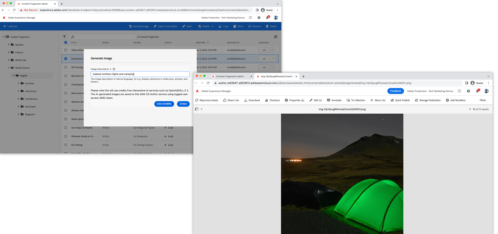

# AEM使用OpenAI產生影像資產

了解如何使用OpenAI或DALL.E 2產生影像，並將其上傳至AEM DAM以了解內容速度。

{width="500" zoomable="yes"}

此範例AEM內容片段主控台擴充功能是 [動作列](../action-bar.md) 從使用自然語言輸入生成數字影像的擴展 [OpenAI API](https://openai.com/api/) 或 [DALL.E 2](https://openai.com/dall-e-2/). 產生的影像會上傳至AEM DAM，而選取的內容片段的影像屬性會更新，以參照這個從DAM新產生的上傳影像。

在此範例中，您會學到：

1. 使用 [OpenAI API](https://beta.openai.com/docs/guides/images/image-generation-beta) 或 [DALL.E 2](https://openai.com/dall-e-2/)
1. 上傳影像至AEM
1. 內容片段屬性更新

範例擴充功能的功能流程如下：

{align="center"}

1. 選取「內容片段」 ，然後按一下擴充功能的 `Generate Image` 按鈕 [動作列](#extension-registration) 開啟 [模態](#modal).
1. 此 [模態](#modal) 顯示自訂輸入表單，使用 [React Spectrum](https://react-spectrum.adobe.com/react-spectrum/).
1. 提交表單會傳送提供的使用者 `Image Description` 文字、選取的內容片段，以及AEM主機 [自訂Adobe I/O Runtime動作](#adobe-io-runtime-action).
1. 此 [Adobe I/O Runtime行動](#adobe-io-runtime-action) 驗證輸入。
1. 接下來，它稱為OpenAI [影像產生](https://beta.openai.com/docs/guides/images/image-generation-beta) API及其使用 `Image Description` 文字，以指定應產生的影像。
1. 此 [影像生成](https://beta.openai.com/docs/guides/images/image-generation-beta) 端點建立大小的原始影像 _1024x1024_ 像素，並傳回產生的影像URL作為回應。
1. 此 [Adobe I/O Runtime行動](#adobe-io-runtime-action) 將產生的影像下載至App Builder執行階段。
1. 接下來，它會在預先定義的路徑下，起始從App Builder執行階段到AEM DAM的影像上傳。
1. AEMas a Cloud Service會將影像儲存至DAM，並傳回對Adobe I/O Runtime動作的成功或失敗回應。 成功的上傳回應會使用Adobe I/O Runtime動作對AEM的其他HTTP要求，來更新所選內容片段的影像屬性值。
1. 強制回應視窗會接收來自Adobe I/O Runtime動作的回應，並提供新產生之上傳影像的AEM資產詳細資訊連結。

此影片會檢閱使用OpenAI或DALL.E 2擴充功能產生影像的範例、運作方式及開發方式。 視訊有章節標籤，例如 __功能示範、設定和技術程式碼__ 來快速觀察相關內容。

>[!VIDEO](https://video.tv.adobe.com/v/3413093/?quality=12&learn=on)


## App Builder擴充功能應用程式

此範例使用現有的Adobe Developer Console專案，以及下列選項，透過 `aio app init`.

+ 要搜索哪些模板？: `All Extension Points`
+ 選擇要安裝的模板：` @adobe/aem-cf-admin-ui-ext-tpl`
+ 您想為擴充功能命名什麼？: `Image generation`
+ 請提供擴充功能的簡短說明： `An example action bar extension that generates an image using OpenAI and uploads it to AEM DAM.`
+ 您想從哪個版本開始？ `0.0.1`
+ 你接下來想做什麼？
   + `Add a custom button to Action Bar`
      + 請為按鈕提供標籤名稱： `Generate Image`
      + 您需要為按鈕顯示強制回應嗎？ `y`
   + `Add server-side handler`
      + Adobe I/O Runtime可讓您隨選叫用無伺服器程式碼。 您要如何命名此動作？: `generate-image`

產生的App Builder擴充功能應用程式會依照下列說明更新。

## 其他設定

1. 免費註冊 [OpenAI API](https://openai.com/api/) 帳戶和建立 [API金鑰](https://beta.openai.com/account/api-keys)
1. 將此金鑰新增至您App Builder專案的 `.env` 檔案

   ```
       # Specify your secrets here
       # This file must not be committed to source control
       ## Adobe I/O Runtime credentials
       ...
       AIO_runtime_apihost=https://adobeioruntime.net
       ...
       # OpenAI secret API key
       OPENAI_API_KEY=my-openai-secrete-key-to-generate-images
       ...
   ```

1. 通過 `OPENAI_API_KEY` 作為Adobe I/O Runtime動作的參數，請更新 `src/aem-cf-console-admin-1/ext.config.yaml`

   ```yaml
       ...
   
       runtimeManifest:
         packages:
           aem-cf-console-admin-1:
             license: Apache-2.0
             actions:
               generate-image:
                 function: actions/generate-image/index.js
                 web: 'yes'
                 runtime: nodejs:16
                 inputs:
                   LOG_LEVEL: debug
                   OPENAI_API_KEY: $OPENAI_API_KEY
       ...
   ```

1. 在Node.js程式庫下安裝
   1. [OpenAI Node.js程式庫](https://github.com/openai/openai-node#installation)  — 輕鬆叫用OpenAI API
   1. [AEM上傳](https://github.com/adobe/aem-upload#install)  — 將影像上傳至AEM-CS例項。


>[!TIP]
>
>在以下章節中，您將了解重要的React和Adobe I/O Runtime動作JavaScript檔案。 若要參考，請參考 `web-src` 和  `actions` 提供AppBuilder專案的資料夾，請參閱 [adobe-appbuilder-cfc-ext-image-generation-code-zip](./assets/digital-image-generation/adobe-appbuilder-cfc-ext-image-generation-code.zip).


## 應用程式路由{#app-routes}

此 `src/aem-cf-console-admin-1/web-src/src/components/App.js` 包含 [React路由器](https://reactrouter.com/en/main).

有兩組邏輯路由：

1. 第一條路由將請求映射到 `index.html`，會叫用負責 [擴充功能註冊](#extension-registration).

   ```javascript
   <Route index element={<ExtensionRegistration />} />
   ```

1. 第二組路由會將URL對應至可轉譯擴充功能強制回應內容的React元件。 此 `:selection` param代表分隔清單內容片段路徑。

   如果擴充功能有多個按鈕可叫用離散動作，則每個 [擴充功能註冊](#extension-registration) 映射到此處定義的路由。

   ```javascript
   <Route
       exact path="content-fragment/:selection/generate-image-modal"
       element={<GenerateImageModal />}
       />
   ```

## 擴充功能註冊

`ExtensionRegistration.js`，對應至 `index.html` route是AEM擴充功能的入口點，並定義：

1. 擴充功能按鈕的位置會顯示在AEM製作體驗(`actionBar` 或 `headerMenu`)
1. 中擴充功能按鈕的定義 `getButton()` 函式
1. 按鈕的點擊處理常式，位於 `onClick()` 函式

+ `src/aem-cf-console-admin-1/web-src/src/components/ExtensionRegistration.js`

```javascript
function ExtensionRegistration() {
  const init = async () => {
    const guestConnection = await register({
      id: extensionId,
      methods: {
        // Configure your Action Bar button here
        actionBar: {
          getButton() {
            return {
              'id': 'generate-image',     // Unique ID for the button
              'label': 'Generate Image',  // Button label 
              'icon': 'PublishCheck'      // Button icon; get name from: https://spectrum.adobe.com/page/icons/ (Remove spaces, keep uppercase)
            }
          },

          // Click handler for the extension button
          onClick(selections) {
            // Collect the selected content fragment paths 
            const selectionIds = selections.map(selection => selection.id);

            // Create a URL that maps to the 
            const modalURL = "/index.html#" + generatePath(
              "/content-fragment/:selection/generate-image-modal",
              {
                // Set the :selection React route parameter to an encoded, delimited list of paths of the selected content fragments
                selection: encodeURIComponent(selectionIds.join('|')),
              }
            );

            // Open the route in the extension modal using the constructed URL
            guestConnection.host.modal.showUrl({
              title: "Generate Image",
              url: modalURL
            })
          }
        },

      }
    })
  }
  init().catch(console.error)
```

## 模型

擴充功能的每個路由(如 [`App.js`](#app-routes)，會對應至可轉譯擴充功能強制回應視窗的React元件。

此範例應用程式中包含強制回應元件(`GenerateImageModal.js`)有四種狀態：

1. 正在載入，表示用戶必須等待
1. 建議使用者一次只選取一個內容片段的警告訊息
1. 「產生影像」表單可讓使用者以自然語言提供影像說明。
1. 影像產生作業的回應，提供新產生、上傳之影像的AEM資產詳細資訊連結。

重要的是，任何從擴充功能與AEM的互動應委派給 [AppBuilder Adobe I/O Runtime動作](https://developer.adobe.com/runtime/docs/guides/using/creating_actions/)，這是在中運行的獨立無伺服器進程 [Adobe I/O Runtime](https://developer.adobe.com/runtime/docs/).
使用Adobe I/O Runtime動作來與AEM通訊，是為了避免跨來源資源共用(CORS)連線問題。

當 _產生影像_ 表單已提交，自訂 `onSubmitHandler()` 叫用Adobe I/O Runtime動作，傳遞影像說明、目前的AEM主機（網域）和使用者的AEM存取權杖。 然後，此動作會呼叫OpenAI的 [影像產生](https://beta.openai.com/docs/guides/images/image-generation-beta) API，使用提交的影像說明產生影像。 下次使用 [AEM上傳](https://github.com/adobe/aem-upload) 節點模組 `DirectBinaryUpload` 類別會將產生的影像上傳至AEM，最後使用 [AEM內容片段API](https://experienceleague.adobe.com/docs/experience-manager-65/assets/extending/assets-api-content-fragments.html) 更新內容片段。

當收到來自Adobe I/O Runtime動作的回應時，會更新強制回應以顯示影像產生操作的結果。

+ `src/aem-cf-console-admin-1/web-src/src/components/GenerateImageModal.js`

```javascript
export default function GenerateImageModal() {
  // Set up state used by the React component
  const [guestConnection, setGuestConnection] = useState();

  // State hooks to manage the application state
  const [imageDescription, setImageDescription] = useState(null);
  const [validationState, setValidationState] = useState({});

  const [actionInvokeInProgress, setActionInvokeInProgress] = useState(false);
  const [actionResponse, setActionResponse] = useState();

  // Get the selected content fragment paths from the route parameter `:selection`
  const { selection } = useParams();
  const fragmentIds = selection?.split('|') || [];

  console.log('Selected Fragment Ids', fragmentIds);

  if (!fragmentIds || fragmentIds.length === 0) {
    console.error('The Content Fragments are not selected, can NOT generate images');
    return;
  }

  // Asynchronously attach the extension to AEM, we must wait or the guestConnection to be set before doing anything in the modal
  useEffect(() => {
    (async () => {
      const myGuestConnection = await attach({ id: extensionId });

      setGuestConnection(myGuestConnection);
    })();
  }, []);

  // Determine view to display in the modal
  if (!guestConnection) {
    // If the guestConnection is not initialized, display a loading spinner
    return <Spinner />;
  } if (actionInvokeInProgress) {
    // If the 'Generate Image' action has been invoked but not completed, display a loading spinner
    return <Spinner />;
  } if (fragmentIds.length > 1) {
    // If more than one CF selected show warning and suggest to select only one CF
    return renderMoreThanOneCFSelectionError();
  } if (fragmentIds.length === 1 && !actionResponse) {
    // Display the 'Generate Image' modal and ask for image description
    return renderImgGenerationForm();
  } if (actionResponse) {
    // If the 'Generate Image' actio has completed, display the response
    return renderActionResponse();
  }

  /**
   * Renders the message suggesting to select only on CF at a time to not lose credits accidentally
   *
   * @returns the suggestion or error message to select one CF at a time
   */
  function renderMoreThanOneCFSelectionError() {
    return (
      <Provider theme={defaultTheme} colorScheme="light">
        <Content width="100%">
          <Text>
            As this operation
            <strong> uses credits from Generative AI services</strong>
            {' '}
            such as DALL.E 2 (or Stable Dufusion), we allow only one Generate Image at a time.
            <p />
            <strong>So please select only one Content Fragment at this moment.</strong>
          </Text>

          <Flex width="100%" justifyContent="end" alignItems="center" marginTop="size-400">
            <ButtonGroup align="end">
              <Button variant="negative" onPress={() => guestConnection.host.modal.close()}>Close</Button>
            </ButtonGroup>
          </Flex>

        </Content>
      </Provider>
    );
  }

  /**
   * Renders the form asking for image description in the natural language and
   * displays message this action uses credits from Generative AI services.
   *
   *
   * @returns the image description input field and credit usage message
   */
  function renderImgGenerationForm() {
    return (

      <Provider theme={defaultTheme} colorScheme="light">
        <Content width="100%">

          <Flex width="100%">
            <Form
              width="100%"
            >
              <TextField
                label="Image Description"
                description="The image description in natural language, for e.g. Alaskan adventure in wilderness, animals, and flowers."
                isRequired
                validationState={validationState?.propertyName}
                onChange={setImageDescription}
                contextualHelp={(
                  <ContextualHelp>
                    <Heading>Need help?</Heading>
                    <Content>
                      <Text>
                        The
                        <strong>description of an image</strong>
                        {' '}
                        you are looking for in the natural language, for e.g. &quot;Family vacation on the beach with blue ocean, dolphins, boats and drink&quot;
                      </Text>
                    </Content>
                  </ContextualHelp>
                  )}
              />

              <Text>
                <p />
                Please note this will use credits from Generative AI services such as OpenAI/DALL.E 2. The AI-generated images are saved to this AEM as a Cloud Service Author service using logged user access (IMS) token.
              </Text>

              <ButtonGroup align="end">
                <Button variant="accent" onPress={onSubmitHandler}>Use Credits</Button>
                <Button variant="accent" onPress={() => guestConnection.host.modal.close()}>Close</Button>
              </ButtonGroup>
            </Form>
          </Flex>

        </Content>
      </Provider>

    );
  }

  function buildAssetDetailsURL(aemImgURL) {
    const urlParts = aemImgURL.split('.com');
    const aemAssetdetailsURL = `${urlParts[0]}.com/ui#/aem/assetdetails.html${urlParts[1]}`;

    return aemAssetdetailsURL;
  }

  /**
   * Displays the action response received from the App Builder
   *
   * @returns Displays App Builder action and details
   */
  function renderActionResponse() {
    return (
      <Provider theme={defaultTheme} colorScheme="light">
        <Content width="100%">

          {actionResponse.status === 'success'
            && (
              <>
                <Heading level="4">
                  Successfully generated an image, uploaded it to this AEM-CS Author service, and associated it to the selected Content Fragment.
                </Heading>

                <Text>
                  {' '}
                  Please see generated image in AEM-CS
                  {' '}
                  <Link>
                    <a href={buildAssetDetailsURL(actionResponse.aemImgURL)} target="_blank" rel="noreferrer">
                      here.
                    </a>
                  </Link>
                </Text>
              </>
            )}

          {actionResponse.status === 'failure'
            && (
            <Heading level="4">
              Failed to generate, upload image, please check App Builder logs.
            </Heading>
            )}

          <Flex width="100%" justifyContent="end" alignItems="center" marginTop="size-400">
            <ButtonGroup align="end">
              <Button variant="negative" onPress={() => guestConnection.host.modal.close()}>Close</Button>
            </ButtonGroup>
          </Flex>

        </Content>
      </Provider>
    );
  }

  /**
   * Handle the Generate Image form submission.
   * This function calls the supporting Adobe I/O Runtime actions such as
   * - Call the Generative AI service (DALL.E) with 'image description' to generate an image
   * - Download the AI generated image to App Builder runtime
   * - Save the downloaded image to AEM DAM and update Content Fragement's image reference property to use this new image
   *
   * When invoking the Adobe I/O Runtime actions, the following parameters are passed as they're used by the action to connect to AEM:
   * - AEM Host to connect to
   * - AEM access token to connect to AEM with
   * - The Content Fragment path to update
   *
   * @returns In case of success the updated content fragment, otherwise failure message
   */
  async function onSubmitHandler() {
    console.log('Started Image Generation orchestration');

    // Validate the form input fields
    if (imageDescription?.length > 1) {
      setValidationState({ imageDescription: 'valid' });
    } else {
      setValidationState({ imageDescription: 'invalid' });
      return;
    }

    // Mark the extension as invoking the action, so the loading spinner is displayed
    setActionInvokeInProgress(true);

    // Set the HTTP headers to access the Adobe I/O runtime action
    const headers = {
      Authorization: `Bearer ${guestConnection.sharedContext.get('auth').imsToken}`,
      'x-gw-ims-org-id': guestConnection.sharedContext.get('auth').imsOrg,
    };

    // Set the parameters to pass to the Adobe I/O Runtime action
    const params = {

      aemHost: `https://${guestConnection.sharedContext.get('aemHost')}`,

      fragmentId: fragmentIds[0],
      imageDescription,
    };

    const generateImageAction = 'generate-image';

    try {
      const generateImageActionResponse = await actionWebInvoke(allActions[generateImageAction], headers, params);

      // Set the response from the Adobe I/O Runtime action
      setActionResponse(generateImageActionResponse);

      console.log(`Response from ${generateImageAction}:`, actionResponse);
    } catch (e) {
      // Log and store any errors
      console.error(e);
    }

    // Set the action as no longer being invoked, so the loading spinner is hidden
    setActionInvokeInProgress(false);
  }
}
```

>[!NOTE]
>
>在 `buildAssetDetailsURL()` 函式， `aemAssetdetailsURL` 變數值假設 [統一殼層](https://experienceleague.adobe.com/docs/experience-manager-cloud-service/content/overview/aem-cloud-service-on-unified-shell.html#overview) 啟用。 如果您已停用「統一殼層」，則需要移除 `/ui#/aem` 從變數值。


## Adobe I/O Runtime行動

AEM擴充功能App Builder應用程式可定義或使用0或許多Adobe I/O Runtime動作。
Adobe執行階段動作負責與AEM、Adobe或協力廠商網站服務互動的工作。

在此範例應用程式中， `generate-image` Adobe I/O Runtime動作負責：

1. 使用 [OpenAI API影像產生](https://beta.openai.com/docs/guides/images/image-generation-beta) 服務
1. 使用將產生的影像上傳至AEM-CS例項 [AEM上傳](https://github.com/adobe/aem-upload) 資料庫
1. 向AEM內容片段API發出HTTP要求，以更新內容片段的影像屬性。
1. 傳回成功和失敗的關鍵資訊，以便由強制回應視窗(`GenerateImageModal.js`)


### Orchestrator - `index.js`

此 `index.js` 使用個別JavaScript模組來協調上述1到3項工作，即 `generate-image-using-openai, upload-generated-image-to-aem, update-content-fragement`. 下一節將說明這些模組和相關的程式碼 [子區段](#image-generation-module---generate-image-using-openaijs).

+ `src/aem-cf-console-admin-1/actions/generate-image/index.js`

```javascript
/**
 *
 * This action orchestrates an image generation by calling the OpenAI API (DALL.E 2) and saves generated image to AEM.
 *
 * It leverages following modules
 *  - 'generate-image-using-openai' - To generate an image using OpenAI API
 *  - 'upload-generated-image-to-aem' - To upload the generated image into AEM-CS instance
 *  - 'update-content-fragement' - To update the CF image property with generated image's DAM path
 *
 */

const { Core } = require('@adobe/aio-sdk');
const {
  errorResponse, stringParameters, getBearerToken, checkMissingRequestInputs,
} = require('../utils');

const { generateImageUsingOpenAI } = require('./generate-image-using-openai');

const { uploadGeneratedImageToAEM } = require('./upload-generated-image-to-aem');

const { updateContentFragmentToUseGeneratedImg } = require('./update-content-fragement');

// main function that will be executed by Adobe I/O Runtime
async function main(params) {
  // create a Logger
  const logger = Core.Logger('main', { level: params.LOG_LEVEL || 'info' });

  try {
    // 'info' is the default level if not set
    logger.info('Calling the main action');

    // log parameters, only if params.LOG_LEVEL === 'debug'
    logger.debug(stringParameters(params));

    // check for missing request input parameters and headers
    const requiredParams = ['aemHost', 'fragmentId', 'imageDescription'];
    const requiredHeaders = ['Authorization'];
    const errorMessage = checkMissingRequestInputs(params, requiredParams, requiredHeaders);

    if (errorMessage) {
      // return and log client errors
      return errorResponse(400, errorMessage, logger);
    }

    // extract the user Bearer token from the Authorization header
    const token = getBearerToken(params);

    // Call OpenAI (DALL.E 2) API to generate an image using image description
    const generatedImageURL = await generateImageUsingOpenAI(params);
    logger.info(`Generated image using OpenAI API and url is : ${generatedImageURL}`);

    // Upload the generated image to AEM-CS
    const uploadedImagePath = await uploadGeneratedImageToAEM(params, generatedImageURL, token);
    logger.info(`Uploaded image to AEM, path is: ${uploadedImagePath}`);

    // Update Content Fragment with the newly generated image reference
    const updateContentFragmentPath = await updateContentFragmentToUseGeneratedImg(params, uploadedImagePath, token);
    logger.info(`Updated Content Fragment path is: ${updateContentFragmentPath}`);

    let result;
    if (updateContentFragmentPath) {
      result = {
        status: 'success', message: 'Successfully generated and uploaded image to AEM', genTechServiceImageURL: generatedImageURL, aemImgURL: uploadedImagePath, fragmentPath: updateContentFragmentPath,
      };
    } else {
      result = { status: 'failure', message: 'Failed to generated and uploaded image, please check App Builder logs' };
    }

    const response = {
      statusCode: 200,
      body: result,
    };

    logger.info('Adobe I/O Runtime action response', response);

    // Return the response to the caller
    return response;
  } catch (error) {
    // log any server errors
    logger.error(error);
    // return with 500
    return errorResponse(500, 'server error', logger);
  }
}

exports.main = main;
```


### 影像產生模組 —  `generate-image-using-openai.js`

此模組負責呼叫OpenAI的 [影像產生](https://beta.openai.com/docs/guides/images/image-generation-beta) 使用端點 [openai](https://github.com/openai/openai-node) 程式庫。 若要取得在 `.env` 檔案，它使用 `params.OPENAI_API_KEY`.

+ `src/aem-cf-console-admin-1/actions/generate-image/generate-image-using-openai.js`

```javascript
/**
 * This module calls OpenAI API to generate an image based on image description provided to Action
 *
 */

const { Configuration, OpenAIApi } = require('openai');

const { Core } = require('@adobe/aio-sdk');

// Placeholder than actual OpenAI Image
const PLACEHOLDER_IMG_URL = 'https://www.gstatic.com/webp/gallery/2.png';

async function generateImageUsingOpenAI(params) {
  // create a Logger
  const logger = Core.Logger('generateImageUsingOpenAI', { level: params.LOG_LEVEL || 'info' });

  let generatedImageURL = PLACEHOLDER_IMG_URL;

  // create configuration object with the API Key
  const configuration = new Configuration({
    apiKey: params.OPENAI_API_KEY,
  });

  // create OpenAIApi object
  const openai = new OpenAIApi(configuration);

  logger.info(`Generating image for input: ${params.imageDescription}`);

  try {
    // invoke createImage method with details
    const response = await openai.createImage({
      prompt: params.imageDescription,
      n: 1,
      size: '1024x1024',
    });

    generatedImageURL = response.data.data[0].url;

    logger.info(`The OpenAI generate image url is: ${generatedImageURL}`);
  } catch (error) {
    logger.error(`Error while generating image, details are: ${error}`);
  }

  return generatedImageURL;
}

module.exports = {
  generateImageUsingOpenAI,
};
```

### 上傳影像至AEM模組 —  `upload-generated-image-to-aem.js`

此模組負責將OpenAI產生的影像上傳至AEM，使用 [AEM上傳](https://github.com/adobe/aem-upload) 程式庫。 產生的影像會先使用Node.js下載至App Builder執行階段 [檔案系統](https://nodejs.org/api/fs.html) 程式庫，上傳至AEM完成後，就會刪除它。

在以下程式碼中 `uploadGeneratedImageToAEM` 函式可協調產生的影像下載至執行階段、將其上傳至AEM，以及從執行階段中刪除。 影像會上傳至 `/content/dam/wknd-shared/en/generated` 路徑，確認所有資料夾都存在於DAM中，這是使用的先決條件 [AEM上傳](https://github.com/adobe/aem-upload) 程式庫。

+ `src/aem-cf-console-admin-1/actions/generate-image/upload-generated-image-to-aem.js`

```javascript
/**
 * This module uploads the generated image to AEM-CS instance using current user's IMS token
 *
 */

const { Core } = require('@adobe/aio-sdk');
const fs = require('fs');

const {
  DirectBinaryUploadErrorCodes,
  DirectBinaryUpload,
  DirectBinaryUploadOptions,
} = require('@adobe/aem-upload');

const codes = DirectBinaryUploadErrorCodes;
const IMG_EXTENSION = '.png';

const GENERATED_IMAGES_DAM_PATH = '/content/dam/wknd-shared/en/generated';

async function downloadImageToRuntime(logger, generatedImageURL) {
  logger.log('Downloading generated image to the runtime');

  // placeholder image name
  let generatedImageName = 'generated.png';

  try {
    // Get the generated image name from the image URL
    const justImgURL = generatedImageURL.substring(0, generatedImageURL.indexOf(IMG_EXTENSION) + 4);
    generatedImageName = justImgURL.substring(justImgURL.lastIndexOf('/') + 1);

    // Read image from URL as the buffer
    const response = await fetch(generatedImageURL);
    const buffer = await response.buffer();

    // Write/download image to the runtime
    fs.writeFileSync(generatedImageName, buffer, (err) => {
      if (err) throw err;
      logger.log('Saved the generated image!');
    });
  } catch (error) {
    logger.error(`Error while downloading image on the runtime, details are: ${error}`);
  }

  return generatedImageName;
}

function setupEventHandlers(binaryUpload, logger) {
  binaryUpload.on('filestart', (data) => {
    const { fileName } = data;

    logger.log(`Started file upload ${fileName}`);
  });

  binaryUpload.on('fileprogress', (data) => {
    const { fileName, transferred } = data;

    logger.log(`Fileupload is in progress ${fileName} & ${transferred}`);
  });

  binaryUpload.on('fileend', (data) => {
    const { fileName } = data;

    logger.log(`Finished file upload ${fileName}`);
  });

  binaryUpload.on('fileerror', (data) => {
    const { fileName, errors } = data;

    logger.log(`Error in file upload ${fileName} and ${errors}`);
  });
}

async function getImageSize(downloadedImgName) {
  const stats = fs.statSync(downloadedImgName);
  return stats.size;
}

async function uploadImageToAEMFromRuntime(logger, aemURL, downloadedImgName, accessToken) {
  let aemImageURL;
  try {
    logger.log('Uploading generated image to AEM from the runtime');

    const binaryUpload = new DirectBinaryUpload();

    // setup event handlers to track the progress, success or error
    setupEventHandlers(binaryUpload, logger);

    // get downloaded image size
    const imageSize = await getImageSize(downloadedImgName);
    logger.info(`The image upload size is: ${imageSize}`);

    // The deatils of the file to be uploaded
    const uploadFiles = [
      {
        fileName: downloadedImgName, // name of the file as it will appear in AEM
        fileSize: imageSize, // total size, in bytes, of the file
        filePath: downloadedImgName, // Full path to the local file
      },
    ];

    // Provide AEM URL and DAM Path where images will be uploaded
    const options = new DirectBinaryUploadOptions()
      .withUrl(`${aemURL}${GENERATED_IMAGES_DAM_PATH}`)
      .withUploadFiles(uploadFiles);

    // Add headers like content type and authorization
    options.withHeaders({
      'content-type': 'image/png',
      Authorization: `Bearer ${accessToken}`,
    });

    // Start the upload to AEM
    await binaryUpload.uploadFiles(options)
      .then((result) => {
        // Handle Error
        result.getErrors().forEach((error) => {
          if (error.getCode() === codes.ALREADY_EXISTS) {
            logger.error('The generated image already exists');
          }
        });

        // Handle Upload result and check for errors
        result.getFileUploadResults().forEach((fileResult) => {
          // log file upload result
          logger.info(`File upload result ${JSON.stringify(fileResult)}`);

          fileResult.getErrors().forEach((fileErr) => {
            if (fileErr.getCode() === codes.ALREADY_EXISTS) {
              const fileName = fileResult.getFileName();
              logger.error(`The generated image already exists ${fileName}`);
            }
          });
        });
      })
      .catch((err) => {
        logger.info(`Failed to uploaded generated image to AEM${err}`);
      });

    logger.info('Successfully uploaded generated image to AEM');

    aemImageURL = `${aemURL + GENERATED_IMAGES_DAM_PATH}/${downloadedImgName}`;
  } catch (error) {
    logger.info(`Error while uploading generated image to AEM, see ${error}`);
  }

  return aemImageURL;
}

async function deleteFileFromRuntime(logger, downloadedImgName) {
  try {
    logger.log('Deleting the generated image from the runtime');

    fs.unlinkSync(downloadedImgName);

    logger.log('Successfully deleted the generated image from the runtime');
  } catch (error) {
    logger.error(`Error while deleting generated image from the runtime, details are: ${error}`);
  }
}

async function uploadGeneratedImageToAEM(params, generatedImageURL, accessToken) {
  // create a Logger
  const logger = Core.Logger('uploadGeneratedImageToAEM', { level: params.LOG_LEVEL || 'info' });

  const aemURL = params.aemHost;

  logger.info(`Uploading generated image from ${generatedImageURL} to AEM ${aemURL} by streaming the bytes.`);

  // download image to the App Builder runtime
  const downloadedImgName = await downloadImageToRuntime(logger, generatedImageURL);

  // Upload image to AEM from the App Builder runtime
  const aemImageURL = await uploadImageToAEMFromRuntime(logger, aemURL, downloadedImgName, accessToken);

  // Delete the downloaded image from the App Builder runtime
  await deleteFileFromRuntime(logger, downloadedImgName);

  return aemImageURL;
}

module.exports = {
  uploadGeneratedImageToAEM,
};
```

### 更新內容片段模組 —  `update-content-fragement.js`

此模組負責使用AEM內容片段API，以新上傳之影像的DAM路徑更新指定內容片段的影像屬性。

+ `src/aem-cf-console-admin-1/actions/generate-image/update-content-fragement.js`

```javascript
/**
 * This module updates the CF image property with generated image's DAM path
 *
 */
const { Core } = require('@adobe/aio-sdk');

const ADVENTURE_MODEL_IMG_PROPERTY_NAME = 'primaryImage';

const ARTICLE_MODEL_IMG_PROPERTY_NAME = 'featuredImage';

const AUTHOR_MODEL_IMG_PROPERTY_NAME = 'profilePicture';

function findImgPropertyName(fragmenPath) {
  if (fragmenPath && fragmenPath.includes('/adventures')) {
    return ADVENTURE_MODEL_IMG_PROPERTY_NAME;
  } if (fragmenPath && fragmenPath.includes('/magazine')) {
    return ARTICLE_MODEL_IMG_PROPERTY_NAME;
  }
  return AUTHOR_MODEL_IMG_PROPERTY_NAME;
}

async function updateContentFragmentToUseGeneratedImg(params, uploadedImagePath, accessToken) {
  // create a Logger
  const logger = Core.Logger('updateContentFragment', { level: params.LOG_LEVEL || 'info' });

  const fragmenPath = params.fragmentId;
  const imgPropName = findImgPropertyName(fragmenPath);
  const relativeImgPath = uploadedImagePath.substring(uploadedImagePath.indexOf('/content/dam'));

  logger.info(`Update CF ${fragmenPath} to use ${relativeImgPath} image path`);

  const body = {
    properties: {
      elements: {
        [imgPropName]: {
          value: relativeImgPath,
        },
      },
    },
  };

  const res = await fetch(`${params.aemHost}${fragmenPath.replace('/content/dam/', '/api/assets/')}.json`, {
    method: 'put',
    body: JSON.stringify(body),
    headers: {
      Authorization: `Bearer ${accessToken}`,
      'Content-Type': 'application/json',
    },

  });

  if (res.ok) {
    logger.info(`Successfully updated ${fragmenPath}`);
    return fragmenPath;
  }

  logger.info(`Failed to update ${fragmenPath}`);
  return '';
}

module.exports = {
  updateContentFragmentToUseGeneratedImg,
};
```

