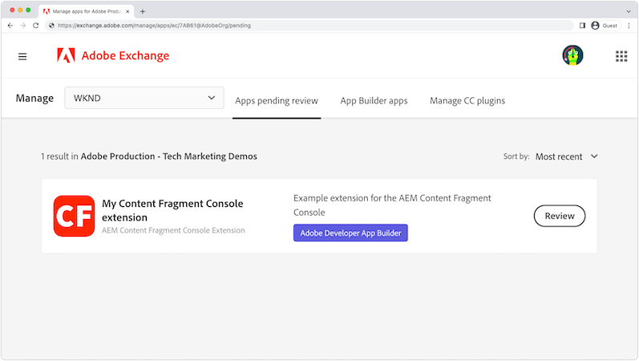

# AEM內容片段主控台擴充功能

[AEM內容片段主控台](https://experienceleague.adobe.com/docs/experience-manager-cloud-service/content/sites/administering/content-fragments/content-fragments-console.html) 擴充功能可透過兩個擴充點新增：按鈕 [內容片段主控台的](https://experienceleague.adobe.com/docs/experience-manager-cloud-service/content/sites/administering/content-fragments/content-fragments-console.html) 標題菜單或操作欄。 這些擴充功能是以JavaScript撰寫，以App Builder應用程式形式執行，並可實作自訂Web UI和無伺服器的Adobe I/O Runtime動作，以執行耗用更多資源、執行時間更長的工作。

{align="center"}

| 擴充功能類型 | 說明 | 參數 |
| :--- | :--- | :--- |
| 標題功能表 | 將按鈕新增至在 __零__ 已選取內容片段。 | 無. |
| 動作列 | 將按鈕新增至動作列，當 __一個或多個__ 已選取內容片段。 | 所選內容片段路徑的陣列。 |

單一AEM內容片段主控台擴充功能可包含零或一個標題功能表，以及零或一個動作列擴充類型。 如果需要多個相同類型的擴充功能類型，則必須建立多個AEM內容片段主控台擴充功能。

AEM內容片段主控台擴充功能，需要 [Adobe Developer Console專案](https://developer.adobe.com/uix/docs/services/aem-cf-console-admin/extension-development/#create-a-project-in-adobe-developer-console) 和 [App Builder應用程式](https://developer.adobe.com/uix/docs/services/aem-cf-console-admin/code-generation) 使用 `@adobe/aem-cf-admin-ui-ext-tpl` 範本，與Adobe Developer Console專案相關聯。

根據擴充功能的作用，在產生App Builder應用程式時，從下列功能中選取。 任何選項組合皆可用於擴充功能。

|  | 新增按鈕至 [標題功能表](./header-menu.md) | 新增按鈕至 [動作列](./action-bar.md) | 顯示 [強制回應](./modal.md) | 新增 [伺服器端處理常式](./runtime-action.md) |
| ------------------------------------------ | :-----------------------: | :----------------------: | :--------: | :--------------------:  |
| 未選取內容片段時可用 | ✔ |  |  |  |
| 選取一或多個內容片段時可用 |  | ✔ |  |  |
| 從用戶收集自定義輸入 |  |  | ✔️ |  |
| 向使用者顯示自訂意見 |  |  | ✔️ |  |
| 叫用AEM的HTTP要求 |  |  |  | ✔ |
| 調用Adobe/第三方服務的HTTP請求 |  |  |  | ✔ |

## Adobe Developer檔案

Adobe Developer包含AEM內容片段控制台擴充功能的開發人員詳細資訊。 請查看 [Adobe Developer內容以取得詳細技術資訊](https://developer.adobe.com/uix/docs/).

## 開發擴充功能

請依照下列步驟，了解如何產生、開發和部署AEM內容片段主控台擴充功能，以供AEMas a Cloud Service。

    <!-- Create Adobe Developer Project -->
    

        

            

                <figure class="image is-16by9">
                    
                </figure>
            

            

                

                    
1.建立專案

                    
建立Adobe Developer Console專案，定義其對其他Adobe服務的存取權並管理其部署。

                    <a href="./adobe-developer-console-project.md" class="spectrum-Button spectrum-Button--outline spectrum-Button--primary spectrum-Button--sizeM">
                        建立Adobe Developer專案
                    </a>
                

            

        

    

    <!-- Generate an Extension app -->
    

        

            

                <figure class="image is-16by9">
                    
                </figure>
            

            

                

                    
2.初始化擴充功能應用程式

                    
初始化AEM內容片段主控台擴充功能應用程式產生器應用程式，定義擴充功能的顯示位置及其執行的工作。

                    <a href="./app-initialization.md" class="spectrum-Button spectrum-Button--outline spectrum-Button--primary spectrum-Button--sizeM">
                        初始化擴充功能應用程式
                    </a>
                

            

        

    

    <!-- Extension registration -->
    

        

            

                <figure class="image is-16by9">
                    
                </figure>
            

            

                

                    
3.延期註冊

                    
在AEM內容片段控制台中，將擴充功能註冊為標題功能表或動作列擴充功能類型。

                    <a href="./extension-registration.md" class="spectrum-Button spectrum-Button--outline spectrum-Button--primary spectrum-Button--sizeM">
                        註冊擴充功能
                    </a>
                

            

        

    

    <!-- Header Menu -->
    

        

            

                <figure class="image is-16by9">
                    
                </figure>
            

            

                

                    
4a. 標題功能表

                    
了解如何建立AEM內容片段控制台標題功能表擴充功能。

                    <a href="./header-menu.md" class="spectrum-Button spectrum-Button--outline spectrum-Button--primary spectrum-Button--sizeM">
                        擴充標題功能表
                    </a>
                

            

        

    

    <!-- Action Bar -->
    

        

            

                <figure class="image is-16by9">
                    
                </figure>
            

            

                

                    
4b. 動作列

                    
了解如何建立AEM內容片段控制台動作列擴充功能。

                    <a href="./action-bar.md" class="spectrum-Button spectrum-Button--outline spectrum-Button--primary spectrum-Button--sizeM">
                        擴充動作列
                    </a>
                

            

        

    

    <!-- Modal -->
    

        

            

                <figure class="image is-16by9">
                    
                </figure>
            

            

                

                    
5.強制回應

                    
在擴充功能中新增自訂強制回應，供使用者建立自訂體驗。 模型通常會收集使用者的輸入，並顯示操作的結果。

                    <a href="./modal.md" class="spectrum-Button spectrum-Button--outline spectrum-Button--primary spectrum-Button--sizeM">
                        新增強制回應視窗
                    </a>
                

            

        

    

    <!-- Adobe I/O Runtime action -->
    

        

            

                <figure class="image is-16by9">
                    
                </figure>
            

            

                

                    
6.Adobe I/O Runtime行動

                    
新增無伺服器Adobe I/O Runtime動作，擴充功能可叫用以與內容片段和AEM互動，以執行自訂業務操作。

                    <a href="./runtime-action.md" class="spectrum-Button spectrum-Button--outline spectrum-Button--primary spectrum-Button--sizeM">
                        新增Adobe I/O Runtime動作
                    </a>
                

            

        

    

    <!-- Test -->
    

        

            

                <figure class="image is-16by9">
                    
                </figure>
            

            

                

                    
7.測試

                    
在開發期間測試擴充功能，並使用特殊URL將完成的擴充功能共用給QA或UAT測試者。

                    <a href="./test.md" class="spectrum-Button spectrum-Button--outline spectrum-Button--primary spectrum-Button--sizeM">
                        測試擴充功能
                    </a>
                

            

        

    

    <!-- Extension deployment -->
    

        

            

                <figure class="image is-16by9">
                    
                </figure>
            

            

                

                    
8.生產部署

                    
部署擴充功能以Adobe I/O讓AEM使用者能使用。 您也可以更新和移除擴充功能。

                    <a href="./deploy.md" class="spectrum-Button spectrum-Button--outline spectrum-Button--primary spectrum-Button--sizeM">
                        部署至生產環境
                    </a>
                

            

        

    

## 範例擴充功能

範例AEM內容片段主控台擴充功能。

    <!-- Bulk property update extension -->
    

        

            

                <figure class="image is-16by9">
                    
                </figure>
            

            

                

                    
大量屬性更新擴充功能

                    
探索動作列擴充功能範例，此範例會大量更新所選內容片段上的屬性。

                    <a href="./example-extensions/bulk-property-update.md" class="spectrum-Button spectrum-Button--outline spectrum-Button--primary spectrum-Button--sizeM">
                        探索範例擴充功能
                    </a>
                

            

        

    

    <!-- Image Generartion update extension -->
    

        

            

                <figure class="image is-16by9">
                    
                </figure>
            

            

                

                    
OpenAI型影像產生與上傳至AEM擴充功能

                    
探索使用OpenAI產生影像、將影像上傳至AEM，以及更新所選內容片段上影像屬性的動作列擴充功能範例。

                    <a href="./example-extensions/image-generation-and-image-upload.md" class="spectrum-Button spectrum-Button--outline spectrum-Button--primary spectrum-Button--sizeM">
                        探索範例擴充功能
                    </a>
                

            

        

    

