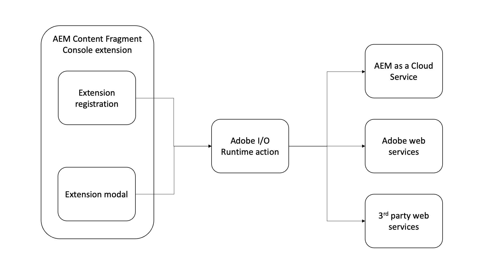

# Adobe I/O Runtime行動

{align="center"}

AEM內容片段擴充功能可選擇包含任何數量 [Adobe I/O Runtime動作](https://developer.adobe.com/runtime/docs/).

Adobe I/O Runtime動作是無伺服器的函式，可由擴充功能叫用。 動作對於執行需要與AEM或其他Adobe網站服務互動的工作很實用。
動作通常對執行長時間執行（只要超過幾秒的時間）工作，或對AEM或其他網站服務提出HTTP要求最有用。

使用Adobe I/O Runtime動作執行工作的優點如下：

+ 動作是在瀏覽器外部執行的無伺服器功能，不需要擔心CORS
+ 使用者無法中斷動作（例如重新整理瀏覽器）
+ 動作為非同步，因此可視需要執行，而不會封鎖使用者

在AEM內容片段擴充功能的內容中，動作通常用於直接與AEMas a Cloud Service通訊，通常是：

+ 從AEM收集關於內容片段的相關資料
+ 對內容片段執行自訂操作
+ 量身打造內容片段

當AEM內容片段擴充功能在內容片段主控台中呈現時，擴充功能及其支援動作可叫用任何可用的AEM HTTP API，包括自訂AEM API端點。

## 叫用動作

Adobe I/O Runtime動作主要是從AEM內容片段擴充功能的兩個位置叫用：

1. 此 [擴展註冊](./extension-registration.md) `onClick(..)` 處理常式
1. 在 [模態](./modal.md)

### 從擴展註冊

Adobe I/O Runtime動作可從擴充功能註冊程式碼直接呼叫。 最常見的使用案例是將動作系結至 [標題功能表](./header-menu.md#no-modal)&#39;s按鈕未使用 [模型](./modal.md).

+ `./src/aem-cf-console-admin-1/web-src/src/components/ExtensionRegistration.js`

```javascript
// allActions is an object containing all the actions defined in the extension's manifest
import allActions from '../config.json'

// actionWebInvoke is a helper that invokes an action
import actionWebInvoke from '../utils'
...
function ExtensionRegistration() {
  const init = async () => {
    const guestConnection = await register({
      id: extensionId, // A unique ID for the extension
      methods: {
        // Configure your header menu button here
        headerMenu: {
          getButton() {
            return {
              'id': 'example.my-header-menu-extension',  // Unique ID for the button
              'label': 'My header menu extension',       // Button label 
              'icon': 'Edit'                             // Button icon from https://spectrum.adobe.com/page/icons/
            }
          },

          // Click handler for the extension button
          onClick() {
            // Set the HTTP headers required to access the Adobe I/O runtime action
            const headers = {
              'Authorization': 'Bearer ' + guestConnection.sharedContext.get('auth').imsToken,
              'x-gw-ims-org-id': guestConnection.sharedContext.get('auth').imsOrg
            };

            // Set the parameters to pass to the Adobe I/O Runtime action
            const params = {
              aemHost: `https://${guestConnection.sharedContext.get('aemHost')}`, // Pass in the AEM host if the action interacts with AEM
              aemAccessToken: guestConnection.sharedContext.get('auth').imsToken
            };

            try {
              // Invoke Adobe I/O Runtime action named `generic`, with the configured headers and parameters.
              const actionResponse = await actionWebInvoke(allActions['generic'], headers, params);
            } catch (e) {
              // Log and store any errors
              console.error(e)
            }           
          }
        }
      }
    })
  }
  init().catch(console.error);
}
```

### 從強制回應視窗

可以直接從模組呼叫Adobe I/O Runtime動作，以執行更多參與的工作，尤其是仰賴與AEMas a Cloud Service、Adobe網站服務或甚至協力廠商服務通訊的工作。

Adobe I/O Runtime動作是以Node.js為基礎的JavaScript應用程式，會在無伺服器Adobe I/O Runtime環境中執行。 擴充功能可透過HTTP定址這些動作。

+ `./src/aem-cf-console-admin-1/web-src/src/components/MyModal.js`

```javascript
import React, { useState, useEffect } from 'react'
import { attach } from "@adobe/uix-guest"
import {
  Flex,
  Provider,
  Content,
  defaultTheme,
  Text,
  ButtonGroup,
  Button
} from '@adobe/react-spectrum'
import Spinner from "./Spinner"
import { useParams } from "react-router-dom"
import { extensionId } from "./Constants"

export default function MyModal() {
  // Initial modal views for Action Bar extensions typically pass in the list of selected Content Fragment Paths from ExtensionRegistration.js
  // Get the paths from useParams() and split on delimiter used
  let { selection } = useParams();
  let contentFragmentPaths = selection?.split('|') || [];

  const [actionInvokeInProgress, setActionInvokeInProgress] = useState(false);
  const [actionResponse, setActionResponse] = useState();

  // Asynchronously attach the extension to AEM. 
  // Wait or the guestConnection to be set before doing anything in the modal.
  const [guestConnection, setGuestConnection] = useState()
  useEffect(() => {
    (async () => {
      const guestConnection = await attach({ id: extensionId })
      setGuestConnection(guestConnection);
    })()
  }, [])

  if (!guestConnection) {
    // If the guestConnection is not initialized, display a loading spinner
    return <Spinner />
  } else if (!actionResponse) {
    // Else if the modal is ready to render and has not called the Adobe I/O Runtime action yet
    return (
        <Provider theme={defaultTheme} colorScheme='light'>
            <Content width="100%">
                <Flex width="100%">
                    <Text>
                        The selected Content Fragments are: { contentFragmentPaths.join(', ') }
                    </Text>                    

                     <ButtonGroup align="end">
                        <Button variant="cta" onPress={doWork}>Do work</Button>
                        <Button variant="primary" onPress={() => guestConnection.host.modal.close()}>Close</Button>
                    </ButtonGroup>
                </Flex>
            </Content>
        </Provider>
    )
  } else {
    // Else the modal has called the Adobe I/O Runtime action and is ready to render the response
    return (
        <Provider theme={defaultTheme} colorScheme='light'>
            <Content width="100%">
                <Flex width="100%">
                    <Text>
                        Done! The response from the action is: { actionResponse }
                    </Text>                    

                     <ButtonGroup align="end">
                        <Button variant="primary" onPress={() => guestConnection.host.modal.close()}>Close</Button>
                    </ButtonGroup>
                </Flex>
            </Content>
        </Provider>
    )
  }

  /**
   * Invoke the Adobe I/O Runtime action and store the response in the React component's state.
   */
  async function doWork() {
    // Mark the extension as invoking the action, so the loading spinner is displayed
    setActionInvokeInProgress(true);

    // Set the HTTP headers to access the Adobe I/O runtime action
    const headers = {
      'Authorization': 'Bearer ' + guestConnection.sharedContext.get('auth').imsToken,
      'x-gw-ims-org-id': guestConnection.sharedContext.get('auth').imsOrg
    };

    // Set the parameters to pass to the Adobe I/O Runtime action
    const params = {
      aemHost: `https://${guestConnection.sharedContext.get('aemHost')}`,
      contentFragmentPaths: contentFragmentPaths
    };

    try {
      // Invoke Adobe I/O Runtime action with the configured headers and parameters
      // Invoke the Adobe I/O Runtime action named `generic`.
      const actionResponse = await actionWebInvoke(allActions['generic'], headers, params);

      // Set the response from the Adobe I/O Runtime action
      setActionResponse(actionResponse);
    } catch (e) {
      // Log and store any errors
      console.error(e)
    }

    // Set the action as no longer being invoked, so the loading spinner is hidden
    setActionInvokeInProgress(false);
  }
}
```

## Adobe I/O Runtime行動

+ `src/aem-cf-console-admin-1/actions/generic/index.js`

```javascript
const fetch = require('node-fetch')
const { Core } = require('@adobe/aio-sdk')
const { errorResponse, getBearerToken, stringParameters, checkMissingRequestInputs } = require('../utils')

async function main (params) {
  const logger = Core.Logger('main', { level: params.LOG_LEVEL || 'info' })

  try {
    logger.debug(stringParameters(params))

    // Check for missing request input parameters and headers
    const requiredParams = [ 'aemHost', 'contentFragmentPaths' ]
    const requiredHeaders = ['Authorization']
    const errorMessage = checkMissingRequestInputs(params, requiredParams, requiredHeaders)
    if (errorMessage) {
      // return and log client errors
      return errorResponse(400, errorMessage, logger)
    }
      
    // Extract the user Bearer token from the Authorization header used to authenticate the request to AEM
    const accessToken = getBearerToken(params);

    // Example HTTP request to AEM payload; This updates all 'title' properties of the Content Fragments to 'Hello World'
    const body = {
      "properties": {
        "elements": {
          "title": {
            "value": "Hello World"
          }
        }
      }
    };

    let results = await Promise.all(params.contentFragmentPaths.map(async (contentFragmentPath) => {
      // Invoke the AEM HTTP Assets Content Fragment API to update each Content Fragment
      // The AEM host is passed in as a parameter to the Adobe I/O Runtime action
      const res = await fetch(`${params.aemHost}${contentFragmentPath.replace('/content/dam/', '/api/assets/')}.json`, { 
        method: 'put',
        body: JSON.stringify(body),
        headers: {
          // Pass in the accessToken as AEM Author service requires authentication/authorization
          'Authorization': `Bearer ${accessToken}`,
          'Content-Type': 'application/json'
        }
      });

      if (res.ok) {
        logger.info(`Successfully updated title of ${contentFragmentPath}`);
        return { contentFragmentPath, status: res.status, statusText: res.statusText, body: await res.json() };
      } else {
        logger.info(`Failed to update title of ${contentFragmentPath}`);
        return { contentFragmentPath, status: res.status, statusText: res.statusText, body: await res.text() };
      }
    }));

    // Return a response to the AEM Content Fragment extension React application
    const response = {
      statusCode: 200,
      body: results
    };
    return response;

  } catch (error) {
    logger.error(error)
    return errorResponse(500, 'server error', logger)
  }
}
```

## AEM HTTP API

下列AEM HTTP API通常用於透過擴充功能與AEM互動：

+ [AEM GraphQL API](https://experienceleague.adobe.com/landing/experience-manager/headless/developer.html?lang=zh-Hant)
+ [AEM Assets HTTP API](https://experienceleague.adobe.com/docs/experience-manager-cloud-service/content/assets/admin/mac-api-assets.html)
   + [AEM Assets HTTP API 內容片段支援](https://experienceleague.adobe.com/docs/experience-manager-cloud-service/content/assets/admin/assets-api-content-fragments.html)
+ [AEM QueryBuilder API](https://experienceleague.adobe.com/docs/experience-manager-cloud-service/content/implementing/developing/full-stack/search/query-builder-api.html)
+ [完整AEMas a Cloud ServiceAPI參考](https://experienceleague.adobe.com/docs/experience-manager-cloud-service/content/implementing/developing/reference-materials.html)


## Adobenpm模組

以下是開發Adobe I/O Runtime動作時實用的npm模組：

+ [@adobe/aio-sdk](https://www.npmjs.com/package/@adobe/aio-sdk)
   + [核心SDK](https://github.com/adobe/aio-sdk-core)
   + [狀態庫](https://github.com/adobe/aio-lib-state)
   + [檔案庫](https://github.com/adobe/aio-lib-files)
   + [Adobe Target資料庫](https://github.com/adobe/aio-lib-target)
   + [Adobe Analytics資料庫](https://github.com/adobe/aio-lib-analytics)
   + [Adobe Campaign Standard資料庫](https://github.com/adobe/aio-lib-campaign-standard)
   + [Adobe客戶設定檔程式庫](https://github.com/adobe/aio-lib-customer-profile)
   + [Adobe Audience Manager客戶資料庫](https://github.com/adobe/aio-lib-audience-manager-cd)
   + [Adobe I/O事件](https://github.com/adobe/aio-lib-events)
+ [@adobe/aio-lib-core-networking](https://github.com/adobe/aio-lib-core-networking)
+ [@adobe/node-httptransfer](https://github.com/adobe/node-httptransfer)