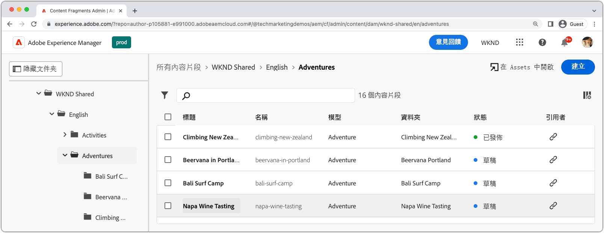
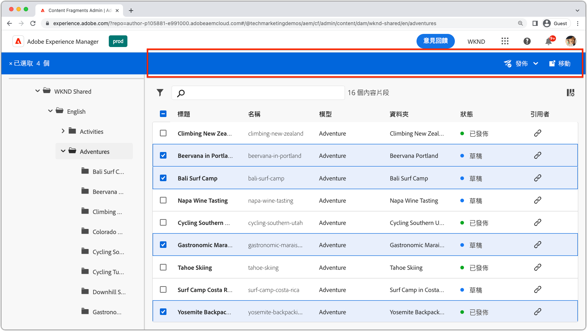
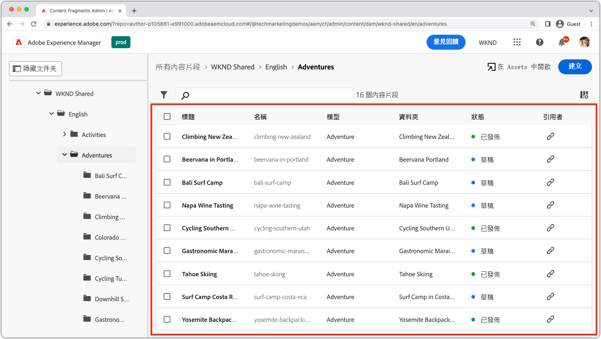
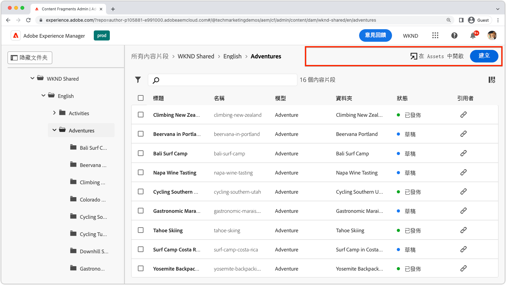
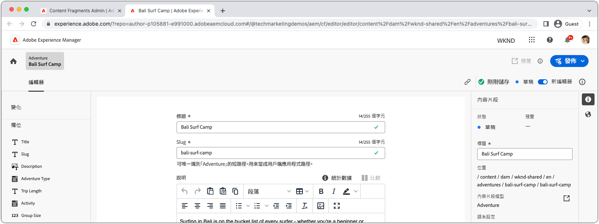
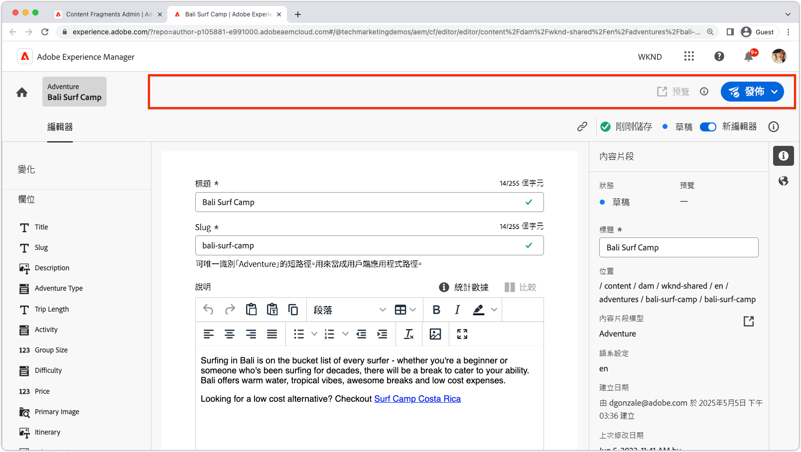
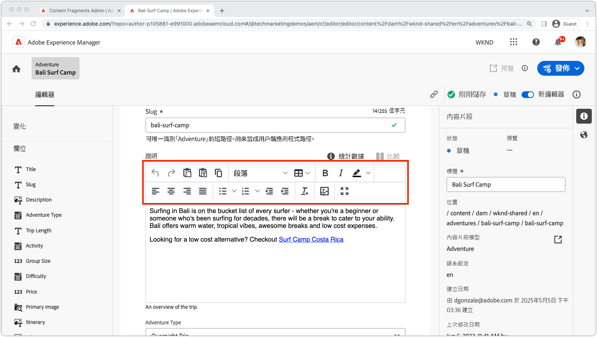
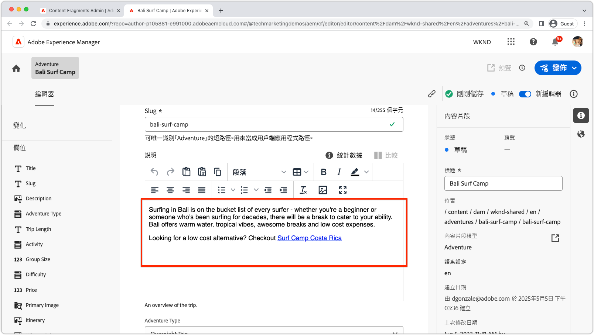
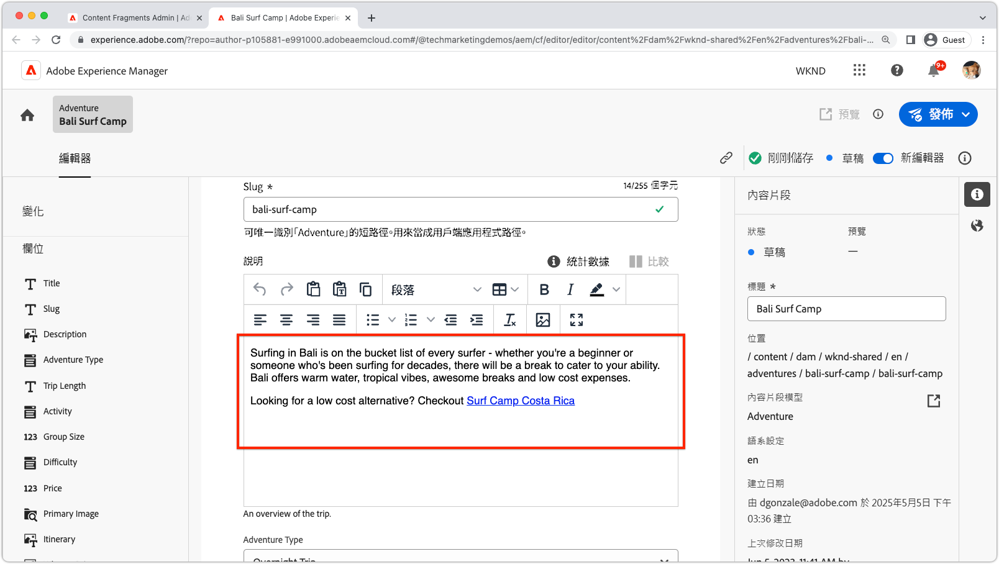

# AEM內容片段擴充性

AEM內容片段UI是功能強大的可擴充UI，用於管理建立、管理和編輯內容片段。 有數個擴充點可用來自訂UI以符合您的需求。 根據您要擴充的UI，有不同的擴充點可供使用。

## 內容片段主控台擴充功能點

AEM (Adobe Experience Manager)中的內容片段主控台是一個使用者介面，為管理和組織內容片段提供集中式位置。 它提供全方位的工具和功能集，用以建立、編輯、發佈和追蹤內容片段，讓使用者能夠有效地管理各種管道和接觸點上的結構化內容。

[AEM內容片段主控台](https://experienceleague.adobe.com/docs/experience-manager-cloud-service/content/sites/administering/content-fragments/content-fragments-console.html)是用於列出和管理內容片段的可擴充UI。 [AEM內容片段主控台擴充功能是使用`@adobe/aem-cf-admin-ui-ext-tpl` App Builder範本建立](https://developer.adobe.com/uix/docs/services/aem-cf-console-admin/code-generation)。

下列內容片段主控台擴充功能點可供使用：

      

        

          

            <figure class="image is-16by9">
              
            </figure>
          

          

            

              
<a href="https://developer.adobe.com/uix/docs/services/aem-cf-console-admin/api/action-bar/" title="動作列" target="_blank" rel="referrer">動作列</a>

              
自訂當選取一或多個內容片段時的動作。

              <a href="https://developer.adobe.com/uix/docs/services/aem-cf-console-admin/api/action-bar/" class="spectrum-Button spectrum-Button--outline spectrum-Button--primary spectrum-Button--sizeM" target="_blank" rel="referrer">
                檢視檔案
              </a>
            

          

        

      

  

    

      

        <figure class="image is-16by9">
          
        </figure>
      

      

        

          
<a href="https://developer.adobe.com/uix/docs/services/aem-cf-console-admin/api/grid-columns/" title="格線欄" target="_blank" rel="referrer">格線欄</a>

          
自訂內容片段清單中顯示的資料。

          <a href="https://developer.adobe.com/uix/docs/services/aem-cf-console-admin/api/grid-columns/" class="spectrum-Button spectrum-Button--outline spectrum-Button--primary spectrum-Button--sizeM" target="_blank" rel="referrer">
            檢視檔案
          </a>
        

      

    

  

  

    

      

        <figure class="image is-16by9">
          
        </figure>
      

      

        

          
<a href="https://developer.adobe.com/uix/docs/services/aem-cf-console-admin/api/header-menu/" title="頁首功能表" target="_blank" rel="referrer">頁首功能表</a>

          
自訂未選取內容片段時的動作。

          <a href="https://developer.adobe.com/uix/docs/services/aem-cf-console-admin/api/header-menu/" class="spectrum-Button spectrum-Button--outline spectrum-Button--primary spectrum-Button--sizeM" target="_blank" rel="referrer">
            檢視檔案
          </a>
        

      

    

  
  

## 內容片段編輯器擴充點

AEM (Adobe Experience Manager)中的內容片段編輯器是一個使用者介面元件，可讓使用者建立、編輯和管理內容片段。 它提供視覺上直覺式且方便使用的環境，讓您使用結構化內容，讓使用者能夠定義及組織內容元素、套用範本、管理變數，以及預覽內容在不同管道中的顯示方式。 內容片段編輯器簡化了建立可重複使用且模組化內容的流程，這些內容可以輕鬆地在多種數位體驗之間分發和發佈。

AEM內容片段編輯器是用於編輯內容片段的可擴充UI。 [AEM內容片段編輯器延伸模組是使用`@adobe/aem-cf-editor-ui-ext-tpl` App Builder範本建立](https://developer.adobe.com/uix/docs/services/aem-cf-editor/code-generation/)。

下列內容片段編輯器擴充功能點可供使用：

    

      

        

          <figure class="image is-16by9">
            
          </figure>
        

        

          

            
<a href="https://developer.adobe.com/uix/docs/services/aem-cf-editor/api/header-menu/" title="頁首功能表" target="_blank" rel="referrer">頁首功能表</a>

            
在內容片段編輯器的標頭功能表中自訂動作。

            <a href="https://developer.adobe.com/uix/docs/services/aem-cf-editor/api/header-menu" class="spectrum-Button spectrum-Button--outline spectrum-Button--primary spectrum-Button--sizeM" target="_blank" rel="referrer">
              檢視檔案
            </a>
          

        

      

    

  

    

      

        <figure class="image is-16by9">
          
        </figure>
      

      

        

          
<a href="https://developer.adobe.com/uix/docs/services/aem-cf-editor/api/rte-toolbar/" title="RTF編輯器工具列"  target="_blank" rel="referrer">RTF編輯器工具列</a>

          
新增自訂按鈕到內容片段編輯器的RTF編輯器(RTE)。

          <a href="https://developer.adobe.com/uix/docs/services/aem-cf-editor/api/rte-toolbar/" class="spectrum-Button spectrum-Button--outline spectrum-Button--primary spectrum-Button--sizeM" target="_blank" rel="referrer">
            檢視檔案
          </a>
        

      

    

  

    

      

        <figure class="image is-16by9">
          
        </figure>
      

      

        

          
<a href="https://developer.adobe.com/uix/docs/services/aem-cf-editor/api/rte-widgets/" title="RTF編輯器Widget" target="_blank" rel="referrer">RTF編輯器Widget</a>

          
在RTE中自訂繫結至按鍵的動作。

          <a href="https://developer.adobe.com/uix/docs/services/aem-cf-editor/api/rte-widgets/" class="spectrum-Button spectrum-Button--outline spectrum-Button--primary spectrum-Button--sizeM" target="_blank" rel="referrer">
            檢視檔案
          </a>
        

      

    

  

  

    

      

        <figure class="image is-16by9">
          
        </figure>
      

      

        

          
<a href="https://developer.adobe.com/uix/docs/services/aem-cf-editor/api/rte-badges/ " title="RTF編輯器徽章" target="_blank" rel="referrer">RTF編輯器徽章</a>

          
在RTE內自訂不可編輯的樣式區塊。

          <a href="https://developer.adobe.com/uix/docs/services/aem-cf-editor/api/rte-badges/" class="spectrum-Button spectrum-Button--outline spectrum-Button--primary spectrum-Button--sizeM" target="_blank" rel="referrer">
            檢視檔案
          </a>
        

      

    

  

## 擴充功能範例

歡迎使用AEM UI擴充功能程式碼範例的集合！ 此資源旨在為您提供延伸Adobe Experience Manager (AEM)使用者介面的實用示範和深入分析。 無論您是想增強AEM功能的開發人員，這些程式碼範例都可作為有價值的參考。

  

    

      

        <figure class="image is-16by9">
          
        </figure>
      

      

        

          
<a href="./examples/console-bulk-property-update.md" title="大量屬性更新">大量內容片段屬性更新</a>

          
包含模組和Adobe I/O Runtime動作的內容片段主控台動作列擴充功能。

          <a href="./examples/console-bulk-property-update.md" class="spectrum-Button spectrum-Button--outline spectrum-Button--primary spectrum-Button--sizeM">
            檢視範例
          </a>
        

      

    

  

  

        

            

                <figure class="image is-16by9">
                    
                </figure>
            

            

                

                    
<a href="./examples/console-image-generation-and-image-upload.md" title="OpenAI型影像產生並上傳至AEM擴充功能">OpenAPI影像產生</a>

                    
探索使用OpenAI產生影像、上傳至AEM並更新所選內容片段上影像屬性的動作列擴充功能範例。

                    <a href="./examples/console-image-generation-and-image-upload.md" class="spectrum-Button spectrum-Button--outline spectrum-Button--primary spectrum-Button--sizeM">
                        檢視範例
                    </a>
                

            

        

    
    
  

    

      

        <figure class="image is-16by9">
          
        </figure>
      

      

        

          
<a href="./examples/custom-grid-columns.md" title="自訂欄">自訂欄</a>

          
新增自訂欄到內容片段控制檯。

          <a href="./examples/custom-grid-columns.md" class="spectrum-Button spectrum-Button--outline spectrum-Button--primary spectrum-Button--sizeM">
            檢視範例
          </a>
        

      

    

  
    
  

    

      

        <figure class="image is-16by9">
          
        </figure>
      

      

        

          
<a href="./examples/editor-export-to-xml.md" title="匯出至XML">匯出至XML</a>

          
從內容片段編輯器將內容片段匯出為XML。

          <a href="./examples/editor-export-to-xml.md" class="spectrum-Button spectrum-Button--outline spectrum-Button--primary spectrum-Button--sizeM">
            檢視範例
          </a>
        

      

    

  
    
  

    

      

        <figure class="image is-16by9">
          
        </figure>
      

      

        

          
<a href="./examples/editor-rte-toolbar.md" title="RTF編輯器工具列按鈕">RTF編輯器工具列按鈕</a>

          
在內容片段編輯器中，將自訂工具列按鈕新增到RTE欄位。

          <a href="./examples/editor-rte-toolbar.md" class="spectrum-Button spectrum-Button--outline spectrum-Button--primary spectrum-Button--sizeM">
            檢視範例
          </a>
        

      

    

  
   
  

    

      

        <figure class="image is-16by9">
          
        </figure>
      

      

        

          
<a href="./examples/editor-rte-toolbar.md" title="RTF編輯器Widget">RTF編輯器Widget</a>

          
在內容片段編輯器中將Widget新增至RTF編輯器。

          <a href="./examples/editor-rte-widget.md" class="spectrum-Button spectrum-Button--outline spectrum-Button--primary spectrum-Button--sizeM">
            檢視範例
          </a>
        

      

    

  
   
  

    

      

        <figure class="image is-16by9">
          
        </figure>
      

      

        

          
<a href="./examples/editor-rte-badges.md" title="RTF編輯器徽章">RTF編輯器徽章</a>

          
在內容片段編輯器中新增徽章至RTF編輯器。

          <a href="./examples/editor-rte-badges.md" class="spectrum-Button spectrum-Button--outline spectrum-Button--primary spectrum-Button--sizeM">
            檢視範例
          </a>
        

      

    

  

    

      

        <figure class="image is-16by9">
          
        </figure>
      

      

        

          
<a href="./examples/editor-custom-field.md" title="自訂欄位">自訂欄位</a>

          
建立自訂內容片段欄位。

          <a href="./examples/editor-custom-field.md" class="spectrum-Button spectrum-Button--outline spectrum-Button--primary spectrum-Button--sizeM">
            檢視範例
          </a>
        

      

    

  
 

