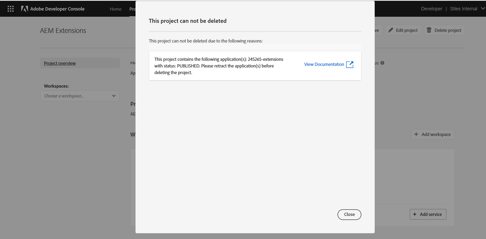

# 部署擴充功能

若要在AEM as a Cloud Service環境中使用，必須部署和核准App Builder擴充功能應用程式。

部署擴充功能App Builder應用程式時，請考量下列事項：

+ 擴充功能會部署至Adobe Developer Console專案工作區。 預設工作區為：
   + __生產__&#x200B;工作區包含所有AEM as a Cloud Service中可用的擴充功能部署。
   + __階段__工作區可作為開發人員工作區。 AEM as a Cloud Service中沒有部署至中繼工作區的擴充功能。
Adobe Developer Console工作區與AEM as a Cloud Service環境型別沒有任何直接關聯。
+ 部署至生產工作區的擴充功能會顯示在該擴充功能所在的Adobe組織的所有AEM as a Cloud Service環境中。
擴充功能無法藉由新增檢查AEM as a Cloud Service主機名稱[&#128279;](https://developer.adobe.com/uix/docs/guides/publication/#enabling-extension-only-on-specific-aem-environments)的條件式邏輯，限製為已登入的環境。
+ AEM as a Cloud Service上可以使用多個擴充功能。 Adobe建議使用App Builder應用程式的每個擴充功能來解決單一業務目標。 也就是說，單一擴充功能App Builder應用程式可實作支援共同業務目標的多個擴充點。

## 初始部署

若要在AEM as a Cloud Service環境中使用擴充功能，必須將其部署至Adobe Developer Console。

部署程式分為兩個邏輯步驟：

1. 開發人員將擴充功能App Builder應用程式部署至Adobe Developer Console。
1. 部署管理員或企業所有者核准擴充功能。

### 部署擴充功能

將擴充功能部署至生產工作區。 部署至生產工作區的擴充功能會自動新增至部署該擴充功能的Adobe組織中的所有AEM as a Cloud Service作者服務。

1. 開啟命令列，前往已更新擴充功能App Builder應用程式的根目錄。
1. 確認生產工作區為作用中

   ```shell
   $ aio app use -w Production
   ```

   合併對`.env`和`.aio`所做的任何變更。

1. 部署更新的擴充功能App Builder應用程式。

   ```shell
   $ aio app deploy
   ```

#### 要求部署核准

{align="center"}

1. 登入[Adobe Developer Console](https://developer.adobe.com)
1. 選取&#x200B;__主控台__
1. 導覽至&#x200B;__專案__
1. 選取與擴充功能相關聯的專案
1. 選取&#x200B;__生產__&#x200B;工作區
1. 選取&#x200B;__提交核准__
1. 完成並提交表單，視需要更新欄位。

### 部署核准

{align="center"}

1. 登入[Adobe Exchange](https://exchange.adobe.com/)
1. 瀏覽至&#x200B;__管理__ > __擱置檢閱的應用程式__
1. __檢閱__&#x200B;擴充功能App Builder App
1. 如果可接受擴充功能變更，請&#x200B;__接受__&#x200B;檢閱。 這會立即在Adobe組織內的所有AEM as a Cloud Service Author服務上插入擴充功能。

擴充功能要求通過核准後，擴充功能會在AEM as a Cloud Service作者服務中立即啟用。

## 更新擴充功能

更新及擴充功能App Builder應用程式會遵循與[初始部署](#initial-deployment)相同的程式，但必須先撤銷現有的擴充功能部署。

### 撤銷擴充功能

若要部署新版本的擴充功能，必須先撤銷（或移除）。 雖然擴充功能已撤銷，但在AEM主控台中無法使用。

1. 登入[Adobe Exchange](https://exchange.adobe.com/)
1. 瀏覽至&#x200B;__管理__ > __App Builder應用程式__
1. __撤銷__&#x200B;要更新的擴充功能

撤銷擴充功能後，仍可在Extension Manager中以撤銷狀態看到。 若要完全移除它，您必須移除專案。

移除專案的按鈕位於右上方：

{align="center"}

擴充功能未撤銷前，將無法刪除專案：

{align="center"}

當擴充功能撤銷時，專案便可移除：

{align="center"}

移除專案後，擴充功能在Extension Manager中不再可見。

### 部署擴充功能

將擴充功能部署至生產工作區。 部署至生產工作區的擴充功能會自動新增至部署該擴充功能的Adobe組織中的所有AEM as a Cloud Service作者服務。

1. 開啟命令列，前往已更新擴充功能App Builder應用程式的根目錄。
1. 確認生產工作區為作用中

   ```shell
   $ aio app use -w Production
   ```

   合併對`.env`和`.aio`所做的任何變更。

1. 部署更新的擴充功能App Builder應用程式。

   ```shell
   $ aio app deploy
   ```

#### 要求部署核准

{align="center"}

1. 登入[Adobe Developer Console](https://developer.adobe.com)
1. 選取&#x200B;__主控台__
1. 導覽至&#x200B;__專案__
1. 選取與擴充功能相關聯的專案
1. 選取&#x200B;__生產__&#x200B;工作區
1. 選取&#x200B;__提交核准__
1. 完成並提交表單，視需要更新欄位。

#### 核准部署請求

{align="center"}

1. 登入[Adobe Exchange](https://exchange.adobe.com/)
1. 瀏覽至&#x200B;__管理__ > __擱置檢閱的應用程式__
1. __檢閱__&#x200B;擴充功能App Builder App
1. 如果可接受擴充功能變更，請&#x200B;__接受__&#x200B;檢閱。 這會立即在Adobe組織內的所有AEM as a Cloud Service Author服務上插入擴充功能。

擴充功能要求通過核准後，擴充功能會在AEM as a Cloud Service作者服務中立即啟用。

## 移除擴充功能


若要移除擴充功能，請從Adobe Exchange撤銷（或移除）該擴充功能。 擴充功能撤銷時，會從所有AEM as a Cloud Service Author服務中移除。

1. 登入[Adobe Exchange](https://exchange.adobe.com/)
1. 瀏覽至&#x200B;__管理__ > __App Builder應用程式__
1. __撤銷__&#x200B;要移除的擴充功能
