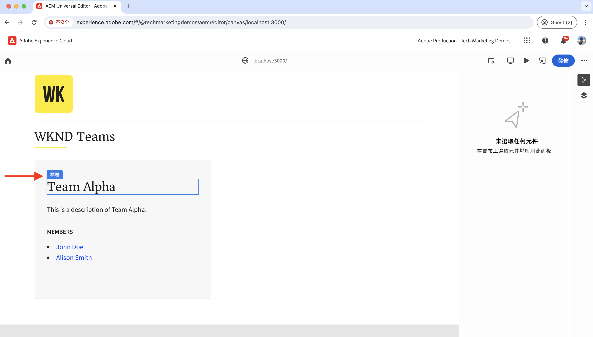
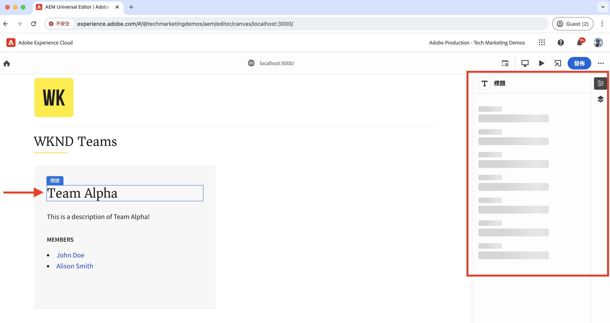
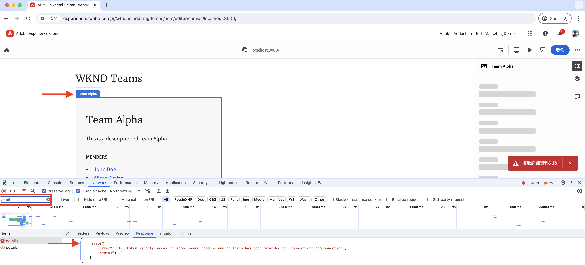
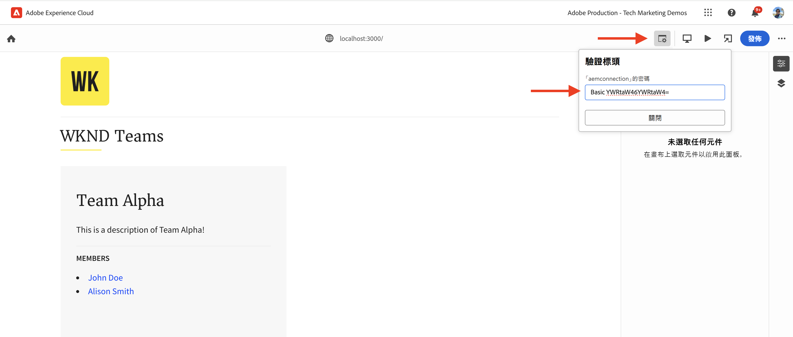
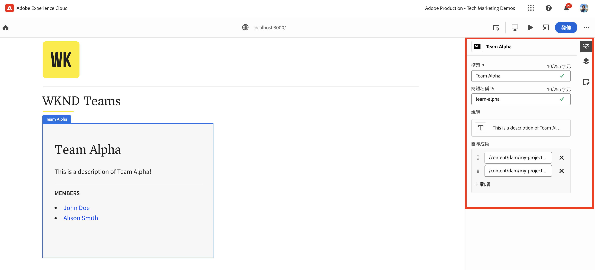
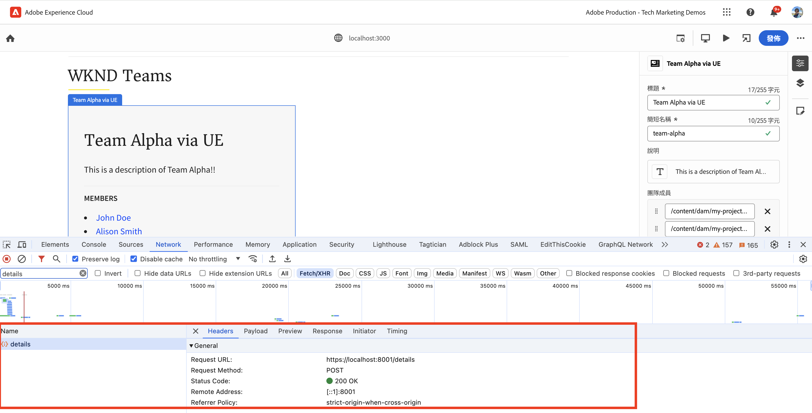
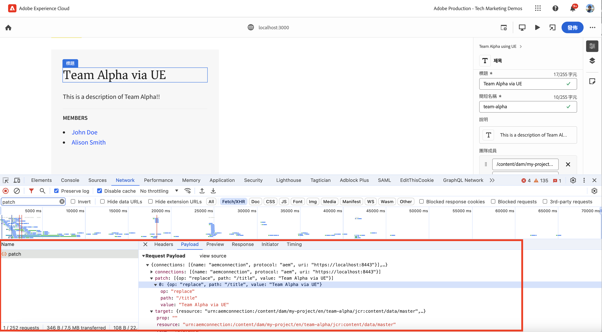
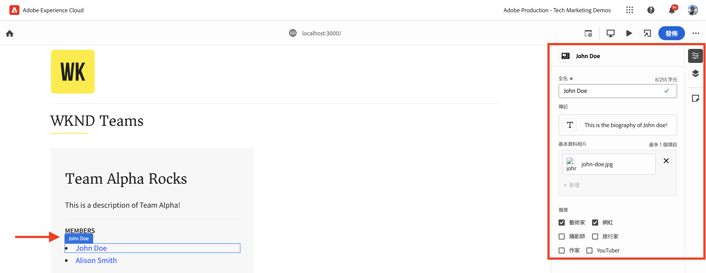
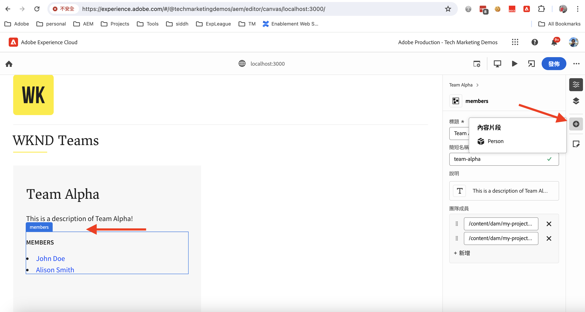
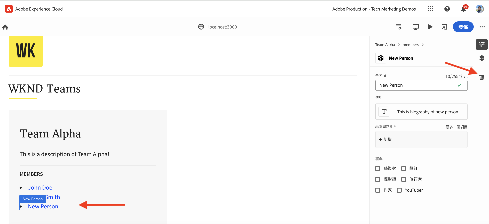

# 使用通用編輯器檢測React應用程式以編輯內容

瞭解如何使用Universal Editor檢測React應用程式以編輯內容。

## 先決條件

您已依照先前[本機開發設定](./local-development-setup.md)步驟的說明設定本機開發環境。

## 包含Universal Editor核心程式庫

讓我們從WKND Teams React應用程式中包含Universal Editor核心程式庫開始。 這是一個JavaScript程式庫，提供已編輯應用程式與通用編輯器之間的通訊層。

在React應用程式中納入Universal Editor核心程式庫的方式有兩種：

1. npm登入中的節點模組相依性，請參閱[@adobe/universal-editor-cors](https://www.npmjs.com/package/@adobe/universal-editor-cors)。
1. HTML檔案中的指令碼標籤(`<script>`)。

在本教學課程中，讓我們使用指令碼標籤方法。

1. 安裝`react-helmet-async`套件以管理React應用程式中的`<script>`標籤。

   ```bash
   $ npm install react-helmet-async
   ```

1. 更新WKND Teams React應用程式的`src/App.js`檔案，以包含Universal Editor核心程式庫。

   ```javascript
   ...
   import { Helmet, HelmetProvider } from "react-helmet-async";
   
   function App() {
   return (
       <HelmetProvider>
           <div className="App">
               <Helmet>
                   {/* AEM Universal Editor :: CORE Library
                     Loads the LATEST Universal Editor library
                   */}
                   <script
                       src="https://universal-editor-service.experiencecloud.live/corslib/LATEST"
                       async
                   />
               </Helmet>
               <Router>
                   <header>
                       <Link to={"/"}>
                       
                       </Link>
                       <hr />
                   </header>
                   <Routes>
                       <Route path="/" element={<Home />} />
                       <Route path="/person/:fullName" element={<Person />} />
                   </Routes>
               </Router>
           </div>
       </HelmetProvider>
   );
   }
   
   export default App;
   ```

## 新增中繼資料 — 內容來源

若要將WKND Teams React應用程式&#x200B;_與內容來源_&#x200B;連線以進行編輯，您必須提供連線中繼資料。 Universal Editor服務會使用此中繼資料來建立與內容來源的連線。

連線中繼資料儲存為HTML檔案中的`<meta>`標籤。 連線中繼資料的語法如下：

```html
<meta name="urn:adobe:aue:<category>:<referenceName>" content="<protocol>:<url>">
```

讓我們將連線中繼資料新增到`<Helmet>`元件內的WKND Teams React應用程式。 使用下列`<meta>`標籤更新`src/App.js`檔案。 在此範例中，內容來源是在`https://localhost:8443`上執行的本機AEM執行個體。

```javascript
...
function App() {
return (
    <HelmetProvider>
        <div className="App">
            <Helmet>
                {/* AEM Universal Editor :: CORE Library
                    Loads the LATEST Universal Editor library
                */}
                <script
                    src="https://universal-editor-service.experiencecloud.live/corslib/LATEST"
                    async
                />
                {/* AEM Universal Editor :: Connection metadata 
                    Connects to local AEM instance
                */}
                <meta
                    name="urn:adobe:aue:system:aemconnection"
                    content={`aem:https://localhost:8443`}
                />
            </Helmet>
            ...
    </HelmetProvider>
);
}

export default App;
```

`aemconnection`提供內容來源的簡短名稱。 後續檢測使用簡短名稱來參照內容來源。

## 新增中繼資料 — 本機通用編輯器服務設定

Universal Editor服務的本機復本不是由Adobe託管的通用編輯器服務，而是用於本機開發。 本機服務會繫結Universal Editor和AEM SDK，所以讓我們將本機Universal Editor服務中繼資料新增到WKND Teams React應用程式。

這些組態設定也會儲存為HTML檔案中的`<meta>`標籤。 本機Universal Editor服務中繼資料的語法如下：

```html
<meta name="urn:adobe:aue:config:service" content="<url>">
```

讓我們將連線中繼資料新增到`<Helmet>`元件內的WKND Teams React應用程式。 使用下列`<meta>`標籤更新`src/App.js`檔案。 在此範例中，本機Universal Editor服務正在`https://localhost:8001`上執行。

```javascript
...

function App() {
  return (
    <HelmetProvider>
      <div className="App">
        <Helmet>
          {/* AEM Universal Editor :: CORE Library
              Loads the LATEST Universal Editor library
          */}
          <script
            src="https://universal-editor-service.experiencecloud.live/corslib/LATEST"
            async
          />
          {/* AEM Universal Editor :: Connection metadata 
              Connects to local AEM instance
          */}
          <meta
            name="urn:adobe:aue:system:aemconnection"
            content={`aem:https://localhost:8443`}
          />
          {/* AEM Universal Editor :: Configuration for Service
              Using locally running Universal Editor service
          */}
          <meta
            name="urn:adobe:aue:config:service"
            content={`https://localhost:8001`}
          />
        </Helmet>
        ...
    </HelmetProvider>
);
}
export default App;
```

## 檢測React元件

若要編輯WKND Teams React應用程式的內容（例如&#x200B;_團隊標題和團隊說明_），您必須檢測React元件。 檢測表示將相關資料屬性(`data-aue-*`)新增至您要使用通用編輯器使其可編輯的HTML元素。 如需資料屬性的詳細資訊，請參閱[屬性和型別](https://experienceleague.adobe.com/en/docs/experience-manager-cloud-service/content/implementing/developing/universal-editor/attributes-types)。

### 定義可編輯的元素

讓我們從定義您要使用通用編輯器編輯的元素開始。 在WKND Teams React應用程式中，團隊標題和說明儲存在AEM的團隊內容片段中，因此是最佳編輯對象。

讓我們檢測`Teams` React元件，使團隊標題和說明可編輯。

1. 開啟WKND Teams React應用程式的`src/components/Teams.js`檔案。
1. 將`data-aue-prop`、`data-aue-type`和`data-aue-label`屬性新增至團隊標題和說明元素。

   ```javascript
   ...
   function Teams() {
       const { teams, error } = useAllTeams();
       ...
   
       return (
           <div className="team">
               // AEM Universal Editor :: Instrumentation using data-aue-* attributes
               <h2 className="team__title" data-aue-prop="title" data-aue-type="text" data-aue-label="title">{title}</h2>
               <p className="team__description" data-aue-prop="description" data-aue-type="richtext" data-aue-label="description">{description.plaintext}</p>
               ...
           </div>
       );
   }
   
   export default Teams;
   ```

1. 重新整理瀏覽器中載入WKND Teams React應用程式的「通用編輯器」頁面。 您現在可以看到專案團隊標題和說明元素是可編輯的。

   

1. 如果您嘗試使用內嵌編輯或屬性邊欄來編輯團隊標題或說明，它會顯示載入進度環但不允許您編輯內容。 因為通用編輯器不知道載入和儲存內容的AEM資源詳細資訊。

   

簡而言之，上述變更在通用編輯器中將專案團隊標題和說明元素標籤為可編輯。 不過，**您尚無法編輯（透過內嵌或屬性邊欄）並儲存變更**，因為您需要使用`data-aue-resource`屬性新增AEM資源詳細資料。 讓我們在下個步驟中進行。

### 定義AEM資源詳細資訊

若要將已編輯的內容儲存回AEM以及在屬性邊欄中載入內容，您必須將AEM資源詳細資料提供給通用編輯器。

在此案例中，AEM資源是Team內容片段路徑，所以讓我們將資源詳細資料新增至頂層`<div>`元素的`Teams` React元件。

1. 更新`src/components/Teams.js`檔案以將`data-aue-resource`、`data-aue-type`和`data-aue-label`屬性新增到最上層`<div>`專案。

   ```javascript
   ...
   function Teams() {
       const { teams, error } = useAllTeams();
       ...
   
       // Render single Team
       function Team({ _path, title, shortName, description, teamMembers }) {
           // Must have title, shortName and at least 1 team member
           if (!_path || !title || !shortName || !teamMembers) {
               return null;
           }
   
         return (
           // AEM Universal Editor :: Instrumentation using data-aue-* attributes
           <div className="team" data-aue-resource={`urn:aemconnection:${_path}/jcr:content/data/master`} data-aue-type="reference" data-aue-label={title}>
           ...
           </div>
       );
       }
   }
   export default Teams;
   ```

   `data-aue-resource`屬性的值是團隊內容片段的AEM資源路徑。 `urn:aemconnection:`首碼使用連線中繼資料中定義的內容來源簡短名稱。

1. 重新整理瀏覽器中載入WKND Teams React應用程式的「通用編輯器」頁面。 您現在可以看到頂層的Team元素可供編輯，但屬性邊欄仍未載入內容。 在瀏覽器的網路標籤中，您可以看到載入內容的`details`請求出現401未授權錯誤。 它嘗試使用IMS權杖進行驗證，但本機AEM SDK不支援IMS驗證。

   

1. 若要修正401未授權錯誤，您必須使用通用編輯器中的&#x200B;**驗證標題**&#x200B;選項，將本機AEM SDK驗證詳細資料提供給通用編輯器。 作為其本機AEM SDK，請將`admin:admin`認證的值設定為`Basic YWRtaW46YWRtaW4=`。

   

1. 重新整理瀏覽器中載入WKND Teams React應用程式的「通用編輯器」頁面。 您現在可以看到屬性邊欄正在載入內容，而且您可以內嵌或使用屬性邊欄編輯團隊標題和說明。

   

#### 隱藏在機殼下

屬性邊欄會使用本機Universal Editor服務，從AEM資源載入內容。 使用瀏覽器的網路標籤，您可以看到本機通用編輯器服務(`https://localhost:8001/details`)的POST要求，以載入內容。

當您使用內嵌編輯或屬性邊欄來編輯內容時，變更會使用本機Universal Editor服務儲存回AEM資源。 使用瀏覽器的網路標籤，您可以看到本機通用編輯器服務（`https://localhost:8001/update`或`https://localhost:8001/patch`）的POST要求，以儲存內容。



要求裝載JSON物件包含必要的詳細資料，例如內容伺服器(`connections`)、資源路徑(`target`)和更新的內容(`patch`)。



### 展開可編輯的內容

讓我們展開可編輯的內容，並將檢測套用至&#x200B;**團隊成員**，以便您可以使用屬性邊欄來編輯團隊成員。

如上所述，我們將相關的`data-aue-*`屬性新增到`Teams` React元件中的團隊成員。

1. 更新`src/components/Teams.js`檔案以新增資料屬性至`<li key={index} className="team__member">`元素。

   ```javascript
   ...
   function Teams() {
       const { teams, error } = useAllTeams();
       ...
   
       <div>
           <h4 className="team__members-title">Members</h4>
           <ul className="team__members">
               {/* Render the referenced Person models associated with the team */}
               {teamMembers.map((teamMember, index) => {
                   return (
                       // AEM Universal Editor :: Instrumentation using data-aue-* attributes
                       <li key={index} className="team__member" data-aue-resource={`urn:aemconnection:${teamMember?._path}/jcr:content/data/master`} data-aue-type="component" data-aue-label={teamMember.fullName}>
                       <Link to={`/person/${teamMember.fullName}`}>
                           {teamMember.fullName}
                       </Link>
                       </li>
                   );
               })}
           </ul>
       </div>
       ...
   }
   export default Teams;
   ```

   `data-aue-type`屬性的值為`component`，因為團隊成員在AEM中儲存為`Person`個內容片段，有助於指出內容的移動/可刪除部分。

1. 重新整理瀏覽器中載入WKND Teams React應用程式的「通用編輯器」頁面。 您現在可以看到可以使用屬性邊欄編輯專案團隊成員。

   

#### 隱藏在機殼下

如上所述，內容擷取和儲存由本機Universal Editor服務完成。 向本機Universal Editor服務發出`/details`、`/update`或`/patch`要求，以載入及儲存內容。

### 定義新增和刪除內容

目前為止，您已讓現有內容可供編輯，但如果您想要新增內容，該怎麼做？ 現在來使用通用編輯器新增新增或刪除團隊成員到WKND團隊的功能。 因此，內容作者不需要前往AEM新增或刪除團隊成員。

不過，快速回顧一下，WKND團隊成員在AEM中儲存為`Person`內容片段，並使用`teamMembers`屬性與團隊內容片段相關聯。 若要檢閱AEM中的模型定義，請造訪[my-project](http://localhost:4502/libs/dam/cfm/models/console/content/models.html/conf/my-project)。

1. 首先，建立元件定義檔`/public/static/component-definition.json`。 此檔案包含`Person`內容片段的元件定義。 `aem/cf`外掛程式允許根據提供要套用之預設值的模型和範本插入內容片段。

   ```json
   {
       "groups": [
           {
           "title": "Content Fragments",
           "id": "content-fragments",
           "components": [
               {
               "title": "Person",
               "id": "person",
               "plugins": {
                   "aem": {
                       "cf": {
                           "name": "person",
                           "cfModel": "/conf/my-project/settings/dam/cfm/models/person",
                           "cfFolder": "/content/dam/my-project/en",
                           "title": "person",
                           "template": {
                               "fullName": "New Person",
                               "biographyText": "This is biography of new person"
                               }
                           }
                       }
                   }
               }
           ]
           }
       ]
   }
   ```

1. 接下來，在WKND Team React應用程式的`index.html`中參考上述元件定義檔案。 更新`public/index.html`檔案的`<head>`區段以包含元件定義檔案。

   ```html
   ...
   <script
       type="application/vnd.adobe.aue.component+json"
       src="/static/component-definition.json"
   ></script>
   <title>WKND App - Basic GraphQL Tutorial</title>
   </head>
   ...
   ```

1. 最後，更新`src/components/Teams.js`檔案以新增資料屬性。 要做為團隊成員容器的&#x200B;**MEMBERS**&#x200B;區段，讓我們將`data-aue-prop`、`data-aue-type`和`data-aue-label`屬性新增到`<div>`元素。

   ```javascript
   ...
   function Teams() {
       const { teams, error } = useAllTeams();
       ...
   
       {/* AEM Universal Editor :: Team Members as container */}
       <div data-aue-prop="teamMembers" data-aue-type="container" data-aue-label="members">
           <h4 className="team__members-title">Members</h4>
           <ul className="team__members">
           {/* Render the referenced Person models associated with the team */}
           {teamMembers.map((teamMember, index) => {
               return (
               // AEM Universal Editor :: Instrumentation using data-aue-* attributes
               <li key={index} className="team__member" data-aue-resource={`urn:aemconnection:${teamMember?._path}/jcr:content/data/master`} data-aue-type="component" data-aue-label={teamMember.fullName}>
                   <Link to={`/person/${teamMember.fullName}`}>
                   {teamMember.fullName}
                   </Link>
               </li>
               );
           })}
           </ul>
       </div>
       ...
   }
   export default Teams;
   ```

1. 重新整理瀏覽器中載入WKND Teams React應用程式的「通用編輯器」頁面。 您現在可以看到&#x200B;**MEMBERS**&#x200B;區段作為容器。 您可以使用屬性邊欄和&#x200B;**+**&#x200B;圖示插入新團隊成員。

   

1. 若要刪除團隊成員，請選取該團隊成員，然後按一下&#x200B;**刪除**&#x200B;圖示。

   

#### 隱藏在機殼下

內容新增和刪除作業由本機Universal Editor服務完成。 對`/add`或`/remove`發出包含詳細裝載的POST要求給本機Universal Editor服務，以將內容新增或刪除AEM。

## 解決方案檔案

若要驗證您的實作變更，或如果您無法讓WKND Teams React應用程式使用通用編輯器，請參閱[basic-tutorial-instructed-for-UE](https://github.com/adobe/aem-guides-wknd-graphql/tree/solution/basic-tutorial-instrumented-for-UE)解決方案分支。

[此處](https://github.com/adobe/aem-guides-wknd-graphql/compare/solution/basic-tutorial...solution/basic-tutorial-instrumented-for-UE?expand=1)提供使用&#x200B;**basic-tutorial**&#x200B;分支的逐檔案比較。

## 恭喜

您已成功檢測WKND Teams React應用程式，以使用通用編輯器新增、編輯和刪除內容。 您已瞭解如何包含核心程式庫、新增連線和本機Universal Editor服務中繼資料，以及使用各種資料(`data-aue-*`)屬性來檢測React元件。
