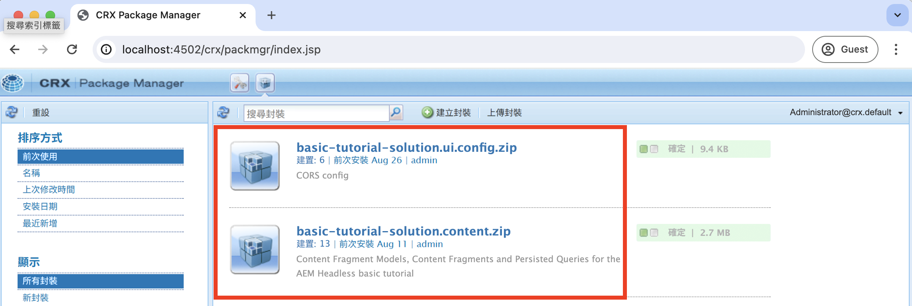
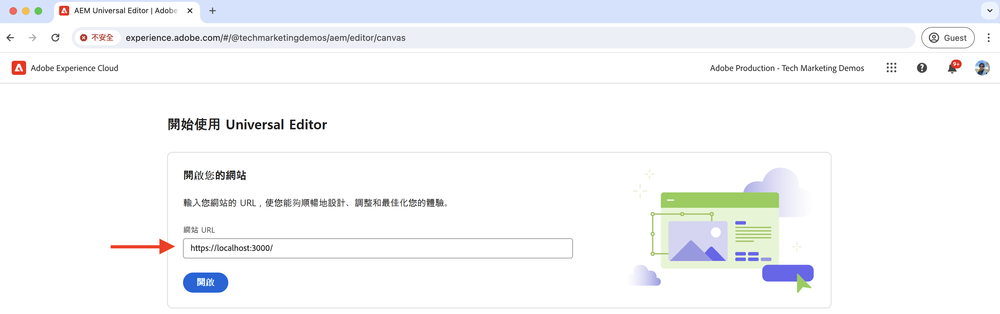
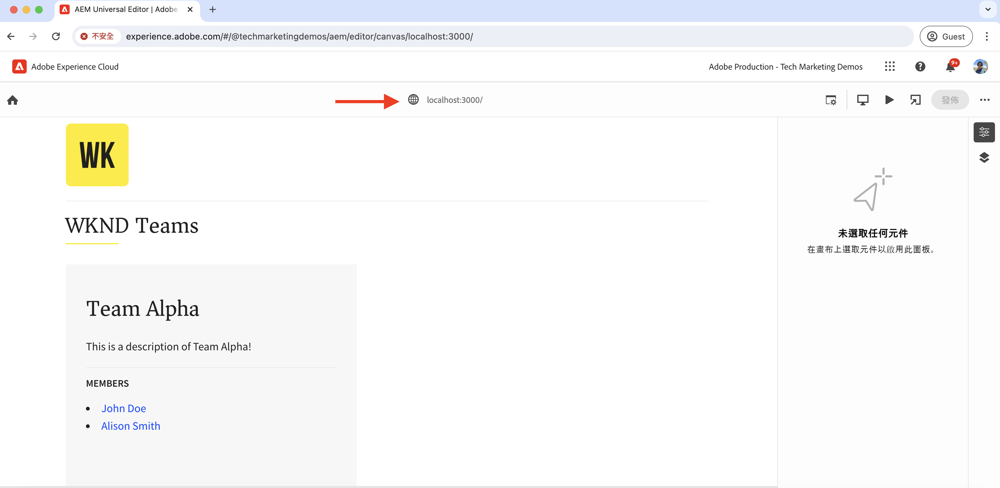

# 本機開發設定

瞭解如何設定本機開發環境，以使用AEM通用編輯器來編輯React應用程式的內容。

## 先決條件

依照本教學課程操作，須具備下列條件：

- 基本HTML和JavaScript技能。
- 下列工具必須安裝在本機：
   - [Node.js](https://nodejs.org/en/download/)
   - [Git](https://git-scm.com/downloads)
   - IDE或程式碼編輯器，例如[Visual Studio Code](https://code.visualstudio.com/)
- 下載並安裝下列專案：
   - [AEM as a Cloud Service SDK](https://experienceleague.adobe.com/zh-hant/docs/experience-manager-learn/cloud-service/local-development-environment-set-up/aem-runtime#download-the-aem-as-a-cloud-service-sdk)：它包含用於在本機執行AEM Author和Publish以進行開發的Quickstart Jar。
   - [Universal Editor服務](https://experienceleague.adobe.com/zh-hant/docs/experience-cloud/software-distribution/home)： Universal Editor服務的本機復本，具有功能子集，可從軟體發佈入口網站下載。
   - [local-ssl-proxy](https://www.npmjs.com/package/local-ssl-proxy#local-ssl-proxy)：使用自我簽署憑證進行本機開發的簡單本機SSL HTTP Proxy。 AEM Universal Editor需要React應用程式的HTTPS URL，才能在編輯器中載入它。

## 本機設定

請依照下列步驟設定本機開發環境：

### AEM SDK

若要提供WKND Teams React應用程式的內容，請在本機AEM SDK中安裝下列套件。

- [WKND Teams — 內容套件](./assets/basic-tutorial-solution.content.zip)：包含內容片段模型、內容片段和持續的GraphQL查詢。
- [WKND Teams — 設定封裝](./assets/basic-tutorial-solution.ui.config.zip)：包含跨原始資源共用(CORS)和權杖驗證處理常式設定。 CORS有助於非AEM Web屬性對AEM的GraphQL API發出瀏覽器式使用者端呼叫，而Token驗證處理常式則可用來向AEM驗證每個請求。

  

### React應用程式

若要設定WKND Teams React應用程式，請遵循下列步驟：

1. 從`basic-tutorial`解決方案分支複製[WKND Teams React應用程式](https://github.com/adobe/aem-guides-wknd-graphql/tree/solution/basic-tutorial)。

   ```bash
   $ git clone -b solution/basic-tutorial git@github.com:adobe/aem-guides-wknd-graphql.git
   ```

1. 導覽至`basic-tutorial`目錄，然後在程式碼編輯器中開啟它。

   ```bash
   $ cd aem-guides-wknd-graphql/basic-tutorial
   $ code .
   ```

1. 安裝相依性並啟動React應用程式。

   ```bash
   $ npm install
   $ npm start
   ```

1. 在[http://localhost:3000](http://localhost:3000)的瀏覽器中，開啟WKND Teams React應用程式。 它會顯示專案團隊成員及其詳細資訊的清單。 React應用程式的內容由本機AEM SDK使用GraphQL API (`/graphql/execute.json/my-project/all-teams`)提供，您可以使用瀏覽器的網路標籤進行驗證。

   

### Universal Editor服務

若要設定&#x200B;**local** Universal Editor服務，請遵循下列步驟：

1. 從[軟體發佈入口網站](https://experience.adobe.com/downloads)下載最新版的Universal Editor服務。

   

1. 解壓縮下載的zip檔案，並將`universal-editor-service.cjs`檔案複製到名為`universal-editor-service`的新目錄。

   ```bash
   $ unzip universal-editor-service-vproduction-<version>.zip
   $ mkdir universal-editor-service
   $ cp universal-editor-service.cjs universal-editor-service
   ```

1. 在`universal-editor-service`目錄中建立`.env`檔案，並新增下列環境變數：

   ```bash
   # The port on which the Universal Editor service runs
   EXPRESS_PORT=8000
   # Disable SSL verification
   NODE_TLS_REJECT_UNAUTHORIZED=0
   ```

1. 啟動本機通用編輯器服務。

   ```bash
   $ cd universal-editor-service
   $ node universal-editor-service.cjs
   ```

上述命令會啟動連線埠`8000`上的Universal Editor服務，您應該會看到下列輸出：

```bash
Either no private key or certificate was set. Starting as HTTP server
Universal Editor Service listening on port 8000 as HTTP Server
```

### 本機SSL HTTP Proxy

AEM Universal Editor需要透過HTTPS提供React應用程式。 讓我們設定使用自我簽署憑證進行本機開發的本機SSL HTTP Proxy。

請依照下列步驟設定本機SSL HTTP Proxy，並透過HTTPS提供AEM SDK和通用編輯器服務：

1. 全域安裝`local-ssl-proxy`套件。

   ```bash
   $ npm install -g local-ssl-proxy
   ```

1. 為下列服務啟動本機SSL HTTP Proxy的兩個執行個體：

   - 連線埠`8443`上的AEM SDK本機SSL HTTP Proxy。
   - 通訊埠`8001`上的Universal Editor服務本機SSL HTTP Proxy。

   ```bash
   # AEM SDK local SSL HTTP proxy on port 8443
   $ local-ssl-proxy --source 8443 --target 4502
   
   # Universal Editor service local SSL HTTP proxy on port 8001
   $ local-ssl-proxy --source 8001 --target 8000
   ```

### 更新React應用程式以使用HTTPS

若要為WKND Teams React應用程式啟用HTTPS，請遵循以下步驟：

1. 在終端機中按`Ctrl + C`停止React。
1. 更新`package.json`檔案以在`start`指令碼中包含`HTTPS=true`環境變數。

   ```json
   "scripts": {
       "start": "HTTPS=true react-scripts start",
       ...
   }
   ```

1. 更新`.env.development`檔案中的`REACT_APP_HOST_URI`，以使用AEM SDK的HTTPS通訊協定和本機SSL HTTP Proxy連線埠。

   ```bash
   REACT_APP_HOST_URI=https://localhost:8443
   ...
   ```

1. 更新`../src/proxy/setupProxy.auth.basic.js`檔案以使用`secure: false`選項使用寬鬆SSL設定。

   ```javascript
   ...
   module.exports = function(app) {
   app.use(
       ['/content', '/graphql'],
       createProxyMiddleware({
       target: REACT_APP_HOST_URI,
       changeOrigin: true,
       secure: false, // Ignore SSL certificate errors
       // pass in credentials when developing against an Author environment
       auth: `${REACT_APP_BASIC_AUTH_USER}:${REACT_APP_BASIC_AUTH_PASS}`
       })
   );
   };
   ```

1. 啟動React應用程式。

   ```bash
   $ npm start
   ```

## 驗證設定

使用上述步驟設定本機開發環境後，讓我們驗證設定。

### 本機驗證

請確定下列服務是透過HTTPS在本機執行，您可能需要接受瀏覽器中自我簽署憑證的安全性警告：

1. [https://localhost:3000](https://localhost:3000)上的WKND Teams React應用程式
1. [https://localhost:8443](https://localhost:8443)上的AEM SDK
1. [https://localhost:8001](https://localhost:8001)上的通用編輯器服務

### 在通用編輯器中載入WKND Teams React應用程式

讓我們在通用編輯器中載入WKND Teams React應用程式以驗證設定：

1. 在瀏覽器中開啟通用編輯器https://experience.adobe.com/#/aem/editor 。 如果出現提示，請使用您的Adobe ID登入。

1. 在通用編輯器的網站URL輸入欄位中輸入WKND Teams React應用程式URL，然後按一下`Open`。

   

1. WKND Teams React應用程式會在Universal Editor **中載入，但您尚無法編輯內容**。 您需要檢測React應用程式，以使用通用編輯器來啟用內容編輯。

   


## 下一步

瞭解如何[檢測React應用程式以編輯內容](./instrument-to-edit-content.md)。
