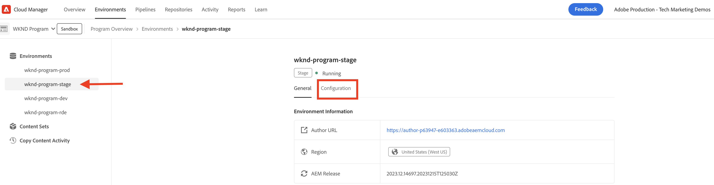

# PIM整合的AEM Assets事件

瞭解如何整合AEM Assets和產品資訊管理(PIM)系統以更新資產中繼資料 **使用AEM事件**. 在收到AEM Assets事件後，可以根據業務需求在AEM、PIM或兩個系統中更新資產中繼資料。 不過，在此範例中，讓我們更新AEM中的資產中繼資料。

若要執行資產中繼資料更新 **AEM外部的程式碼**，則 [Adobe I/O Runtime](https://developer.adobe.com/runtime/docs/guides/overview/what_is_runtime/) 使用無伺服器平台。 事件處理流程如下：


1. AEM Author服務觸發 _資產處理已完成_ 資產上傳完成時的事件。
1. 事件會傳送至 [Adobe I/O事件](https://developer.adobe.com/events/) 服務。
1. Adobe I/O事件服務會將事件傳遞至 [Adobe I/O Runtime動作](https://developer.adobe.com/runtime/docs/guides/using/creating_actions/) 以進行處理。
1. 「Adobe I/O Runtime動作」會呼叫模擬的PIM API來擷取其他中繼資料，例如SKU、供應商資訊。
1. PIM擷取到的其他中繼資料隨後會在AEM Assets中使用 [Assets作者API](https://developer.adobe.com/experience-cloud/experience-manager-apis/api/experimental/assets/author/).

## 先決條件

若要完成本教學課程，您需要：

- AEMas a Cloud Service環境搭配 [AEM事件已啟用](https://developer.adobe.com/experience-cloud/experience-manager-apis/guides/events/#enable-aem-events-on-your-aem-cloud-service-environment). 此外，範例 [WKND網站](https://github.com/adobe/aem-guides-wknd?#aem-wknd-sites-project) 專案必須部署在其上。

- 存取目標 [Adobe Developer Console](https://developer.adobe.com/developer-console/docs/guides/getting-started/).

- [ADOBE DEVELOPER CLI](https://developer.adobe.com/runtime/docs/guides/tools/cli_install/) 已安裝在您的本機電腦上。

## 開發步驟

高階開發步驟為：

1. [在Adobe Developer主控台(ADC)中建立專案](./runtime-action.md#Create-project-in-Adobe-Developer-Console)
1. [初始化專案以進行本機開發](./runtime-action.md#initialize-project-for-local-development)
1. 在ADC中設定專案
1. 設定AEM作者服務以啟用ADC專案通訊
1. 開發可協調中繼資料擷取和更新的執行階段動作
1. 在AEM作者服務中上傳資產並驗證中繼資料更新

如需1-2的詳細步驟，請參閱 [Adobe I/O Runtime動作與AEM事件](./runtime-action.md#) 例如，和3-6請參閱以下章節。

### 在Adobe Developer主控台(ADC)中設定專案

若要接收AEM Assets事件並執行上一步建立的Adobe I/O Runtime動作，請在ADC中設定專案。

- 在ADC中，導覽至 [專案](https://developer.adobe.com/console/projects). 選取 `Stage` 工作區，這是部署執行階段動作的位置。

- 按一下 **新增服務** 按鈕並選取 **事件** 選項。 在 **新增事件** 對話方塊，選取 **Experience Cloud** > **AEM Assets**，然後按一下 **下一個**. 按照其他配置步驟，選擇AEMCS例項 _資產處理已完成_ 事件、OAuth伺服器對伺服器驗證型別和其他詳細資訊。

  

- 最後，在 **如何接收事件** 步驟，展開 **執行階段動作** 選項並選取 _一般_ 在上一步建立的動作。 按一下 **儲存已設定的事件**.

  

- 同樣地，按一下 **新增服務** 按鈕並選取 **API** 選項。 在 **新增API** 強制回應視窗，選取 **Experience Cloud** > **AEMAS A CLOUD SERVICEAPI** 並按一下 **下一個**.

  

- 然後選取 **OAuth伺服器對伺服器** 驗證型別，然後按一下 **下一個**.

- 然後選取 **AEM管理員 — XXX** 產品設定檔並按一下 **儲存已設定的API**. 若要存取精細功能和許可權，選取的產品設定檔必須與產生AEMCS環境的AEM Assets事件相關聯。

  

### 設定AEM作者服務以啟用ADC專案通訊

若要從上述ADC專案更新AEM中的資產中繼資料，請使用ADC專案的使用者端ID設定AEM Author服務。 此 _使用者端id_ 會使用，新增為環境變數 [AdobeCloud Manager](https://experienceleague.adobe.com/docs/experience-manager-cloud-service/content/implementing/using-cloud-manager/environment-variables.html#add-variables) UI。

- 登入 [AdobeCloud Manager](https://my.cloudmanager.adobe.com/)，選取 **計畫** > **環境** > **省略符號** > **檢視詳細資料** > **設定** 標籤。

  

- 則 **新增設定** 按鈕並輸入變數詳細資訊，如下所示

  | 名稱 | 值 | AEM服務 | 類型 |
  | ----------- | ----------- | ----------- | ----------- |
  | Adobe提供的CLIENT_ID | &lt;COPY_FROM_ADC_PROJECT_CREDENTIALS> | 作者 | 變數 |

  

- 按一下 **新增** 和 **儲存** 設定。

### 開發執行階段動作

若要執行中繼資料擷取和更新，請先更新自動建立的 _一般_ 中的動作程式碼 `src/dx-excshell-1/actions/generic` 資料夾。

請參閱附件中的 [WKND-Assets-PIM-Integration.zip](../assets/examples/assets-pim-integration/WKND-Assets-PIM-Integration.zip) 檔案以取得完整程式碼，而下節會醒目提示重要檔案。

- 此 `src/dx-excshell-1/actions/generic/mockPIMCommunicator.js` 檔案會模擬PIM API呼叫，以擷取其他中繼資料，例如SKU和供應商名稱。

  ```javascript
  /**
   * Mock PIM API to get the product data such as SKU, Supplier, etc.
   *
   * In a real-world scenario, this function would call the PIM API to get the product data.
   * For this example, we are returning mock data.
   *
   * @param {string} assetId - The assetId to get the product data.
   */
  module.exports = {
      async getPIMData(assetId) {
          if (!assetId) {
          throw new Error('Invalid assetId');
          }
          // Mock response data for demo purposes
          const data = {
          SKUID: 'MockSKU 123',
          SupplierName: 'mock-supplier',
          // ... other product data
          };
          return data;
      },
  };
  ```

- 此 `src/dx-excshell-1/actions/generic/aemCommunicator.js` 檔案會使用，更新AEM中的資產中繼資料 [Assets作者API](https://developer.adobe.com/experience-cloud/experience-manager-apis/api/experimental/assets/author/).

  ```javascript
  const fetch = require('node-fetch');
  
  ...
  
  /**
  *  Get IMS Access Token using Client Credentials Flow
  *
  * @param {*} clientId - IMS Client ID from ADC project's OAuth Server-to-Server Integration
  * @param {*} clientSecret - IMS Client Secret from ADC project's OAuth Server-to-Server Integration
  * @param {*} scopes - IMS Meta Scopes from ADC project's OAuth Server-to-Server Integration as comma separated strings
  * @returns {string} - Returns the IMS Access Token
  */
  async function getIMSAccessToken(clientId, clientSecret, scopes) {
    const adobeIMSV3TokenEndpointURL = 'https://ims-na1.adobelogin.com/ims/token/v3';
  
    const options = {
      method: 'POST',
      headers: {
        'Content-Type': 'application/x-www-form-urlencoded',
      },
      body: `grant_type=client_credentials&client_id=${clientId}&client_secret=${clientSecret}&scope=${scopes}`,
    };
  
    const response = await fetch(adobeIMSV3TokenEndpointURL, options);
    const responseJSON = await response.json();
  
    return responseJSON.access_token;
  }    
  
  async function updateAEMAssetMetadata(metadataDetails, aemAssetEvent, params) {
    ...
    // Transform the metadata details to JSON Patch format,
    // see https://developer.adobe.com/experience-cloud/experience-manager-apis/api/experimental/assets/author/#operation/patchAssetMetadata
    const transformedMetadata = Object.keys(metadataDetails).map((key) => ({
      op: 'add',
      path: `wknd-${key.toLowerCase()}`,
      value: metadataDetails[key],
    }));
  
    ...
  
    // Get ADC project's OAuth Server-to-Server Integration credentials
    const clientId = params.ADC_CECREDENTIALS_CLIENTID;
    const clientSecret = params.ADC_CECREDENTIALS_CLIENTSECRET;
    const scopes = params.ADC_CECREDENTIALS_METASCOPES;
  
    // Get IMS Access Token using Client Credentials Flow
    const access_token = await getIMSAccessToken(clientId, clientSecret, scopes);
  
    // Call AEM Author service to update the metadata using Assets Author API
    // See https://developer.adobe.com/experience-cloud/experience-manager-apis/api/experimental/assets/author/
    const res = await fetch(`${aemAuthorHost}/adobe/assets/${assetId}/metadata`, {
      method: 'PATCH',
      headers: {
        'Content-Type': 'application/json-patch+json',
        'If-Match': '*',
        'X-Adobe-Accept-Experimental': '1',
        'X-Api-Key': 'aem-assets-management-api', // temporary value
        Authorization: `Bearer ${access_token}`,
      },
      body: JSON.stringify(transformedMetadata),
    });
  
    ...
  }
  
  module.exports = { updateAEMAssetMetadata };
  ```

  此 `.env` 檔案會儲存ADC專案的OAuth伺服器對伺服器憑證詳細資料，而且會使用以引數形式傳遞至動作 `ext.config.yaml` 檔案。 請參閱 [App Builder設定檔案](https://developer.adobe.com/app-builder/docs/guides/configuration/) 用於管理秘密和動作引數。

- 此 `src/dx-excshell-1/actions/model` 資料夾包含 `aemAssetEvent.js` 和 `errors.js` 檔案，動作會使用這些檔案來分別剖析收到的事件和處理錯誤。

- 此 `src/dx-excshell-1/actions/generic/index.js` 檔案會使用上述模組來協調中繼資料的擷取和更新。

  ```javascript
  ...
  
  let responseMsg;
  // handle the challenge probe request, they are sent by I/O to verify the action is valid
  if (params.challenge) {
    logger.info('Challenge probe request detected');
    responseMsg = JSON.stringify({ challenge: params.challenge });
  } else {
    logger.info('AEM Asset Event request received');
  
    // create AEM Asset Event object from request parameters
    const aemAssetEvent = new AEMAssetEvent(params);
  
    // Call mock PIM API to get the product data such as SKU, Supplier, etc.
    const mockPIMData = await mockPIMAPI.getPIMData(
      aemAssetEvent.getAssetName(),
    );
    logger.info('Mock PIM API response', mockPIMData);
  
    // Update PIM received data in AEM as Asset metadata
    const aemUpdateStatus = await updateAEMAssetMetadata(
      mockPIMData,
      aemAssetEvent,
      params,
    );
    logger.info('AEM Asset metadata update status', aemUpdateStatus);
  
    if (aemUpdateStatus) {
      // create response message
      responseMsg = JSON.stringify({
        message:
          'AEM Asset Event processed successfully, updated the asset metadata with PIM data.',
        assetdata: {
          assetName: aemAssetEvent.getAssetName(),
          assetPath: aemAssetEvent.getAssetPath(),
          assetId: aemAssetEvent.getAssetId(),
          aemHost: aemAssetEvent.getAEMHost(),
          pimdata: mockPIMData,
        },
      });
    } 
  
    // response object
    const response = {
      statusCode: 200,
      body: responseMsg,
    };
  
    // Return the response to the caller
    return response;
  
    ...
  }
  ```

使用以下命令，將更新的動作部署到Adobe I/O Runtime：

```bash
$ aio app deploy
```

### 資產上傳和中繼資料驗證

若要驗證AEM Assets與PIM整合，請遵循下列步驟：

- 若要檢視模擬PIM提供的中繼資料，例如SKU和供應商名稱，請在AEM Assets中建立中繼資料結構，請參閱 [中繼資料結構](https://experienceleague.adobe.com/docs/experience-manager-learn/assets/configuring/metadata-schemas.html) 顯示SKU和供應商名稱中繼資料屬性。

- 在AEM作者服務中上傳資產，並驗證中繼資料更新。

  

## 概念與主要要領

企業通常需要在AEM和其他系統（例如PIM）之間同步資產中繼資料。 使用AEM Eventing可以達到此類要求。

- 資產中繼資料程式碼會在AEM外部執行，避免AEM Author服務上的負載，因此事件導向架構可獨立擴展。
- 新推出的Assets Author API可用於更新AEM中的資產中繼資料。
- API驗證使用OAuth伺服器對伺服器（亦稱為使用者端憑證流程），請參閱 [OAuth伺服器對伺服器認證實作指南](https://developer.adobe.com/developer-console/docs/guides/authentication/ServerToServerAuthentication/implementation/).
- 與其使用Adobe I/O Runtime動作，其他Webhook或Amazon EventBridge可以用來接收AEM Assets事件和處理中繼資料更新。
- 透過AEM Eventing進行的資產事件可讓企業自動化及簡化關鍵程式，提升整個內容生態系統的效率及一致性。

