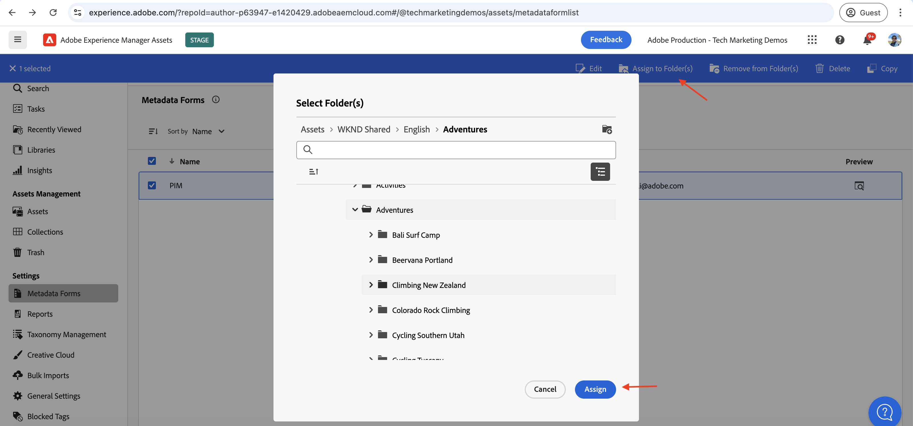

# PIM整合的AEM Assets事件

>[!IMPORTANT]
>
>本教學課程使用OpenAPI型AEM API。 如果您有興趣存取，建議您將使用案例說明以電子郵件寄至[aem-apis@adobe.com](mailto:aem-apis@adobe.com)，作為搶先使用方案的一部分。

瞭解如何使用OpenAPI型AEM製作API接收Assets事件並據以更新AEM中的內容狀態。

如何處理收到的事件取決於業務需求。 例如，事件資料可用來更新協力廠商系統或AEM，或兩者皆更新。

此範例示範如何將協力廠商系統(例如產品資訊管理(PIM)系統)與AEM as a Cloud Service Assets整合。 在收到AEM Assets事件時，系統會對其進行處理，以從PIM系統擷取其他中繼資料，並更新AEM中的資產中繼資料。 更新的資產中繼資料可包含SKU、供應商名稱或其他產品詳細資料等額外資訊。

為了接收及處理AEM Assets事件[Adobe I/O Runtime](https://developer.adobe.com/runtime/docs/guides/overview/what_is_runtime/)，使用無伺服器平台。 不過，您也可以在協力廠商系統或Amazon EventBridge中使用其他事件處理系統，例如Webhook。

整合的高層級流程如下：

用於PIM整合的

1. 當資產上傳完成且所有資產處理活動也完成時，AEM作者服務會觸發&#x200B;_資產處理完成_&#x200B;事件。 等候資產處理完成可確保任何現成可用的處理（例如中繼資料擷取）已完成。
1. 事件已傳送至[Adobe I/O Events](https://developer.adobe.com/events/)服務。
1. Adobe I/O Events服務將事件傳遞至[Adobe I/O Runtime動作](https://developer.adobe.com/runtime/docs/guides/using/creating_actions/)以進行處理。
1. 「Adobe I/O Runtime動作」會呼叫PIM系統的API來擷取其他中繼資料，例如SKU、供應商資訊或其他詳細資訊。
1. 從PIM擷取的其他中繼資料會在AEM Assets中使用以OpenAPI為基礎的[Assets作者API](https://developer.adobe.com/experience-cloud/experience-manager-apis/api/experimental/assets/author/)更新。

## 先決條件

若要完成本教學課程，您需要：

- 已啟用[AEM事件的AEM as a Cloud Service環境](https://developer.adobe.com/experience-cloud/experience-manager-apis/guides/events/#enable-aem-events-on-your-aem-cloud-service-environment)。 此外，必須在其上部署範例[WKND Sites](https://github.com/adobe/aem-guides-wknd?#aem-wknd-sites-project)專案。

- 存取[Adobe Developer Console](https://developer.adobe.com/developer-console/docs/guides/getting-started)。

- [Adobe Developer CLI](https://developer.adobe.com/runtime/docs/guides/tools/cli_install/)已安裝在您的本機電腦上。

## 開發步驟

高階開發步驟為：

1. [更新AEM as a Cloud Service環境](https://experienceleague.adobe.com/zh-hant/docs/experience-manager-learn/cloud-service/aem-apis/invoke-openapi-based-aem-apis#modernization-of-aem-as-a-cloud-service-environment)
1. [啟用AEM API存取權](https://experienceleague.adobe.com/zh-hant/docs/experience-manager-learn/cloud-service/aem-apis/invoke-openapi-based-aem-apis#enable-aem-apis-access)
1. [在Adobe Developer Console (ADC)中建立專案](./runtime-action.md#Create-project-in-Adobe-Developer-Console)
1. [初始化專案以進行本機開發](./runtime-action.md#initialize-project-for-local-development)
1. 在ADC中設定專案
1. 設定AEM作者服務以啟用ADC專案通訊
1. 開發執行階段動作以進行協調
   1. 從PIM系統擷取中繼資料
   1. 使用Assets作者API在AEM Assets中更新中繼資料
1. 建立和套用資產中繼資料結構
1. 驗證資產上傳和中繼資料更新

如需步驟1-2的詳細資訊，請參閱[叫用OpenAPI型AEM API](https://experienceleague.adobe.com/zh-hant/docs/experience-manager-learn/cloud-service/aem-apis/invoke-openapi-based-aem-apis)指南，如需步驟3-4，請參閱[Adobe I/O Runtime動作和AEM事件](./runtime-action.md#)範例。 如需步驟5-9，請參閱下列章節。

### 在Adobe Developer Console (ADC)中設定專案

若要接收AEM Assets事件並執行上一步建立的Adobe I/O Runtime動作，請在ADC中設定專案。

- 在ADC中，導覽至您在步驟3中建立的[專案](https://developer.adobe.com/console/projects)。 從該專案中，選取`Stage`工作區，執行階段動作會在您執行`aio app deploy`時部署為步驟4指示的一部分。

- 按一下&#x200B;**新增服務**&#x200B;按鈕，然後選取&#x200B;**事件**&#x200B;選項。 在&#x200B;**新增事件**&#x200B;對話方塊中，選取&#x200B;**Experience Cloud** > **AEM Assets**，然後按一下&#x200B;**下一步**。
  

- 在&#x200B;**設定事件註冊**&#x200B;步驟中，選取所需的AEMCS執行個體，然後選取&#x200B;_已完成資產處理_&#x200B;事件，以及OAuth伺服器對伺服器驗證型別。

  

- 最後，在&#x200B;**如何接收事件**&#x200B;步驟中，展開&#x200B;**執行階段動作**&#x200B;選項，並選取在上一步建立的&#x200B;_一般_&#x200B;動作。 按一下&#x200B;**儲存已設定的事件**。

  

- 同樣地，按一下&#x200B;**新增服務**&#x200B;按鈕並選取&#x200B;**API**&#x200B;選項。 在&#x200B;**新增API**&#x200B;強制回應視窗中，選取&#x200B;**Experience Cloud** > **AEM Assets作者API**&#x200B;並按一下&#x200B;**下一步**。

  

- 然後選取&#x200B;**OAuth伺服器對伺服器**&#x200B;做為驗證型別，並按一下&#x200B;**下一步**。

- 然後選取與正在產生事件的AEM Assets環境相關聯的正確&#x200B;**產品設定檔**，並擁有在該處更新資產的足夠存取許可權。 最後，按一下&#x200B;**儲存已設定的API**&#x200B;按鈕。

  

  在我看來，_AEM管理員 — 作者 — 方案XXX — 環境YYYY_&#x200B;產品設定檔已選取，它已啟用&#x200B;**AEM Assets API使用者**&#x200B;服務。

  

## 設定AEM執行個體以啟用ADC專案通訊

若要啟用ADC Project的OAuth伺服器對伺服器認證ClientID來與AEM執行個體通訊，您必須設定AEM執行個體。

若要完成設定，請在AEM專案的`api.yaml`檔案中定義設定。 然後，使用Cloud Manager中的設定管道來部署`api.yaml`檔案。

- 在AEM專案中，從`config`資料夾中找到或建立`api.yaml`檔案。

  

- 將下列設定新增至`api.yaml`檔案。

  ```yaml
  kind: "API"
  version: "1.0"
  metadata: 
      envTypes: ["dev", "stage", "prod"]
  data:
      allowedClientIDs:
          author:
          - "<ADC Project's OAuth Server-to-Server credential ClientID>"
  ```

  以ADC專案的OAuth伺服器對伺服器認證的實際ClientID取代`<ADC Project's OAuth Server-to-Server credential ClientID>`。

  >[!CAUTION]
  >
  > 為了示範，所有環境都會使用相同的ClientID。 建議您針對每個環境（開發、階段、生產）使用個別的ClientID，以提升安全性和控制能力。


- 將設定變更提交至Git存放庫並將變更推送至遠端存放庫。

- 使用Cloud Manager中的設定管道來部署上述變更。 請注意，也可以使用命令列工具將`api.yaml`檔案安裝在RDE中。

  

### 開發執行階段動作

若要執行中繼資料擷取和更新，請先更新`src/dx-excshell-1/actions/generic`資料夾中自動建立的&#x200B;_通用_&#x200B;動作代碼。

如需完整程式碼，請參閱附加的[WKND-Assets-PIM-Integration.zip](../assets/examples/assets-pim-integration/WKND-Assets-PIM-Integration.zip)檔案，以下區段將重點說明重要檔案。

- `src/dx-excshell-1/actions/generic/mockPIMCommunicator.js`檔案會模擬PIM API呼叫，以擷取其他中繼資料，例如SKU和供應商名稱。 此檔案用於示範用途。 一旦您讓端對端流程正常運作，請以呼叫您真正的PIM系統來取代此函式，以擷取資產的中繼資料。

  ```javascript
  /**
   * Mock PIM API to get the product data such as SKU, Supplier, etc.
   *
   * In a real-world scenario, this function would call the PIM API to get the product data.
   * For this example, we are returning mock data.
   *
   * @param {string} assetId - The assetId to get the product data.
   */
  module.exports = {
      async getPIMData(assetId) {
          if (!assetId) {
          throw new Error('Invalid assetId');
          }
          // Mock response data for demo purposes
          const data = {
          SKUID: 'MockSKU 123',
          SupplierName: 'mock-supplier',
          // ... other product data
          };
          return data;
      },
  };
  ```

- `src/dx-excshell-1/actions/generic/aemCommunicator.js`檔案會使用[Assets作者API](https://developer.adobe.com/experience-cloud/experience-manager-apis/api/experimental/assets/author/)更新AEM中的資產中繼資料。

  ```javascript
  const fetch = require('node-fetch');
  ...
  /**
  *  Get IMS Access Token using Client Credentials Flow
  *
  * @param {*} clientId - IMS Client ID from ADC project's OAuth Server-to-Server Integration
  * @param {*} clientSecret - IMS Client Secret from ADC project's OAuth Server-to-Server Integration
  * @param {*} scopes - IMS Meta Scopes from ADC project's OAuth Server-to-Server Integration as comma separated strings
  * @returns {string} - Returns the IMS Access Token
  */
  async function getIMSAccessToken(clientId, clientSecret, scopes) {
    const adobeIMSV3TokenEndpointURL = 'https://ims-na1.adobelogin.com/ims/token/v3';
    const options = {
      method: 'POST',
      headers: {
        'Content-Type': 'application/x-www-form-urlencoded',
      },
      body: `grant_type=client_credentials&client_id=${clientId}&client_secret=${clientSecret}&scope=${scopes}`,
    };
    const response = await fetch(adobeIMSV3TokenEndpointURL, options);
    const responseJSON = await response.json();
    return responseJSON.access_token;
  }    
  async function updateAEMAssetMetadata(metadataDetails, aemAssetEvent, params) {
    ...
    // Transform the metadata details to JSON Patch format,
    // see https://developer.adobe.com/experience-cloud/experience-manager-apis/api/experimental/assets/author/#operation/patchAssetMetadata
    const transformedMetadata = Object.keys(metadataDetails).map((key) => ({
      op: 'add',
      path: `wknd-${key.toLowerCase()}`,
      value: metadataDetails[key],
    }));
    ...
    // Get ADC project's OAuth Server-to-Server Integration credentials
    const clientId = params.ADC_CECREDENTIALS_CLIENTID;
    const clientSecret = params.ADC_CECREDENTIALS_CLIENTSECRET;
    const scopes = params.ADC_CECREDENTIALS_METASCOPES;
    // Get IMS Access Token using Client Credentials Flow
    const access_token = await getIMSAccessToken(clientId, clientSecret, scopes);
    // Call AEM Author service to update the metadata using Assets Author API
    // See https://developer.adobe.com/experience-cloud/experience-manager-apis/api/experimental/assets/author/
    const res = await fetch(`${aemAuthorHost}/adobe/assets/${assetId}/metadata`, {
      method: 'PATCH',
      headers: {
        'Content-Type': 'application/json-patch+json',
        'If-Match': '*',
        'X-Adobe-Accept-Experimental': '1',
        'X-Api-Key': '12345676', // Use the `ClientID` value from the ADC Project's credentials section
        Authorization: `Bearer ${access_token}`,
      },
      body: JSON.stringify(transformedMetadata),
    });
    ...
  }
  module.exports = { updateAEMAssetMetadata };
  ```

  `.env`檔案儲存ADC Project的OAuth伺服器對伺服器認證詳細資料，並使用`ext.config.yaml`檔案將這些資料作為引數傳遞給動作。 如需管理密碼和動作引數，請參閱[App Builder組態檔](https://developer.adobe.com/app-builder/docs/guides/configuration/)。
- `src/dx-excshell-1/actions/model`資料夾包含`aemAssetEvent.js`和`errors.js`檔案，動作會使用這些檔案分別剖析收到的事件和處理錯誤。
- `src/dx-excshell-1/actions/generic/index.js`檔案使用上述模組來協調中繼資料的擷取和更新。

  ```javascript
  ...
  let responseMsg;
  // handle the challenge probe request, they are sent by I/O to verify the action is valid
  if (params.challenge) {
    logger.info('Challenge probe request detected');
    responseMsg = JSON.stringify({ challenge: params.challenge });
  } else {
    logger.info('AEM Asset Event request received');
    // create AEM Asset Event object from request parameters
    const aemAssetEvent = new AEMAssetEvent(params);
    // Call mock PIM API to get the product data such as SKU, Supplier, etc.
    const mockPIMData = await mockPIMAPI.getPIMData(
      aemAssetEvent.getAssetName(),
    );
    logger.info('Mock PIM API response', mockPIMData);
    // Update PIM received data in AEM as Asset metadata
    const aemUpdateStatus = await updateAEMAssetMetadata(
      mockPIMData,
      aemAssetEvent,
      params,
    );
    logger.info('AEM Asset metadata update status', aemUpdateStatus);
    if (aemUpdateStatus) {
      // create response message
      responseMsg = JSON.stringify({
        message:
          'AEM Asset Event processed successfully, updated the asset metadata with PIM data.',
        assetdata: {
          assetName: aemAssetEvent.getAssetName(),
          assetPath: aemAssetEvent.getAssetPath(),
          assetId: aemAssetEvent.getAssetId(),
          aemHost: aemAssetEvent.getAEMHost(),
          pimdata: mockPIMData,
        },
      });
    } 
    // response object
    const response = {
      statusCode: 200,
      body: responseMsg,
    };
    // Return the response to the caller
    return response;
    ...
  }
  ```

- 使用以下命令，將更新的動作部署到Adobe I/O Runtime：

  ```bash
  $ aio app deploy
  ```

### 建立和套用資產中繼資料結構

依預設，WKND Sites專案沒有資產中繼資料結構可顯示PIM特定中繼資料，例如SKU、供應商名稱等。 讓我們建立資產中繼資料結構，並將其套用至AEM例項中的資產資料夾。

1. 登入AEM as a Cloud Service Asset執行個體並出現在[資產檢視](https://experienceleague.adobe.com/zh-hant/docs/experience-manager-learn/assets/authoring/switch-views)中。

   

1. 從左側邊欄瀏覽至&#x200B;**設定** > **中繼資料Forms**&#x200B;選項，然後按一下&#x200B;**建立**&#x200B;按鈕。 在&#x200B;**建立中繼資料表單**&#x200B;對話方塊中，輸入下列詳細資料，然後按一下&#x200B;**建立**。
   - 名稱：`PIM`
   - 使用現有的表單結構作為範本： `Check`
   - 選擇來源： `default`

   

1. 按一下&#x200B;**+**&#x200B;圖示以新增新的&#x200B;**PIM**&#x200B;索引標籤，並新增&#x200B;**單行文字**&#x200B;元件。

   

   下表列出中繼資料屬性及其對應欄位。

   | 標籤 | 預留位置 | 中繼資料屬性 |
   | --- | --- | --- |
   | SKU | 透過AEM Eventing整合自動填入 | `wknd-skuid` |
   | 供應商名稱 | 透過AEM Eventing整合自動填入 | `wknd-suppliername` |

1. 按一下&#x200B;**儲存**&#x200B;和&#x200B;**關閉**&#x200B;以儲存中繼資料表單。

1. 最後，將&#x200B;**PIM**&#x200B;中繼資料結構描述套用至&#x200B;**PIM**&#x200B;資料夾。

   

透過上述步驟，**Adventures**&#x200B;資料夾中的資產已準備好顯示PIM特定的中繼資料，例如SKU、供應商名稱等。

### 資產上傳和中繼資料驗證

若要驗證AEM Assets和PIM整合，請將資產上傳至AEM Assets中的&#x200B;**Adventures**&#x200B;資料夾。 資產明細頁面中的PIM頁標應顯示SKU與「供應商名稱」中繼資料。


## 概念與主要要領

企業通常需要在AEM和其他系統（例如PIM）之間同步資產中繼資料。 使用AEM Eventing即可達到這類要求。

- 資產中繼資料擷取程式碼會在AEM外部執行，避免AEM Author服務上的負載，因此是一種獨立擴展的事件導向架構。
- 新推出的Assets Author API可用於更新AEM中的資產中繼資料。
- API驗證使用OAuth伺服器對伺服器（亦稱為使用者端認證流程），請參閱[OAuth伺服器對伺服器認證實作指南](https://developer.adobe.com/developer-console/docs/guides/authentication/ServerToServerAuthentication/implementation)。
- 與其使用Adobe I/O Runtime動作，其他Webhook或Amazon EventBridge可以用來接收AEM Assets事件和處理中繼資料更新。
- 透過AEM舉辦資產活動可讓企業自動化及簡化關鍵程式，進而促進內容生態系統的效率及一致性。
