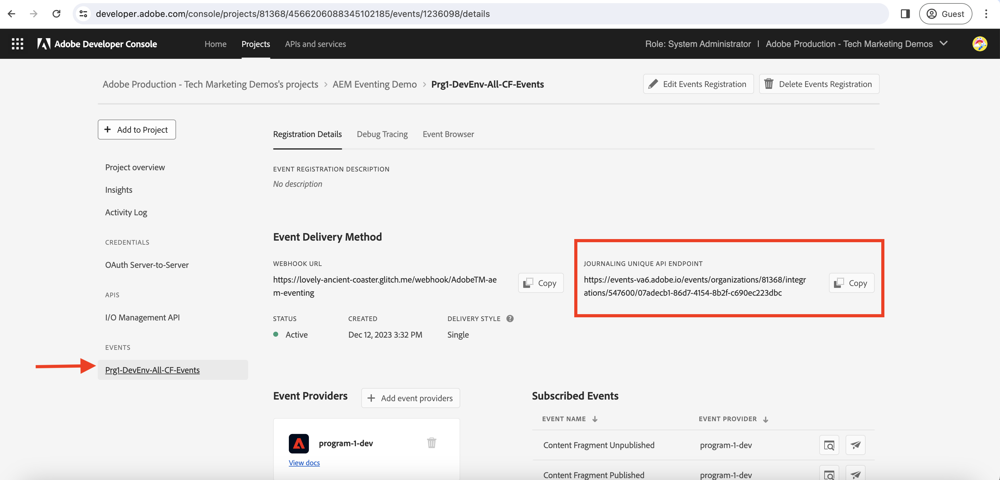

# 日誌記錄和AEM事件

瞭解如何從日誌擷取初始的AEM事件集，並探索有關每個事件的詳細資訊。

分錄是一種用於沖銷「AEM事件」的提取方法，而分錄則是經過排序的事件清單。 使用Adobe I/O事件日誌API，您可以從日誌擷取AEM事件，並在您的應用程式中處理它們。 此方法可讓您根據指定的步調管理事件，並有效率地大量處理這些事件。 請參閱 [日誌](https://developer.adobe.com/events/docs/guides/journaling_intro/) 以進行深入分析，包括保留期、分頁等基本考量事項。

在Adobe Developer Console專案中，每個事件註冊都會自動啟用日誌功能，以實現順暢的整合。

在此範例中，利用Adobe提供的 _託管網站應用程式_ 可讓您從日誌擷取第一批AEM事件，而不需要設定應用程式。 此Adobe提供的Web應用程式託管於 [故障](https://glitch.com/)，此平台以提供Web式環境而聞名，有助於建置和部署Web應用程式。 不過，您也可以選擇使用自己的應用程式（若偏好使用）。

## 先決條件

若要完成本教學課程，您需要：

- AEMas a Cloud Service環境搭配 [AEM事件已啟用](https://developer.adobe.com/experience-cloud/experience-manager-apis/guides/events/#enable-aem-events-on-your-aem-cloud-service-environment).

- [為AEM事件設定的Adobe Developer Console專案](https://developer.adobe.com/experience-cloud/experience-manager-apis/guides/events/#how-to-subscribe-to-aem-events-in-the-adobe-developer-console).

## 存取網頁應用程式

若要存取Adobe提供的Web應用程式，請遵循下列步驟：

- 確認您可存取 [問題 — 託管式網頁應用程式](https://indigo-speckle-antler.glitch.me/) 在新的瀏覽器標籤中。

  

## 收集Adobe Developer Console專案詳細資料

若要從日誌擷取AEM事件，請提供 _IMS組織ID_， _使用者端ID_、和 _存取權杖_ 為必要項。 若要收集這些認證，請依照下列步驟進行：

- 在 [Adobe Developer Console](https://developer.adobe.com)，導覽至您的專案，然後按一下以開啟專案。

- 在 **認證** 區段，按一下 **OAuth伺服器對伺服器** 用以開啟 **認證詳細資料** 標籤。

- 按一下 **產生存取權杖** 按鈕以產生存取權杖。

  

- 複製 **產生的存取權杖**， **使用者端ID**、和 **組織ID**. 在本教學課程的後半部分，您會需要用到這些資訊。

  

- 每個事件註冊都會自動啟用日誌。 若要取得 _唯一日誌API端點_ 在活動註冊中，按一下已訂閱AEM Events的活動卡。 從 **註冊詳細資料** 標籤，複製 **日誌唯一API端點**.

  

## 載入AEM事件日誌

為了簡單起見，此託管Web應用程式只會從日誌擷取第一批AEM事件。 這些是日誌中最舊可用的事件。 如需詳細資訊，請參閱 [第一批事件](https://developer.adobe.com/events/docs/guides/api/journaling_api/#fetching-your-first-batch-of-events-from-the-journal).

- 在 [問題 — 託管式網頁應用程式](https://indigo-speckle-antler.glitch.me/)，輸入 **IMS組織ID**， **使用者端ID**、和 **存取權杖** 您先前從Adobe Developer Console專案複製的，然後按一下 **提交**.

- 成功後，表格元件會顯示AEM Events Journal資料。

  

- 若要檢視完整的事件裝載，請連按兩下該列。 您可以看到AEM事件詳細資料具有在webhook中處理事件所需的所有必要資訊。 例如，事件型別(`type`)，事件來源(`source`)，事件id (`event_id`)，事件時間(`time`)和事件資料(`data`)。

  

## 其他資源

- [Webhook原始碼問題](https://glitch.com/edit/#!/indigo-speckle-antler) 可供參考。 它是一個簡單的React應用程式，使用 [AdobeReact Spectrum](https://react-spectrum.adobe.com/react-spectrum/index.html) 元件以呈現UI。

- [Adobe I/O事件日誌API](https://developer.adobe.com/events/docs/guides/api/journaling_api/) 提供有關API的詳細資訊，例如第一批、下一批和最後一批事件、分頁等等。
