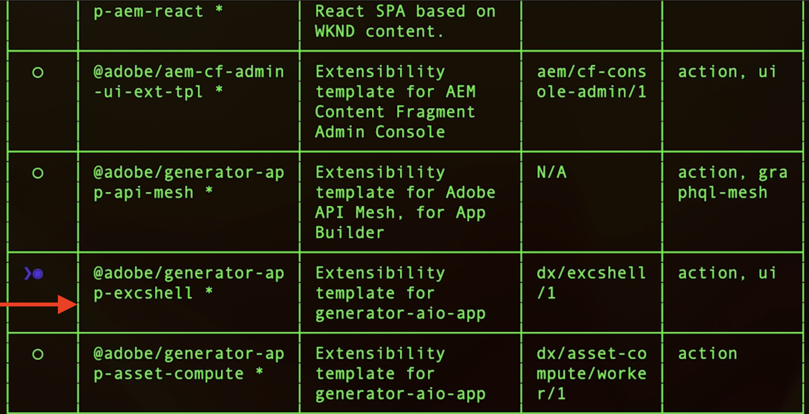

# Adobe I/O Runtime動作與AEM事件

瞭解如何使用接收AEM事件 [Adobe I/O Runtime](https://developer.adobe.com/runtime/docs/guides/overview/what_is_runtime/) 動作並檢閱事件詳細資訊，例如，裝載、標題和中繼資料。

>[!VIDEO](https://video.tv.adobe.com/v/3427053?quality=12&learn=on)

Adobe I/O Runtime是無伺服器平台，可讓程式碼執行以回應Adobe I/O事件。 因此可協助您建立事件驅動的應用程式，而不需擔心基礎建設問題。

在此範例中，您會建立Adobe I/O Runtime [動作](https://developer.adobe.com/runtime/docs/guides/using/creating_actions/) 會接收AEM事件並記錄事件詳細資訊。
https://developer.adobe.com/runtime/docs/guides/overview/what_is_runtime/

高層級步驟為：

- 在Adobe Developer Console中建立專案
- 初始化專案以進行本機開發
- 在Adobe Developer主控台中設定專案
- 觸發AEM事件並驗證動作執行

## 先決條件

若要完成本教學課程，您需要：

- AEMas a Cloud Service環境搭配 [AEM事件已啟用](https://developer.adobe.com/experience-cloud/experience-manager-apis/guides/events/#enable-aem-events-on-your-aem-cloud-service-environment).

- 存取目標 [Adobe Developer Console](https://developer.adobe.com/developer-console/docs/guides/getting-started/).

- [ADOBE DEVELOPER CLI](https://developer.adobe.com/runtime/docs/guides/tools/cli_install/) 已安裝在您的本機電腦上。

## 在Adobe Developer Console中建立專案

若要在Adobe Developer Console中建立專案，請遵循下列步驟：

- 瀏覽至 [Adobe Developer Console](https://developer.adobe.com/) 並按一下 **主控台** 按鈕。

- 在 **快速入門** 區段，按一下 **從範本建立專案**. 然後，在 **瀏覽範本** 對話方塊，選取 **App Builder** 範本。

- 視需要更新專案標題、應用程式名稱並新增工作區。 然後，按一下 **儲存**.

  


## 初始化專案以進行本機開發

若要將Adobe I/O Runtime動作新增至專案，您必須初始化專案以進行本機開發。 在本機電腦開啟終端機上，導覽至您要初始化專案的位置，然後依照下列步驟進行：

- 執行以初始化專案

  ```bash
  aio app init
  ```

- 選取 `Organization`，則 `Project` 以及工作區中建立的物件。 在 `What templates do you want to search for?` 步驟，選取 `All Templates` 選項。

  

- 從範本清單中選取 `@adobe/generator-app-excshell` 選項。

  

- 在您最愛的IDE中開啟專案，例如VSCode。

- 選取的 _擴充性範本_ (`@adobe/generator-app-excshell`)提供一般執行階段動作，程式碼位於 `src/dx-excshell-1/actions/generic/index.js` 檔案。 讓我們更新以保持簡單，記錄事件詳細資料並傳回成功回應。 不過在下個範例中，會增強來處理已收到的AEM事件。

  ```javascript
  const fetch = require("node-fetch");
  const { Core } = require("@adobe/aio-sdk");
  const {
  errorResponse,
  getBearerToken,
  stringParameters,
  checkMissingRequestInputs,
  } = require("../utils");
  
  // main function that will be executed by Adobe I/O Runtime
  async function main(params) {
  // create a Logger
  const logger = Core.Logger("main", { level: params.LOG_LEVEL || "info" });
  
  try {
      // 'info' is the default level if not set
      logger.info("Calling the main action");
  
      // log parameters, only if params.LOG_LEVEL === 'debug'
      logger.debug(stringParameters(params));
  
      const response = {
      statusCode: 200,
      body: {
          message: "Received AEM Event, it will be processed in next example",
      },
      };
  
      // log the response status code
      logger.info(`${response.statusCode}: successful request`);
      return response;
  } catch (error) {
      // log any server errors
      logger.error(error);
      // return with 500
      return errorResponse(500, "server error", logger);
  }
  }
  
  exports.main = main;
  ```

- 最後，透過執行在Adobe I/O Runtime上部署更新的動作。

  ```bash
  aio app deploy
  ```

## 在Adobe Developer主控台中設定專案

若要接收AEM事件並執行上一步建立的Adobe I/O Runtime動作，請在Adobe Developer Console中設定專案。

- 在Adobe Developer Console中導覽至 [專案](https://developer.adobe.com/console/projects) 在上一步中建立，然後按一下以開啟它。 選取 `Stage` 工作區，這是部署動作的位置。

- 按一下 **新增服務** 按鈕並選取 **API** 選項。 在 **新增API** 強制回應視窗，選取 **Adobe服務** > **I/O管理API** 並按一下 **下一個**，按照其他設定步驟操作並按一下 **儲存已設定的API**.

  

- 同樣地，按一下 **新增服務** 按鈕並選取 **事件** 選項。 在 **新增事件** 對話方塊，選取 **Experience Cloud** > **AEM Sites**，然後按一下 **下一個**. 按照其他設定步驟操作，選取AEMCS執行個體、事件型別和其他詳細資訊。

- 最後，在 **如何接收事件** 步驟，展開 **執行階段動作** 選項並選取 _一般_ 在上一步建立的動作。 按一下 **儲存已設定的事件**.

  

- 請檢閱「事件註冊」詳細資料，以及 **偵錯追蹤** 標籤並驗證 **挑戰探查** 要求和回應。

  


## 觸發AEM事件

若要從已在上述Adobe Developer Console專案中註冊的AEMas a Cloud Service環境觸發AEM事件，請遵循下列步驟：

- 透過存取和登入您的AEMas a Cloud Service作者環境 [Cloud Manager](https://my.cloudmanager.adobe.com/).

- 根據您的 **訂閱的事件**、建立、更新、刪除、發佈或取消發佈內容片段。

## 檢閱事件詳細資料

完成上述步驟後，您應該會看到系統將AEM事件傳遞至一般動作。

您可以在下列位置檢視事件詳細資訊： **偵錯追蹤** 「 」事件註冊詳細資訊的「 」標籤。


## 後續步驟

在下個範例中，我們將增強此動作以處理AEM事件、回撥AEM作者服務以取得內容詳細資料、將詳細資料儲存在Adobe I/O Runtime儲存體中，並透過單頁應用程式(SPA)顯示它們。

