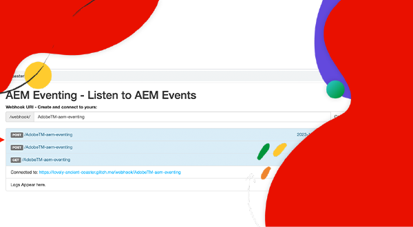

# AEM Eventing

了解 AEM Eventing 是什麼及其使用原因、使用時機和相關範例。

>[!VIDEO](https://video.tv.adobe.com/v/3426686?quality=12&learn=on)

## AEM Eventing 是什麼

AEM Eventing 是一個雲端原生的事件系統，支援訂閱 AEM 事件，以便在外部系統進行處理。AEM 事件是每當發生特定動作時，AEM 所發送的狀態變更通知。例如，包括建立、更新或刪除內容片段時的事件。

上述圖表以視覺化方式呈現 AEM as a Cloud Service 服務是如何產生事件並將其發送至 Adobe I/O Events，進而向事件訂閱者公開。

概括而言，有以下三個主要元件：

1. **事件提供者：** AEM as a Cloud Service。
1. **Adobe I/O Events：**&#x200B;開發人員平台，用於整合、擴充以及建置以 Adobe 產品和技術為基礎的應用程式與體驗。
1. **事件使用者：**&#x200B;訂閱 AEM 事件之客戶所擁有的系統。例如，CRM (客戶關係管理)、PIM (產品資訊管理)、OMS (訂單管理系統) 或自訂的應用程式。

### 有何不同

[Apache Sling 事件](https://sling.apache.org/documentation/bundles/apache-sling-eventing-and-job-handling.html)、OSGi 事件和 [JCR 觀察](https://jackrabbit.apache.org/oak/docs/features/observation.html)皆能提供訂閱和處理事件的機制。但是，這些與本文件中所討論的 AEM Eventing 不同。

AEM Eventing 的主要差異包括：

- 事件使用者程式碼會在 AEM 之外執行，而非在與 AEM 相同的 JVM 中運作。
- AEM 產品程式碼會負責定義事件，並將其傳送至 Adobe I/O Events。
- 事件資訊經過標準化，並以 JSON 格式傳送。如需更多詳細資訊，請參閱 [cloudevents](https://cloudevents.io/)。
- 為了回頭與 AEM 進行通訊，事件使用者會利用 AEM as a Cloud Service API。

## 使用的理由和時機

AEM Eventing 能為系統架構和營運效率帶來多項優勢。使用 AEM Eventing 的主要原因包括：

- **建置事件驅動的架構**：有助於建立可獨立擴展，且能有效應對故障情況的鬆散耦合系統。
- **少量程式碼並降低營運成本**：避免在 AEM 中進行自訂，讓系統更易於維護和擴充，進而降低營運費用。
- **簡化 AEM 與外部系統間的通訊**：讓 Adobe I/O Events 管理通訊，藉此消除點對點連線，例如判定應將哪些 AEM 事件傳遞到特定系統或服務。
- **事件持久性更長**：Adobe I/O Events 是一個高度可用且可擴充的系統，能處理大量事件並可靠地將其傳遞給訂閱者。
- **並行處理事件**：支援同時向多個訂閱者傳遞事件，以便多個不同的系統可以分散進行事件處理。
- **無伺服器應用程式開發**：支援將事件使用者程式碼部署為無伺服器應用程式，進一步增強系統的彈性和擴充性。

### 限制

AEM Eventing 雖然功能強大，但也必須考量其中一些限制：

- **可用性僅限於 AEM as a Cloud Service**：目前，AEM Eventing 僅可在 AEM as a Cloud Service 中使用。

- **可用的事件類型**：於[此處](https://developer.adobe.com/experience-cloud/experience-manager-apis/guides/events/#available-event-types)檢閱目前可用之事件類型的清單。

## 如何啟用

請參閱[在 AEM Cloud Service 環境中啟用 AEM 事件](https://developer.adobe.com/experience-cloud/experience-manager-apis/guides/events/#enable-aem-events-on-your-aem-cloud-service-environment)，了解後續步驟。

## 如何訂閱

若要訂閱 AEM 事件，您不需要在 AEM 中編寫任何程式碼，而是設定 [Adobe Developer Console](https://developer.adobe.com/) 專案。Adobe Developer Console 是通往 Adobe API、SDK、事件、執行階段和 App Builder 的入口。

在這個情況下，您可以透過 Adobe Developer Console 中的&#x200B;_專案_&#x200B;訂閱從 AEM as a Cloud Service 環境發出的事件，並將事件傳遞到外部系統。

如需詳細資訊，請參閱[如何在 Adobe Developer Console 中訂閱 AEM 事件](https://developer.adobe.com/experience-cloud/experience-manager-apis/guides/events/#how-to-subscribe-to-aem-events-in-the-adobe-developer-console)。

## 如何使用

使用 AEM 事件的主要方法有兩種：_推送_&#x200B;方法和&#x200B;_提取_&#x200B;方法。

- **推送方法**：在此方法中，當事件可使用時，Adobe I/O Events 會主動通知事件使用者。整合選項包括 Webhooks、Adobe I/O Runtime 和 Amazon EventBridge。
- **提取方法**：在此方法中，由事件使用者主動提取 Adobe I/O Events 來確認是否有新事件。此方法的主要整合選項是 Adobe Developer Journaling API。

如需詳細資訊，請參閱[透過 Adobe I/O Events 處理 AEM 事件](https://developer.adobe.com/experience-cloud/experience-manager-apis/guides/events/#aem-events-processing-via-adobe-io)。

## 範例

<table>
  <tr>
    <td>
        
        
<strong><a href="./examples/webhook.md">在 Webhook 上接收 AEM 事件</a></strong>

        

          使用 Adobe 提供的 Webhook 接收 AEM 事件，並檢閱事件詳細資訊。
        

      </td>
      <td>
        
        
<strong><a href="./examples/journaling.md">載入 AEM 事件日誌</a></strong>

        

          使用 Adobe 提供的網頁應用程式從日誌中載入 AEM 事件，並檢閱事件詳細資訊。
        

      </td>
    </tr>
  <tr>
    <td>
        
        
<strong><a href="./examples/runtime-action.md">在出現 Adobe I/O Runtime 動作時接收 AEM 事件</a></strong>

        

          接收 AEM 事件，並檢閱事件詳細資訊。
        

      </td>
      <td>
        
        
<strong><a href="./examples/event-processing-using-runtime-action.md">使用 Adobe I/O Runtime 動作處理 AEM 事件</a></strong>

        

          了解如何使用 Adobe I/O Runtime 動作處理接收到的 AEM 事件。事件處理包括 AEM 回調、事件資料持續性，以及將其顯示在 SPA 中。
        

      </td>
  </tr>
  <tr>
    <td>
        
        
<strong><a href="./examples/assets-pim-integration.md">用於 PIM 整合的 AEM Assets 事件</a></strong>

        

          了解如何整合 AEM Assets 和產品資訊管理 (PIM) 系統，以利進行中繼資料更新。
        

      </td>
  </tr> 
</table>
