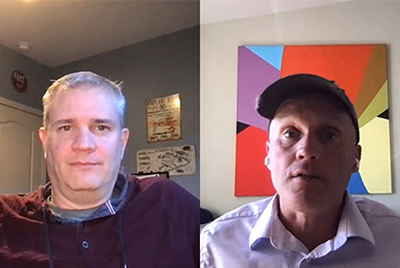

# Cloud 5第1季

## 簡介

歡迎使用AEM Engineering的Cloud 5系列。 任何產品實作階段的主要問題之一，就是這些範例、工具或API有足夠的程式碼範例和/或即時示範。 此系列的目標是在5分鐘或更短時間內提供關於AEMas a Cloud Service的有用資訊。

造訪 [建議方塊](https://forms.office.com/r/74P5Xz4UH0) 用於提交主題構想。

## 第1季

每一季的長度各異，且會依固定排程發行。 第1季的主題主要是基於我們在與客戶和合作夥伴的日常互動中遇到的過去請求。 請造訪此頁面，每週更新或關注您選擇的社交網路。

<table>
  <tr>
   <td>
      
      

         <a href="./cloud5-aem-cdn-part1.md"><strong>AEM CDN深入探討（第1部分）</strong></a>         
          <em>資深雲端架構師達林·孔策與詹姆斯·塔博特</em>
      

      

         
         第1部分說明AEMas a Cloud Service的CDN，以及如何在實施中使用。
      

     </td>   
     <td>
      
      

         <a href="./cloud5-aem-cdn-part2.md"><strong>AEM CDN深入探討（第2部分）</strong></a>
          <em>資深雲端架構師達林·孔策與詹姆斯·塔博特</em>
      

      

         
         第2部分延續我們對AEMas a Cloud ServiceCDN的審視。 我們針對您使用新CDN所獲得的功能回答了一些更常見的問題和誤解。
      

   </td>
     <td>
        
      

         <a href="./cloud5-aem-log-files.md"><strong>記錄檔和記錄</strong></a>
          <em>資深雲端架構師達林·孔策與詹姆斯·塔博特</em>
      

      

         
         以下快速說明如何在AEMas a Cloud Service存取記錄，包括如何透過使用者介面及從API存取記錄。
      

   </td> 
  </tr>
  <tr>
   <td>
        
      

        <a href="./cloud5-getting-login-token-integrations.md"><strong>與存取權杖整合</strong></a>        
          <em>資深雲端架構師達林·孔策與詹姆斯·塔博特</em>
      

      

         
         與登入權杖互動以在雲端服務環境中進行整合工作的快速概述和示範。
      

     </td>   
     <td>
        
      

        <a href="./cloud5-aem-dispatcher-cloud.md"><strong>雲端中的Dispatcher</strong></a>
          <em>資深雲端架構師達林·孔策與詹姆斯·塔博特</em>
      

      

         
        Darin和James討論AEM雲端中的Dispatcher，包括一些最佳實務和與AMS/內部部署的差異。 
      

   </td>
     <td>
        
      

         <a href="./cloud5-aem-content-migration-part-1.md"><strong>移轉（第1部分）</strong></a>
          <em>與資深雲端建築師與博士達林·昆策及詹姆斯·塔博特合作</em>
      

      

         
         移轉至雲端的秘訣第一部分（共兩部分）。 我們第一部分的主要重點在於讓您做好遷移準備的最佳實務和準備工作。
      

   </td> 
  </tr>
<tr>
   <td>
        
      

        <a href="./cloud5-aem-content-migration-part-2.md"><strong>移轉（第2部分）</strong></a>     
          <em>資深雲端架構師達林·孔策與詹姆斯·塔博特</em>
      

      

         
         移轉至雲端的秘訣與訣竅中的第二部分（共兩部分）。 第二部分主要說明如何使用可用的移轉工具。
      

     </td>   
     <td>
        
      

         <a href="./cloud5-aem-dispatcher-validator.md"><strong>Dispatcher驗證器</strong></a>
          <em>資深雲端架構師達林·孔策與詹姆斯·塔博特</em>
      

      

         
         作為先前移轉討論的一個分支，我們將審視Dispatcher驗證器及其可以完成的一些任務。
      

   </td>
     <td>
        
      

         <a href="./cloud5-aem-search-and-indexing.md"><strong>索引和搜尋提示</strong></a>
          <em>資深雲端架構師達林·孔策與詹姆斯·塔博特</em>
      

      

         
         對於像索引和搜尋這樣複雜的專案，團隊會向您展示一些可讓您最佳化開發時間並在問題發生之前解決問題的簡單方法。
      

   </td> 
  </tr>
    <tr>
        <td>
            
            

                <a href="./cloud5-adobe-app-builder.md"><strong>AdobeApp Builder</strong></a>         
                <em>資深雲端設計師與Amol Anand合著的Darin Kuntze與James Talbot</em>
            

            
 
                快來看看您可以使用AdobeApp Builder做的一些很酷的事情，並瞭解雲端中自訂的未來相關新資訊。
            

        </td>
        <td></td>
        <td></td>
    </tr>
</table>
