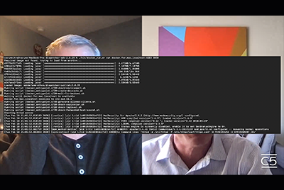

# Cloud 5

## 簡介

歡迎使用AEM Engineering的Cloud 5系列。 任何產品實作階段的主要問題之一，就是這些範例、工具或API的程式碼範例和/或即時示範是否足夠。 此系列的目標是在5分鐘或更短時間內提供關於AEMas a Cloud Service的有用資訊。

造訪 [建議方塊](https://forms.office.com/r/74P5Xz4UH0) 用於提交主題概念。

## 第1季

每一季的長度各異，且會依固定排程發行。 第1季的主題主要來自我們在與客戶和合作夥伴的日常互動中遇到的過去請求。 請造訪此頁面，瞭解每週更新或前往您選擇的社交網路關注我們。

<table>
  <tr>
   <td>
      
      

         <a href="./cloud5-aem-cdn-part1.md"><strong>AEM CDN深入探討（第1部分）</strong></a>         
          <em>資深雲端架構師Darin Kuntze與James Talbot</em>
      

      

         
         第1部分說明AEMas a Cloud Service的CDN，以及如何在實施中使用。
      

     </td>   
     <td>
      
      

         <a href="./cloud5-aem-cdn-part2.md"><strong>AEM CDN深入探討（第2部分）</strong></a>
          <em>資深雲端架構師Darin Kuntze與James Talbot</em>
      

      

         
         第2部分延續我們對AEMas a Cloud ServiceCDN的看法。 我們針對您在新CDN中獲得哪些功能的一些常見問題和神話，提供解答。
      

   </td>
     <td>
        
      

         <a href="./cloud5-aem-log-files.md"><strong>記錄檔與記錄</strong></a>
          <em>資深雲端架構師Darin Kuntze與James Talbot</em>
      

      

         
         以下快速說明如何存取AEMas a Cloud Service的記錄，包括如何透過使用者介面及從API存取記錄。
      

   </td> 
  </tr>
  <tr>
   <td>
        
      

        <a href="./cloud5-getting-login-token-integrations.md"><strong>與Access Token整合</strong></a>        
          <em>資深雲端架構師Darin Kuntze與James Talbot</em>
      

      

         
         與登入權杖互動以在雲端服務環境中進行整合工作的快速概述和示範。
      

     </td>   
     <td>
        
      

        <a href="./cloud5-aem-dispatcher-cloud.md"><strong>雲端中的Dispatcher</strong></a>
          <em>資深雲端架構師Darin Kuntze與James Talbot</em>
      

      

         
        Darin和James討論AEM雲端中的Dispatcher，包括一些最佳實務和與AMS/內部部署的差異。 
      

   </td>
     <td>
        
      

         <a href="./cloud5-aem-content-migration-part-1.md"><strong>移轉（第1部分）</strong></a>
          <em>與Darin Kuntze和James Talbot，資深雲端架構師與Applesmith博士</em>
      

      

         
         移轉至雲端的秘訣和訣竅中的第一部分（兩部分之一）。 我們第一部分的主要重點是讓您做好遷移準備的最佳實務和準備工作。
      

   </td> 
  </tr>
<tr>
   <td>
        
      

        <a href="./cloud5-aem-content-migration-part-2.md"><strong>移轉（第2部分）</strong></a>     
          <em>資深雲端架構師Darin Kuntze與James Talbot</em>
      

      

         
         移轉至雲端的秘訣與技巧，共分為第二部分（共2部分）。 第二部分主要說明如何使用可用的移轉工具。
      

     </td>   
     <td>
        
      

         <a href="./cloud5-aem-dispatcher-validator.md"><strong>Dispatcher驗證器</strong></a>
          <em>資深雲端架構師Darin Kuntze與James Talbot</em>
      

      

         
         作為先前移轉討論的分支，我們將瞭解Dispatcher驗證器及其可以完成的一些任務。
      

   </td>
     <td>
        
      

         <a href="./cloud5-aem-search-and-indexing.md"><strong>索引和搜尋提示</strong></a>
          <em>資深雲端架構師Darin Kuntze與James Talbot</em>
      

      

         
         對於像索引和搜尋這樣複雜的專案，團隊會向您展示一些可以讓您最佳化開發時間並在問題發生之前解決這些問題的簡單方法。
      

   </td> 
  </tr>
    <tr>
        <td>
            
            

                <a href="./cloud5-adobe-app-builder.md"><strong>AdobeApp Builder</strong></a>         
                <em>與Darin Kuntze和James Talbot，資深雲端架構師和Amol Anand</em>
            

            
 
                快來看看您可以使用AdobeApp Builder做的一些很酷的事情，並瞭解關於雲端中自訂的未來的一些新東西。
            

        </td>
        <td></td>
        <td></td>
    </tr>
</table>