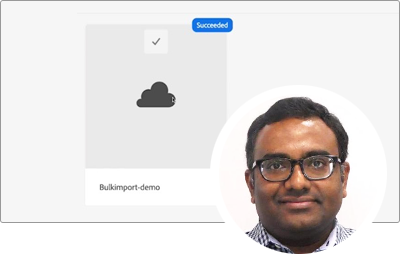

# AEMas a Cloud Service專家系列

與建置Adobe Experience Manager (AEM)的Adobe專家工程師及提供該產品的專業服務團隊as a Cloud Service，瞭解該產品。 加入Adobe專家的行列，探索什麼是AEMas a Cloud Service、其如何與AEM 6相同和不同，以及如何從AEM 6移至AEMas a Cloud Service。

  
 

## AEMas a Cloud Service快速入門

瞭解AEM as aCloud Service的基礎知識，以及它與AEM 6和Adobe工程的資深雲端架構師有何不同。

<table>
  <tr>
   <td>
      
      

         <a href="../../migration/moving-to-aem-as-a-cloud-service/introduction.md"><strong>想法不同</strong></a>         
          <em>與資深雲端架構師Darin Kuntze</em>
      

      

         
         檢視AEMas a Cloud Service的架構，以及如何以不同的方式思考AEMas a Cloud Service實作。
      

     </td>   
     <td>
      
      

         <a href="../../migration/moving-to-aem-as-a-cloud-service/onboarding.md"><strong>AEMas a Cloud Service入門</strong></a>
          <em>與資深雲端架構師Damian Langsweirdt合作</em>
      

      

         
         瞭解AEMas a Cloud Service上線程式，從合約階段開始，使用Cloud Manager設定自助服務環境。
      

   </td>     
   </td>   
     <td>
      
      

         <a href="../../migration/moving-to-aem-as-a-cloud-service/cloud-manager.md"><strong>AEM適用的Cloud Manageras a Cloud Service</strong></a>
          <em>與資深雲端架構師Bryan Stopp合作</em>
      

      

         
         瞭解適用於AEM的Cloud Manageras a Cloud Service，以及其與適用於AEM onAdobe管理服務(AMS)的Cloud Manager的差異。
      

   </td> 
  </tr>
</table>

## 移至AEMas a Cloud Service？

要從AEM 6移至AEMas a Cloud Service嗎？ 瞭解Adobe移至AEMas a Cloud Service的方法，以及有助於順利轉換的各種工具和功能。

<table>
  <tr>
   <td>
      
      

         <a href="../../migration/moving-to-aem-as-a-cloud-service/bpa-and-cam.md" target="_aem-experts-series-video"><strong>移轉方法</strong></a>
          <em>與Adobe諮詢服務技術架構師Roger Blanton合作</em>
      

      

         
        檢視使用AEM Best Practice Analyzer (BPA)和Cloud Acceleration Manager (CAM)從AEM 6移轉至AEMas a Cloud Service的最佳實務移轉方法。
      

   </td>   
     <td>
      
      

         <a href="../../migration/moving-to-aem-as-a-cloud-service/aem-modernization-tools.md" target="_aem-experts-series-video"><strong>更新您的內容</strong></a>
          <em>與資深雲端架構師Bryan Stopp合作</em>
      

      

         
         瞭解如何自動匯入最新的AEM內容，以運用最新的AEMas a Cloud Service功能。
      

   </td>     
   </td>   
     <td>
      
      

         <a href="../../migration/moving-to-aem-as-a-cloud-service/repository-modernization.md" target="_aem-experts-series-video"><strong>更新您的AEM Maven專案</strong></a>
          <em>雲端架構師Varun Mitra</em>
      

      

         
         瞭解如何自動將自訂AEM應用程式的Maven專案結構和組織現代化，以與AEMas a Cloud Service相容並符合Adobe的最新最佳實務。
      

   </td> 
  </tr>
  <tr>
   <td>
      
      

         <a href="../../migration/moving-to-aem-as-a-cloud-service/search-and-indexing.md" target="_aem-experts-series-video"><strong>更新Oak索引</strong></a>
          <em>與資深雲端架構師Darin Kuntze</em>
      

      

         
        瞭解如何將AEM 6 Oak索引定義自動轉換為相容於AEMas a Cloud Service，以及如何在未來維護AEMas a Cloud Service的Oak索引。
      

   </td>   
     <td>
      
      

         <a href="../../migration/moving-to-aem-as-a-cloud-service/dispatcher.md" target="_aem-experts-series-video"><strong>更新Dispatcher設定</strong></a>
          <em>與資深雲端架構師Bryan Stopp合作</em>
      

      

         
         瞭解AEM適用的AEM Dispatcheras a Cloud Service，重點放在適用於AEM 6的Dispatcher、Dispatcher轉換工具及如何使用Dispatcher Tools SDK。
      

   </td>     
   </td>   
     <td>
      
      

         <a href="../../migration/moving-to-aem-as-a-cloud-service/content-migration/content-transfer-tool.md" target="_aem-experts-series-video"><strong>將您的內容傳輸到AEMas a Cloud Service</strong></a>
          <em>與資深雲端架構師Kiran Murugulla合作</em>
      

      

         
         瞭解內容轉移工具如何協助您將內容從AEM 6.3+as a Cloud Service移轉至AEM。
      

   </td> 
  </tr>  
</table>

## AEM as a Cloud Service功能

向Adobe專家瞭解AEMas a Cloud Service的獨特功能。

<table>
  <tr>
   <td>
      
      

         <a href="../../migration/moving-to-aem-as-a-cloud-service/asset-compute-microservices.md" target="_aem-experts-series-video"><strong>asset compute微服務</strong></a>
          <em>與Principal Cloud Architect Amol Anand合作</em>
      

      

         
        瞭解AEM Assets的Asset compute微服務，這些服務如何取代AEM 6資產處理，以及如何將其延伸以產生自訂資產轉譯。
      

   </td>   
   <td>
      
      

         <a href="../../migration/moving-to-aem-as-a-cloud-service/content-migration/bulk-import-service.md" target="_aem-experts-series-video"><strong>大量匯入內容</strong></a>
          <em>與資深雲端架構師Kiran Murugulla合作</em>
      

      

         
        瞭解如何使用大量匯入服務和AEM封裝管理員，安全且有效地大量匯入內容至AEMas a Cloud Service。
      

   </td> 
    <td></td>
  </tr>
</table>

## 需要AEM as aCloud Service的相關協助嗎？

向專家瞭解如何針對AEMas a Cloud Service和AEM SDK進行偵錯和疑難排解！

<table>
  <tr>
   <td>
      
      

         <a href="../../migration/moving-to-aem-as-a-cloud-service/troubleshooting.md" 
         target="_aem-experts-series-video"><strong>疑難排解AEMas a Cloud Service</strong></a>
          <em>雲端架構師Kunwar Saluja</em>
      

      

         
        瞭解如何疑難排解AEMas a Cloud Service的各個層面，從AEM SDK和AEMas a Cloud Service的偵錯到Cloud Manager建置和部署失敗。
      

   </td>   
    <td></td>
    <td></td>
  </tr>
</table>
