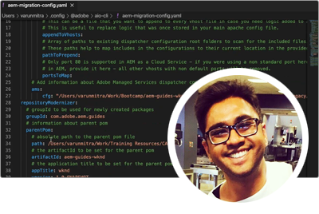

# Adobe Experience Manager as a Cloud Service專家系列

瞭解Adobe Experience Manager(AEM)as a Cloud Service於Adobe的專業工程師和提供該技術的專業服務團隊。 與Adobe的專家一起探AEM討什麼是as a Cloud Service，它與6的相同和不同AEM，以及如何從6AEM向AEMas a Cloud Service。

  
 

## 開始使AEM用as a Cloud Service

瞭解Cloud ServicesAEM的基本知識，以及它與6的AEM不同之處，與Adobe工程部門的高級雲架構師。

<table>
  <tr>
   <td>
      
      

         <a href="../../migration/moving-to-aem-as-a-cloud-service/introduction.md"><strong>不同的思考</strong></a>         
          <em>與高級雲架構師Darin Kuntze</em>
      

      

         
         看看AEMas a Cloud Service的體系結構，以及如何對as a Cloud Service實施有不同AEM的思考。
      

     </td>   
     <td>
      
      

         <a href="../../migration/moving-to-aem-as-a-cloud-service/onboarding.md"><strong>進入AEMas a Cloud Service</strong></a>
          <em>與高級雲架構師Damian Langsweirdt</em>
      

      

         
         瞭解如何開始AEM到as a Cloud Service，從合同階段開始，使用雲管理器設定自助服務環境。
      

   </td>     
   </td>   
     <td>
      
      

         <a href="../../migration/moving-to-aem-as-a-cloud-service/cloud-manager.md"><strong>用於AEMas a Cloud Service的雲管理器</strong></a>
          <em>與高級雲架構師Bryan Stopp</em>
      

      

         
         瞭解as a Cloud Service的Cloud Manager及AEM其與Adobe管理服務(AMS)上AEMCloud Manager的不同之處。
      

   </td> 
  </tr>
</table>

## 轉移至 AEM as a Cloud Service?

計畫從6AEM遷到AEMas a Cloud Service? 瞭解Adobe的as a Cloud Service方法，以AEM及使此過渡平穩的各種工具和功能。

<table>
  <tr>
   <td>
      
      

         <a href="../../migration/moving-to-aem-as-a-cloud-service/bpa-and-cam.md" target="_aem-experts-series-video"><strong>遷移方法</strong></a>
          <em>與Adobe咨詢服務技術架構師Roger Blanton</em>
      

      

         
        瞭解使用最佳實踐分析器(AEMBPA)和雲加速管理器(CAM)從6AEM遷移到AEMas a Cloud Service的最佳實踐遷移方法。
      

   </td>   
     <td>
      
      

         <a href="../../migration/moving-to-aem-as-a-cloud-service/aem-modernization-tools.md" target="_aem-experts-series-video"><strong>更新您的內容</strong></a>
          <em>與高級雲架構師Bryan Stopp</em>
      

      

         
         瞭解如何自動實現內AEM容現代化，以利用最新的AEMas a Cloud Service功能。
      

   </td>     
   </td>   
     <td>
      
      

         <a href="../../migration/moving-to-aem-as-a-cloud-service/repository-modernization.md" target="_aem-experts-series-video"><strong>對Maven項AEM目進行現代化</strong></a>
          <em>雲架構師Varun Mitra</em>
      

      

         
         瞭解如何自動實現自定義應AEM用程式的Maven項目結構和組織的現代化，使其與AEMas a Cloud Service相容並與Adobe的最新最佳做法保持一致。
      

   </td> 
  </tr>
  <tr>
   <td>
      
      

         <a href="../../migration/moving-to-aem-as-a-cloud-service/search-and-indexing.md" target="_aem-experts-series-video"><strong>更新您的Oak索引</strong></a>
          <em>與高級雲架構師Darin Kuntze</em>
      

      

         
        瞭解如何自動將AEM6個Oak索引定義轉換為AEMas a Cloud Service相容，以及如何保持Oak索引，以便將AEM來能夠as a Cloud Service。
      

   </td>   
     <td>
      
      

         <a href="../../migration/moving-to-aem-as-a-cloud-service/dispatcher.md" target="_aem-experts-series-video"><strong>對Dispatcher配置進行現代化</strong></a>
          <em>與高級雲架構師Bryan Stopp</em>
      

      

         
         了AEM解Dispatcher for AEMfergie，重點介紹Dispatcher for AEM 6 、 Dispatcher轉換工具以及如何使用Dispatcher Tools SDK的顯著更改。
      

   </td>     
   </td>   
     <td>
      
      

         <a href="../../migration/moving-to-aem-as-a-cloud-service/content-migration/content-transfer-tool.md" target="_aem-experts-series-video"><strong>將內容傳輸到AEMas a Cloud Service</strong></a>
          <em>與高級雲架構師基蘭·穆魯古拉合作</em>
      

      

         
         瞭解內容傳輸工具如何幫助您將內容AEM從6.AEM3+遷移到as a Cloud Service。
      

   </td> 
  </tr>  
</table>

## AEM作為Cloud Services

向AdobeAEM的專家瞭解as a Cloud Service的獨特能力。

<table>
  <tr>
   <td>
      
      

         <a href="../../migration/moving-to-aem-as-a-cloud-service/asset-compute-microservices.md" target="_aem-experts-series-video"><strong>asset compute微服務</strong></a>
          <em>雲架構師Amol Anand</em>
      

      

         
        瞭解AEM Assets的Asset computeMicroservices 、它們如何替換AEM6個資產處理，以及如何擴展它們以生成自定義資產格式副本。
      

   </td>   
   <td>
      
      

         <a href="../../migration/moving-to-aem-as-a-cloud-service/content-migration/bulk-import-service.md" target="_aem-experts-series-video"><strong>批量導入內容</strong></a>
          <em>與高級雲架構師基蘭·穆魯古拉合作</em>
      

      

         
        瞭解如何使用批量導入服務和包管理器AEM將內容批量安全高效地導AEM入as a Cloud Service。
      

   </td> 
    <td></td>
  </tr>
</table>

## 需要幫AEM助嗎，Cloud Services?

瞭解如何調試和排除AEMas a Cloud Service和AEM專家的SDK!

<table>
  <tr>
   <td>
      
      

         <a href="../../migration/moving-to-aem-as-a-cloud-service/troubleshooting.md" 
         target="_aem-experts-series-video"><strong>故障排除AEMas a Cloud Service</strong></a>
          <em>與Kunwar Saluja一起，雲架構師</em>
      

      

         
        瞭解如何排除as a Cloud Service的AEM各種故障，從調試SDK和as a Cloud Service到AEMCloud Manager生成和部署故障。
      

   </td>   
    <td></td>
    <td></td>
  </tr>
</table>
