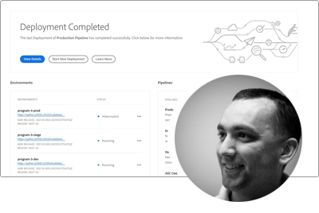

# AEM as a Cloud Service Experts系列

向建置Adobe Experience Manager (AEM)的Adobe專家工程師與提供該產品的專業服務團隊瞭解as a Cloud Service。 加入Adobe專家的的行列，探索什麼是AEM as a Cloud Service、其如何與AEM 6相同和不同，以及如何從AEM 6移至AEM as a Cloud Service。

  
 

## AEM as a Cloud Service快速入門

瞭解AEM as aCloud Service的基礎知識，以及它與AEM 6和Adobe工程的資深雲端架構師有何不同。

<table>
  <tr>
   <td>
      
      

         <a href="../../migration/moving-to-aem-as-a-cloud-service/introduction.md"><strong>有不同的想法</strong></a>         
          <em>與Darin Kuntze，資深雲端架構師</em>
      

      

         
         瞭解AEM as a Cloud Service的架構，以及如何以不同的方式思考AEM as a Cloud Service實作。
      

     </td>   
     <td>
      
      

         <a href="../../migration/moving-to-aem-as-a-cloud-service/onboarding.md"><strong>開始使用AEM as a Cloud Service</strong></a>
          <em>與Damian Langsweirdt，資深雲端架構師</em>
      

      

         
         瞭解AEM as a Cloud Service上線程式，從合約階段開始，使用Cloud Manager設定自助服務環境。
      

   </td>     
   </td>   
     <td>
      
      

         適用於AEM as a Cloud Service的<a href="../../migration/moving-to-aem-as-a-cloud-service/cloud-manager.md"><strong>Cloud Manager</strong></a>
          <em>與Bryan Stopp，資深雲端架構師</em>
      

      

         
         瞭解適用於AEM as a Cloud Service的Cloud Manager，以及其與適用於AEM on Adobe Manage Services (AMS)的Cloud Manager的差異。
      

   </td> 
  </tr>
</table>

## 是否移至AEM as a Cloud Service？

是否計畫從AEM 6移至AEM as a Cloud Service？ 瞭解Adobe移轉至AEM as a Cloud Service的方法，以及有助於順利轉換的各種工具和功能。

<table>
  <tr>
   <td>
      
      

         <a href="../../migration/moving-to-aem-as-a-cloud-service/bpa-and-cam.md" target="_aem-experts-series-video"><strong>移轉方法</strong></a>
          <em>與Adobe Consulting Services技術架構師Roger Blanton</em>
      

      

         
        檢視使用AEM Best Practice Analyzer (BPA)和Cloud Acceleration Manager (CAM)從AEM 6移轉至AEM as a Cloud Service的最佳實務移轉方法。
      

   </td>   
     <td>
      
      

         <a href="../../migration/moving-to-aem-as-a-cloud-service/aem-modernization-tools.md" target="_aem-experts-series-video"><strong>更新您的內容</strong></a>
          <em>與Bryan Stopp，資深雲端架構師</em>
      

      

         
         瞭解如何自動匯入最新的AEM內容，以善用最新AEM as a Cloud Service功能。
      

   </td>     
   </td>   
     <td>
      
      

         <a href="../../migration/moving-to-aem-as-a-cloud-service/repository-modernization.md" target="_aem-experts-series-video"><strong>更新您的AEM Maven專案</strong></a>
          <em>與Varun Mitra，雲端架構師</em>
      

      

         
         瞭解如何自動將自訂AEM應用程式的Maven專案結構和組織現代化為相容於AEM as a Cloud Service並符合Adobe的最新最佳實務。
      

   </td> 
  </tr>
  <tr>
   <td>
      
      

         <a href="../../migration/moving-to-aem-as-a-cloud-service/search-and-indexing.md" target="_aem-experts-series-video"><strong>更新您的Oak索引</strong></a>
          <em>與Darin Kuntze，資深雲端架構師</em>
      

      

         
        瞭解如何將AEM 6 Oak索引定義自動轉換為相容於AEM as a Cloud Service，以及如何為未來的AEM as a Cloud Service維護Oak索引。
      

   </td>   
     <td>
      
      

         <a href="../../migration/moving-to-aem-as-a-cloud-service/dispatcher.md" target="_aem-experts-series-video"><strong>更新您的Dispatcher設定</strong></a>
          <em>與Bryan Stopp，資深雲端架構師</em>
      

      

         
         瞭解適用於AEM as a Cloud Service的AEM Dispatcher，重點放在適用於AEM 6的Dispatcher、Dispatcher轉換工具及如何使用Dispatcher Tools SDK的重大變更。
      

   </td>     
   </td>   
     <td>
      
      

         <a href="../../migration/moving-to-aem-as-a-cloud-service/content-migration/content-transfer-tool.md" target="_aem-experts-series-video"><strong>正在將您的內容傳輸到AEM as a Cloud Service</strong></a>
          <em>與Kiran Murugulla，資深雲端架構師</em>
      

      

         
         瞭解內容轉移工具如何協助您將內容從AEM 6.3+移轉至AEM as a Cloud Service。
      

   </td> 
  </tr>  
</table>

## AEM as a Cloud Service功能

向Adobe專家瞭解AEM as a Cloud Service的獨特功能。

<table>
  <tr>
   <td>
      
      

         <a href="../../migration/moving-to-aem-as-a-cloud-service/asset-compute-microservices.md" target="_aem-experts-series-video"><strong>Asset compute微服務</strong></a>
          <em>與Amol Anand，主要雲端架構師</em>
      

      

         
        瞭解AEM Assets的Asset compute微服務，這些服務如何取代AEM 6資產處理，以及如何將其延伸以產生自訂資產轉譯。
      

   </td>   
   <td>
      
      

         <a href="../../migration/moving-to-aem-as-a-cloud-service/content-migration/bulk-import-service.md" target="_aem-experts-series-video"><strong>正在大量匯入內容</strong></a>
          <em>與Kiran Murugulla，資深雲端架構師</em>
      

      

         
        瞭解如何使用大量匯入服務和AEM封裝管理員，安全且有效地大量匯入內容至AEM as a Cloud Service。
      

   </td> 
    <td></td>
  </tr>
</table>

## 需要AEM as aCloud Service的相關協助嗎？

向專家瞭解如何針對AEM as a Cloud Service和AEM SDK進行除錯和疑難排解！

<table>
  <tr>
   <td>
      
      

         <a href="../../migration/moving-to-aem-as-a-cloud-service/troubleshooting.md" 
         target="_aem-experts-series-video"><strong>疑難排解AEM as a Cloud Service</strong></a>
          <em>與Kunwar Saluja，雲端架構師</em>
      

      

         
        瞭解如何疑難排解AEM as a Cloud Service的各個層面，從AEM SDK和AEM as a Cloud Service的偵錯到Cloud Manager的建置和部署失敗。
      

   </td>   
    <td></td>
    <td></td>
  </tr>
</table>
