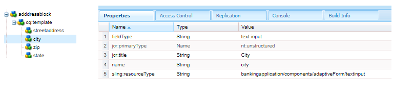

# 建立地址元件

登入本機雲端就緒的AEM Forms執行個體的CRXDE。

建立``/apps/bankingapplication/components/adaptiveForm/button``節點的復本，並將其重新命名為addressblock。 選取addressblock節點並設定其屬性，如下所示。

>[!NOTE]
>
> ``bankingapplication``是在建立Maven專案時提供的appId。 此appId在您的環境中可能會不同。 您可以製作任何元件的副本，我剛才正好製作按鈕元件的副本

## cq-template節點屬性

選取``addressblock``節點下的``cq-template``節點並設定其屬性，如下所示。 請注意，fieldType已設定為panel

## 在cq-template下新增節點

在``cq-template``下新增下列型別``nt:unstructured``的節點

* streetaddress
* 城市
* ZIP
* 州別

這些節點代表位址區塊元件的欄位。 街道地址、城市和郵遞區號欄位將是文字輸入欄位，而州別欄位將是下拉式欄位。

## 設定streetaddress節點的屬性

>[!NOTE]
>
> 路徑中的&#x200B;**_銀行應用程式_**&#x200B;參考Maven專案的appId。 您的環境可能會有所不同

選取``streetaddress``節點並設定其屬性，如下所示。

## 設定城市節點的屬性

選取``city``節點並設定其屬性，如下所示。

## 設定zip節點的屬性

選取``zip``節點並設定其屬性，如下所示。

## 設定狀態節點的屬性

選取``state``節點並設定其屬性，如下所示。 請注意fieldType的狀態型別 — 已設定為下拉式清單

## 設定狀態列位的選項

選取``state``節點並新增下列屬性。

| 名稱 | 類型 | 值 |
|----------|----------|---------------------|
| 列舉 | 字串[] | CA，紐約 |
| enumName | 字串[] | 加利福尼亞、紐約 |

最終的addressblock元件看起來像這樣

## 後續步驟

[部署專案](./deploy-your-project.md)
