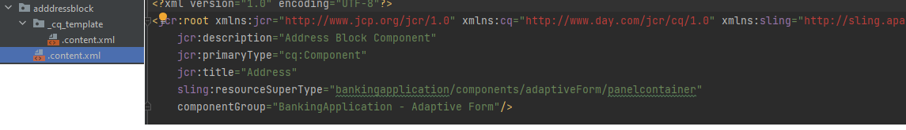

# 部署您的專案

開始將專案部署至AEM Forms as a Cloud Service之前，建議先將專案部署至本機雲端就緒的AEM Forms執行個體。

## 將變更與您的AEM專案同步

啟動IntelliJ並導覽至``ui.apps``資料夾下的adaptiveForm資料夾，如下所示

以滑鼠右鍵按一下``adaptiveForm``節點並選取[新增] | 封裝
請確定您將名稱**addressblock**&#x200B;新增至封裝

在新建立的封裝``addressblock``上按一下滑鼠右鍵，然後選取``repo | Get Command``，如下所示

這會將專案與您的本機雲端就緒AEM Forms執行個體同步。 您可以驗證.content.xml檔案以確認屬性

## 將專案部署到您的本機執行個體

啟動新的命令提示視窗，並瀏覽至專案的根資料夾，然後使用下面顯示的命令建置專案

成功部署專案後，
位址元件現在可用於最適化表單中

## 將專案部署到雲端環境

如果您的本機開發環境一切正常，下一步就是使用Cloud Manager部署到[雲端執行個體。](https://experienceleague.adobe.com/en/docs/experience-manager-learn/cloud-service/forms/developing-for-cloud-service/push-project-to-cloud-manager-git)
