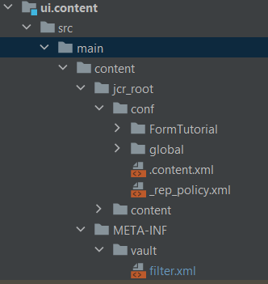

# 在項目中包括雲服務配置

建立名為「FormTutorial」的配置容器以保存你的雲服務配置通過提供Azure儲存帳戶詳細資訊和Azure訪問密鑰，在「FormTutorial」容器中為名為「FormsCSAndAzureBlob」的Azure儲存建立雲服務配置。

在AEMIntelliJ中開啟項目。 確保在ui.content項目中添加資料夾FormTutorial，如下所示


確保在ui.content項目的filter.xml中添加以下條目

```xml
<filter root="/conf/FormTutorial" mode="replace"/>
```



## 在項目中包括表單資料模型

根據您在前一步中建立的雲服務配置建立表單資料模型。 要在項目中包括表單資料模型，請在intelliJ中在項目中創AEM建相應的資料夾結構。 例如，我的表單資料模型位於名為註冊的資料夾中


在ui.content項目的filter.xml中包含相應條目

```xml
<filter root="/content/dam/formsanddocuments-fdm/registrations" mode="replace"/>
```


>[!NOTE]
>
>現在，使用雲管理器構建和部署項目時，必須在雲服務配置中重新輸入您的Azure訪問密鑰。 為避免重新輸入訪問密鑰，建議使用環境變數建立上下文感知配置，如 [下一篇文章](./context-aware-fdm.md)
