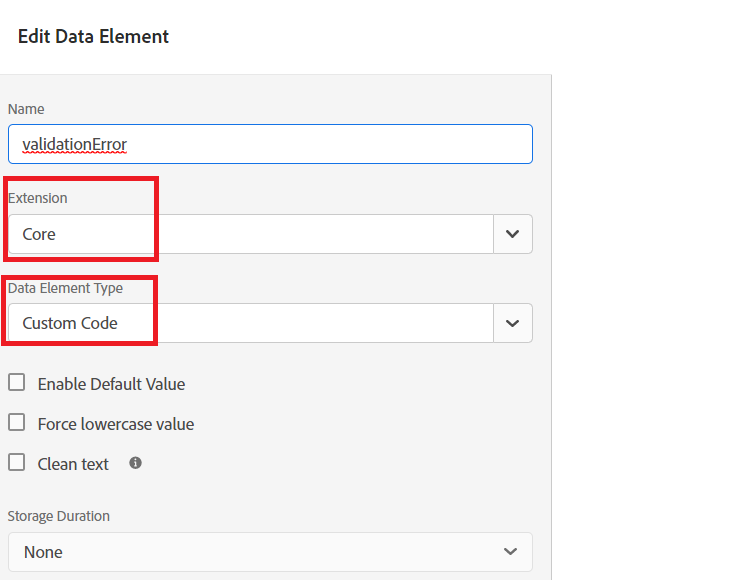

# 建立適當的資料元素

在「標籤」屬性中，我們添加了兩個新資料元素（RapcitsStateOfResidence和validationError）。


## 申請人居住狀態

的 **申請人居住狀態** 通過選擇 **核心** 在擴展下拉清單中 **自定義代碼** 顯示在下面螢幕抓圖中的資料元素類型


以下自定義代碼用於從 **_狀態_** 自適應窗體欄位。

```javascript
// use the GuideBridge API to access adaptive form elements
//The state field's SOM expression is used to access the state field
var ApplicantsStateOfResidence = guideBridge.resolveNode("guide[0].guide1[0].guideRootPanel[0].state[0]").value;
_satellite.logger.log(" Returning  Applicants State Of Residence is "+ApplicantsStateOfResidence);
return ApplicantsStateOfResidence;
```

## 驗證錯誤

的 **驗證錯誤** 通過選擇 **核心** 在擴展下拉清單中 **自定義代碼** 顯示在下面螢幕抓圖中的資料元素類型



編寫了以下自定義代碼以設定validationError資料元素值。

```javascript
var validationError = "";
// Using GuideBridge API to access adaptive forms fields using the fields SOM expression
var tel = guideBridge.resolveNode("guide[0].guide1[0].guideRootPanel[0].telephone[0]");
var email = guideBridge.resolveNode("guide[0].guide1[0].guideRootPanel[0].email[0]");
_satellite.logger.log("Got tel in Tags custom script "+tel.isValid)
_satellite.logger.log("Got email in Tags custom script "+email.isValid)
if(tel.isValid == false)
{  
  validationError = "error: telephone number";
  _satellite.logger.log("Validation error is "+ validationError);
}

if(email.isValid == false)
{  
  validationError = "error: invalid email";
  _satellite.logger.log("Validation error is "+ validationError);
}

return validationError;
```
