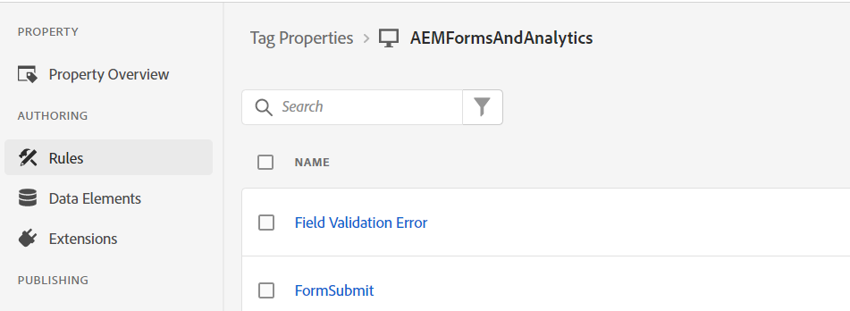
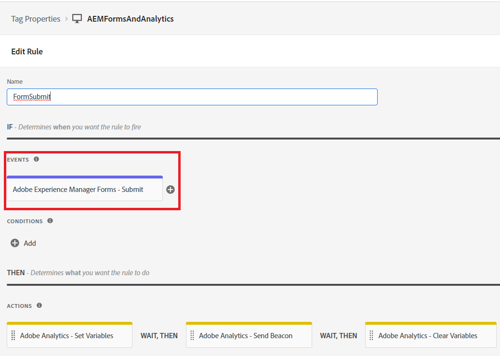

# 定義規則

在Tags屬性中，我們建立了2個新的 [規則](https://experienceleague.adobe.com/docs/platform-learn/implement-in-websites/configure-tags/add-data-elements-rules.html) (**欄位驗證錯誤和FormSubmit**)。

## 欄位驗證錯誤

此 **欄位驗證錯誤** 每當最適化表單欄位中出現驗證錯誤時，就會觸發規則。 例如，在我們的表單中，如果電話號碼或電子郵件不是預期的格式，則會顯示驗證錯誤訊息。

欄位驗證錯誤規則是透過將事件設定為來設定 _**Adobe Experience Manager Forms-Error**_ 如熒幕擷取畫面所示

Adobe Analytics — 設定變數的設定如下

## 表單提交規則

每次成功提交最適化表單時，就會觸發表單提交規則。

表單提交規則是使用 _**Adobe Experience Manager Forms — 提交**_ 事件

在表單提交規則中，資料元素的值 _**ApplicatesStateOfResidence**_ 對應至prop5，而資料元素FormTitle的值對應至prop8。

Adobe Analytics — 設定變數的設定如下。

當您準備好要測試您的標籤程式碼時，[發佈您對標籤所做的變更](https://experienceleague.adobe.com/docs/experience-platform/tags/publish/publishing-flow.html) 使用發佈流程。
