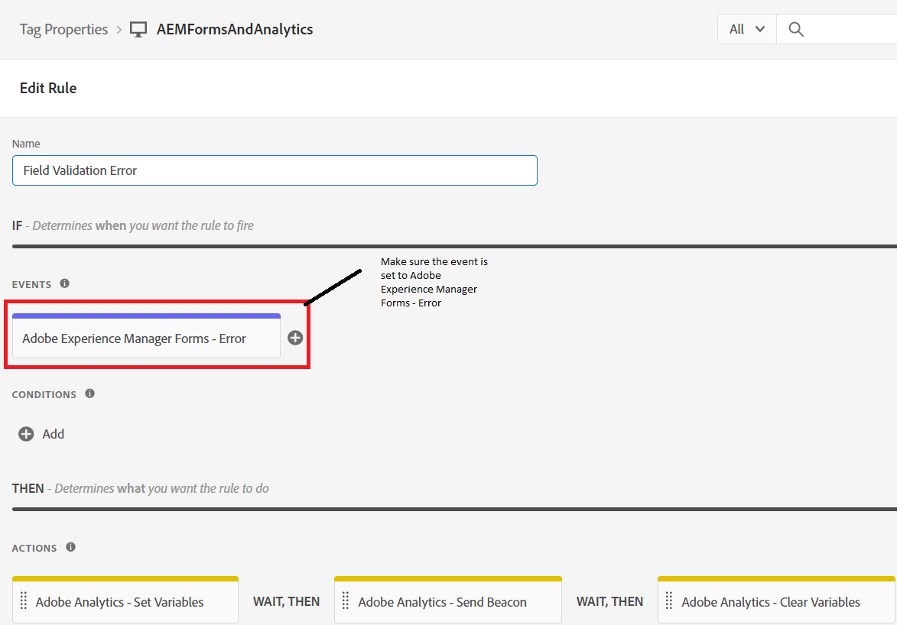

# 定義規則

在「標籤」屬性中，我們建立了2個新 [規則](https://experienceleague.adobe.com/docs/platform-learn/implement-in-websites/configure-tags/add-data-elements-rules.html) (**欄位驗證錯誤和表單提交**)。

## 欄位驗證錯誤

的 **欄位驗證錯誤** 每次在自適應表單域中出現驗證錯誤時都會觸發規則。 例如，在我們的表單中，如果電話號碼或電子郵件的格式不是預期格式，則會顯示驗證錯誤消息。

通過將事件設定為來配置欄位驗證錯誤規則 _**Adobe Experience Manager Forms錯誤**_ 如螢幕抓圖所示

Adobe Analytics — 設定變數的配置如下

## 表單提交規則

每次成功提交自適應表單時都會觸發「表單提交」規則。

表單提交規則是使用 _**Adobe Experience Manager Forms — 提交**_ 事件

在表單提交規則中，資料元素的值 _**申請人居住狀態**_ 映射到prop5，資料元素FormTitle的值映射到prop8。

Adobe Analytics — 設定變數的配置如下。

當您準備好test標籤代碼時，[發佈對標籤所做的更改](https://experienceleague.adobe.com/docs/experience-platform/tags/publish/publishing-flow.html) 使用發佈流。
