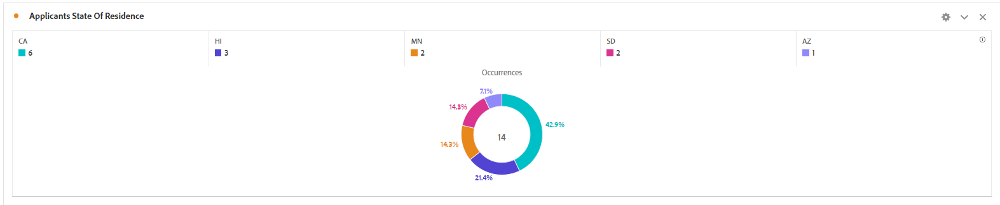

# 測試您的解決方案

使用表單值的數種組合來預覽和提交表單。 若要在Adobe Analytics報表中查看您的資料，請等待數到30分鐘。 設為Prop的資料集會比設為eVar的資料集更早在報表中顯示。

## 報表套裝

Adobe Analytics中擷取的表單資料會以環圈格式（依州提交）呈現



欄位驗證錯誤


## 偵錯

確認適用性表單使用的設定容器與包含「Adobe啟動設定」的容器相同。

若要確認表單正將資料傳送至Adobe Analytics，請執行下列動作

* 在瀏覽器中開啟「開發人員工具」。
* 在「主控台」面板的下列文字中輸入。

```javascript
_satellite.setDebug(true)
```

與表單互動，同時保持控制台視窗開啟。 你應該看到這樣的


## 使用Adobe Experience Platform Debugger

新增 [AEP Debugger擴充功能](https://experienceleague.adobe.com/docs/experience-platform/debugger/home.html) 登入瀏覽器（您必須登入）以取得更多除錯資訊


