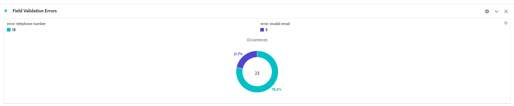

# Test您的解決方案

使用多個表單值組合預覽和提交表單。 允許幾到30分鐘在Adobe Analytics報告中查看資料。 要使用的資料集在報告中顯示的時間早於資料集到eVars。

## 報表套裝

在Adobe Analytics捕獲的表格資料以甜圈形式呈現

**各國提交**


欄位驗證錯誤



## 偵錯

確保自適應表單使用的配置容器與包含Adobe啟動配置的容器相同。

要確認表單正在向Adobe Analytics發送資料，請執行以下操作

* 在瀏覽器中開啟「開發人員工具」。
* 在「控制台」面板中輸入以下文本。

```javascript
_satellite.setDebug(true)
```

在保持控制台窗口開啟的同時與表單交互。 你應該看到這樣的


## 使用Adobe Experience Platform調試器

添加 [AEP調試器擴展](https://experienceleague.adobe.com/docs/experience-platform/debugger/home.html) 瀏覽器（需要您登錄才能獲取更多調試資訊）


