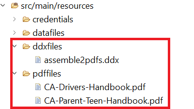

# 匯入Eclipse專案

* 下載並解壓縮 [zip檔案](./assets/pdf-manipulation.zip)
* 啟動Eclipse並將專案匯入Eclipse
* 專案在資源資料夾中包含下列資料夾：
   * ddxFiles — 此資料夾包含描述您要產生的輸出的ddx檔案
   * pdf — 此資料夾包含您要組合的pdf檔案和測試PDFA公用程式的pdf檔案
   * 認證 — 此資料夾包含pdfa-options.json檔案

## 測試組裝PDF檔案

* 將您的服務認證複製並貼到專案的service_token.json資源檔案中。
* 開啟AssemblePDFFiles.java檔案，並指定要儲存產生的PDF檔案的資料夾
* 開啟ExecuteAssemblerService.java。 設定變數的值 _AEM_FORMS_CS_ 以指向您的執行個體。
* 取消註解適當的行，以測試組裝兩個或多個PDF檔案
* 以Java應用程式執行ExecuteAssemblerService.java

### 測試PDFA公用程式

* 將您的服務認證複製並貼到專案的service_token.json資源檔案中。
* 開啟PDFAUtilities.java檔案，並指定要儲存產生的PDF檔案的資料夾。
* 開啟ExecuteAssemblerService.java。 設定變數的值 _AEM_FORMS_CS_ 以指向您的執行個體。
* 取消註解適當的行以測試PDFA操作。
* 以Java應用程式執行ExecuteAssemblerService.java。

>[!NOTE]
> 第一次執行Java程式時，您會收到HTTP 403錯誤。 若要通過此程式，請務必提供 [AEM中技術帳戶使用者的適當許可權](https://experienceleague.adobe.com/docs/experience-manager-learn/getting-started-with-aem-headless/authentication/service-credentials.html?lang=en#configure-access-in-aem).

**AEM Forms使用者** 是我在此課程中使用的角色。
