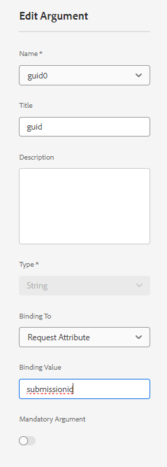

# 使用SharePoint清單資料預先填寫最適化表單

在舊版AEM Form(6.5)中，自訂程式碼必須使用要求屬性預先填入表單資料模型支援的最適化表單。 在AEM Forms as a Cloud Service中，不再需要編寫自訂程式碼。

本文會說明使用表單資料模型預填服務，以從SharePoint清單擷取的資料預填/預填最適化表單所需的步驟。

本文假設您擁有 [已成功設定最適化表單以提交資料至sharepoint清單。](https://experienceleague.adobe.com/docs/experience-manager-cloud-service/content/forms/adaptive-forms-authoring/authoring-adaptive-forms-core-components/create-an-adaptive-form-on-forms-cs/configure-submit-actions-core-components.html?lang=en#connect-af-sharepoint-list)

以下是SharePoint清單中的資料


若要使用與特定GUID相關聯的資料預先填入調適型表單，必須執行下列步驟

## 設定取得服務

* 使用guid屬性為表單資料模型的頂層物件建立get服務
  

在此熒幕擷圖中，guid欄是透過稱為的請求屬性繫結 `submissionid`.

已完整設定的get服務看起來像這樣


## 設定最適化表單以使用表單資料模型預填服務

* 根據共用點清單表單資料模型開啟最適化表單。 與表單資料模型預填服務建立關聯
  

## 測試表單

加入以預覽表單 `submissionid` 在URL中，如下所示

```html
http://localhost:4502/content/dam/formsanddocuments/contactusform/jcr:content?wcmmode=disabled&submissionid=57e12249-751a-4a38-a81f-0a4422b24412
```


