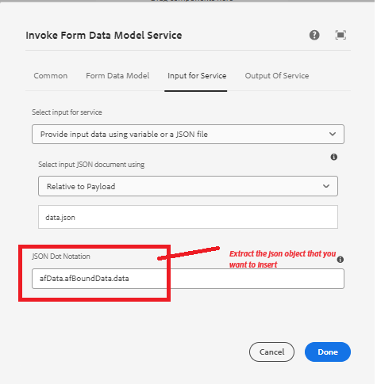

# 使用叫用FDM工作流程步驟將資料插入SharePoint清單


本文說明在SharePoint工作流程中使用叫用FDM步驟，將資料插入AEM清單所需的步驟。

本文假設您已[成功設定最適化表單，以將資料提交至SharePoint清單。](https://experienceleague.adobe.com/docs/experience-manager-cloud-service/content/forms/adaptive-forms-authoring/authoring-adaptive-forms-core-components/create-an-adaptive-form-on-forms-cs/configure-submit-actions-core-components.html?lang=en#connect-af-sharepoint-list)


## 根據SharePoint清單資料來源建立表單資料模型

* 根據SharePoint清單資料來源建立新的表單資料模型。
* 新增適當的模型和表單資料模型的get服務。
* 設定插入服務以插入頂層模型物件。
* 測試插入服務。


## 建立工作流程

* 使用叫用FDM步驟建立簡單的工作流程。
* 設定呼叫FDM步驟，使用先前步驟建立的表單資料模型。
* 

## 根據核心元件的最適化表單

提交的資料採用以下格式。 我們需要在叫用表單資料模型服務工作流程步驟中使用點標籤法來擷取ContactUS物件，如熒幕擷取所示

```json
{
  "ContactUS": {
    "Title": "Mr",
    "Products": "Photoshop",
    "HighNetWorth": "1",
    "SubmitterName": "John Does"
  }
}
```


* 


## 根據Foundation元件的最適化表單

提交的資料採用以下格式。 在叫用表單資料模型服務工作流程步驟中使用點標籤法擷取ContactUS JSON物件

```json
{
    "afData": {
        "afUnboundData": {
            "data": {}
        },
        "afBoundData": {
            "data": {
                "ContactUS": {
                    "Title": "Lord",
                    "HighNetWorth": "true",
                    "SubmitterName": "John Doe",
                    "Products": "Forms"
                }
            }
        },
        "afSubmissionInfo": {
            "lastFocusItem": "guide[0].guide1[0].guideRootPanel[0].afJsonSchemaRoot[0]",
            "stateOverrides": {},
            "signers": {},
            "afPath": "/content/dam/formsanddocuments/foundationform",
            "afSubmissionTime": "20240517100126"
        }
    }
}
```



## 設定最適化表單以觸發AEM工作流程

* 使用先前步驟建立的表單資料模型建立最適化表單。
* 將資料來源中的一些欄位拖放至您的表單上。
* 設定表單的提交動作，如下所示
* 


## 測試表單

預覽在上一步建立的表單。 填寫表單並提交。 表單中的資料應插入SharePoint清單中。
