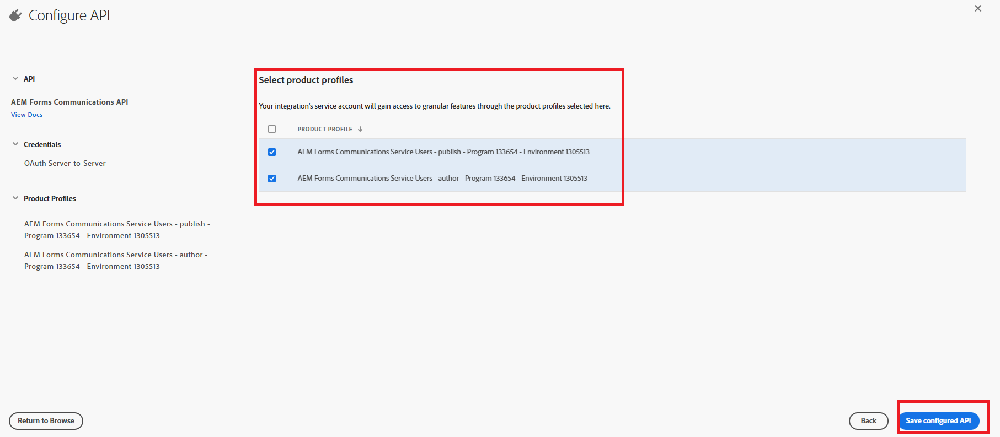

# 在AEM Forms as a Cloud Service上設定OpenAPI型AEM Forms通訊API

## 先決條件

* AEM Forms as a Cloud Service的最新執行個體。
* 已將所有必要的[產品設定檔新增至環境。](https://experienceleague.adobe.com/zh-hant/docs/experience-manager-learn/cloud-service/aem-apis/invoke-openapi-based-aem-apis)

* 啟用產品設定檔的AEM API存取權，如下所示
  
  

## 建立Adobe Developer Console專案

使用您的Adobe ID登入[Adobe Developer Console](https://developer.adobe.com/console/)。
按一下適當的圖示以建立新專案

為專案提供有意義的名稱，然後按一下「新增API」圖示

選取Experience Cloud

選取AEM Forms Communications API並按下一步

確定您已選取伺服器對伺服器驗證，然後按下一步

選取設定檔，然後按一下「儲存已設定的API」按鈕以儲存您的設定

按一下OAuth伺服器對伺服器

複製使用者端ID、使用者端密碼和範圍

## 設定AEM執行個體以啟用ADC專案通訊

如果您已有AEM Forms專案，[請依照這些指示](https://experienceleague.adobe.com/zh-hant/docs/experience-manager-learn/cloud-service/aem-apis/invoke-openapi-based-aem-apis)啟用Adobe Developer Console專案的OAuth伺服器對伺服器認證ClientID與AEM執行個體通訊

如果您沒有AEM Forms專案，請依照本檔案建立[AEM Forms專案。](https://experienceleague.adobe.com/zh-hant/docs/experience-manager-learn/cloud-service/forms/developing-for-cloud-service/getting-started)，然後啟用Adobe Developer Console專案的OAuth伺服器對伺服器認證ClientID，以使用此檔案與AEM執行個體[通訊。](https://experienceleague.adobe.com/zh-hant/docs/experience-manager-learn/cloud-service/aem-apis/invoke-openapi-based-aem-apis)

## 後續步驟

[產生存取權杖](./generate-access-token.md)
