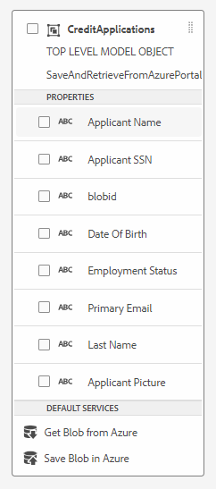

# 建立與Azure儲存體的整合

下一步是使用表單資料模型建立AEM Forms CS與Azure儲存體之間的整合。
以下影片會逐步引導您執行建立整合所需的步驟。

>[!VIDEO](https://video.tv.adobe.com/v/335385?quality=12&learn=on)

在本教學課程中，已使用名為CreditApplications的實體建立名為SaveAndRetrieveFromAzurePortal的表單資料模型

## 後續步驟

[建立最適化表單](./create-af.md)
