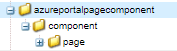

# 頁面元件

頁面元件是負責轉譯頁面的一般元件。 我們將建立新的頁面元件，並將將此頁面元件與新的調適型表單範本建立關聯。 這可確保只有當最適化表單以此特定範本為基礎時，才會執行我們的程式碼。

## 建立頁面元件

登入本機雲端就緒的AEM Forms執行個體。 在apps資料夾下建立以下結構


1. 以滑鼠右鍵按一下頁面資料夾，並建立名為storedfetch的節點，型別為cq：Component
1. 儲存變更
1. 將下列屬性新增至 `storeandfetch` 節點並儲存

| **屬性名稱** | **屬性型別** | **屬性值** |
|-------------------------|-------------------|----------------------------------------|
| componentGroup | 字串 | 隱藏 |
| jcr：description | 字串 | 最適化表單範本頁面類型 |
| jcr:title | 字串 | 最適化表單範本頁面 |
| sling:resourceSuperType | 字串 | `fd/af/components/page2/aftemplatedpage` |

複製 `/libs/fd/af/components/page2/aftemplatedpage/aftemplatedpage.jsp` 並貼到 `storeandfetch` 節點。 重新命名 `aftemplatedpage.jsp` 至 `storeandfetch.jsp`.

開啟 `storeandfetch.jsp` 並新增下列行：

```jsp
<cq:include script="azureportal.jsp"/>
```

在

```jsp
<cq:include script="fallbackLibrary.jsp"/>
```

最終程式碼應如下所示

```jsp
<cq:include script="fallbackLibrary.jsp"/>
<cq:include script="azureportal.jsp"/>
```

在storeandfetch節點下建立名為azureportal.jsp的檔案，將下列程式碼複製到azureportal.jsp中並儲存變更

```jsp
<%@page session="false" %>
<%@include file="/libs/fd/af/components/guidesglobal.jsp" %>
<%@ page import="org.apache.commons.logging.Log" %>
<%@ page import="org.apache.commons.logging.LogFactory" %>
<%
    if(request.getParameter("guid")!=null) {
            logger.debug( "Got Guid in the request" );
            String BlobId = request.getParameter("guid");
            java.util.Map paraMap = new java.util.HashMap();
            paraMap.put("BlobId",BlobId);
            slingRequest.setAttribute("paramMap",paraMap);
    } else {
            logger.debug( "There is no Guid in the request " );
    }            
%>
```

在此程式碼中，我們會取得請求引數的值 **guid** 並將其儲存在名為BlobId的變數中。 然後使用paramMap屬性將此BlobId傳遞到sling請求中。 為了讓此程式碼運作，假設您有一個以Azure儲存體支援的表單資料模型為基礎的表單，且表單資料模型的讀取服務繫結至名為BlobId的請求屬性，如下方熒幕擷取所示。


### 後續步驟

[將頁面元件與範本建立關聯](./associate-page-component.md)
