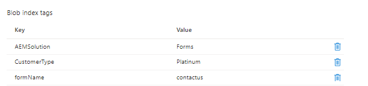

# 簡介

在本教學課程中，您將瞭解如何實作一個簡單的使用案例，將表單提交專案儲存在Azure儲存空間並標籤blob索引。 Blob索引標籤使用索引鍵值索引標籤屬性提供資料管理和探索功能。 您可以在單一容器中或在儲存帳戶的所有容器中分類和尋找物件。

## 必要條件

* AEM Forms CS使用體驗。
* 使用Cloud Manager部署程式碼的體驗。
* 存取AEM Forms CS的雲端就緒例項。

若要在AEM Forms CS中實作上述使用案例，您將需要下列專案

* [AEM Forms CS雲端就緒例項](https://experienceleague.adobe.com/docs/experience-manager-learn/cloud-service/forms/developing-for-cloud-service/intellij-and-aem-sync.html?lang=en#set-up-aem-author-instance)
* [Azure入口網站帳戶](https://portal.azure.com/)

### 後續步驟

[extend-choice-group-components](./extend-choice-group-components.md)
