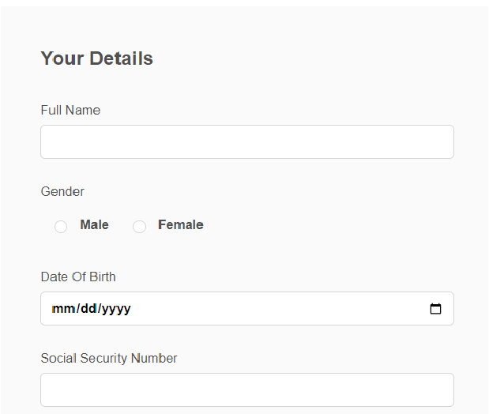

# 建立最適化表單

建立以核心元件為基礎的最適化表單，並將垂直索引標籤元件插入您的表單上。

## 設定垂直元件

按一下垂直標籤元件以開啟組態特性表。 設定下列標籤

1. 基本 — 為垂直標籤元件提供有意義的名稱和標題，如下所示
   
1. 專案 — 專案索引標籤可讓您將專案新增到垂直索引標籤元件。 通常，您會將面板新增為專案，然後將表單元素新增至面板。 垂直標籤預設有兩個專案，您可以根據需求為專案命名，如下所示
   

## 設定個別面板

1. 您的詳細資料 — 選取&#x200B;**您的資訊**&#x200B;節點下的專案1，並開啟設定內容表。 提供有意義的名稱和標題，如下所示
   

將下列欄位新增至您的詳細資料面板，如下所示

1. 位址 — 選取&#x200B;**您的資訊**&#x200B;節點下的專案2，並開啟設定內容表。 提供有意義的名稱和標題，如下所示
   

將下列2個文字欄位新增至「地址」面板，如下所示

