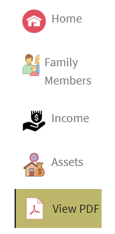
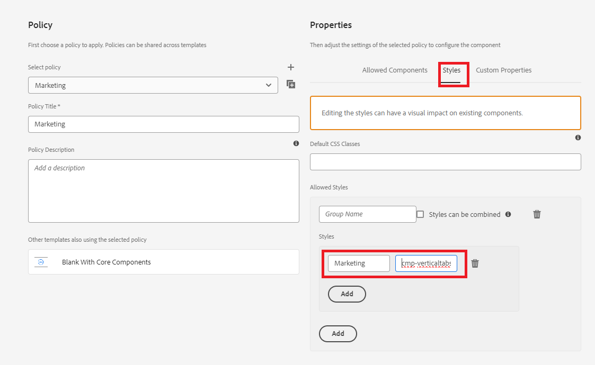

# 新增自訂圖示

將自訂圖示新增到索引標籤可以透過以下幾種方式改善使用者體驗和視覺吸引力：

* 增強的可用性：圖示可以快速傳達每個標籤的用途，讓使用者更容易一眼就找到他們想要的東西。 圖示等視覺提示可協助使用者更直覺地導覽。

* 視覺階層與焦點：圖示可在標籤之間建立更清楚的分隔，進而改善視覺階層。 這可協助重要標籤脫穎而出，並有效引導使用者的注意。
依照本文的指示，您應該能夠放置圖示，如下所示



## 先決條件

若要閱讀本文章，您需要熟悉Git、使用Cloud Manager建立和部署AEM專案、在AEM Cloud Manager中設定前端管道，以及少量CSS。 如果您不熟悉上述主題，請遵循[使用主題來設定核心元件樣式](https://experienceleague.adobe.com/en/docs/experience-manager-cloud-service/content/forms/adaptive-forms-authoring/authoring-adaptive-forms-core-components/create-an-adaptive-form-on-forms-cs/using-themes-in-core-components#rename-env-file-theme-folder)文章。

## 在主題中新增圖示

在Visual Studio程式碼或您選擇的任何其他編輯器中開啟主題專案。
將您選擇的圖示新增至影像資料夾。
標示為紅色的圖示是新增的圖示。


## 建立圖示對應以儲存圖示

在_variable.scss檔案中建立icon-map。 SCSS map $icon-map是索引鍵值配對的集合，每個索引鍵代表圖示名稱（例如home、family等），每個值是與該圖示相關聯的影像檔案的路徑。


```css
$icon-map: (
    home: "./resources/images/home.png",
    family: "./resources/images/icons8-family-80.png",
    pdf: "./resources/images/pdf.png",
    income: "./resources/images/income.png",
    assets: "./resources/images/assets.png",
    cars: "./resources/images/cars.png"
);
```

## 新增mixin

將下列程式碼新增至_mixin.scss

```css
@mixin add-icon-to-vertical-tab($image-url) {
  display: inline-flex;
  align-self: center;
  &::before {
    content: "";
    display:inline-block;
    background: url($image-url) left center / cover no-repeat;
    margin-right: 8px; /* Space between icon and text */
    height:40px;
    width:40px;
    vertical-align:middle;
    
  }
  
}
```

新增圖示至垂直索引標籤mixin的設計目的，是在垂直索引標籤上的文字旁新增自訂圖示。 它可讓您輕鬆地將影像加入索引標籤中，做為圖示，將它放置在文字旁邊，並設定其樣式，以確保一致性和對齊方式。

Mixin的劃分，以下是mixin每個部分的功能：

引數：

* $image-url：您要在定位字元文字旁邊顯示的圖示或影像URL。 傳遞此引數可讓mixin具備多用性，因為它可讓您視需求將不同的圖示新增至不同的索引標籤。

* 套用的樣式：

   * display： inline-flex：這可讓元素成為Flex容器，水準對齊任何巢狀內容（例如圖示和文字）。
   * align-self： center：確保元素在其容器內垂直置中。
   * 虛擬元素(：：before)：
   * content： &quot;&quot;：初始化：：before虛擬元素，用於將圖示顯示為背景影像。
   * display： inline-block：將虛擬元素設為inline-block，使其行為類似於與文字內嵌的圖示。
   * background： url($image-url)左中/ cover no-repeat；：使用透過$image-url提供的URL新增背景影像。 圖示會靠左對齊，並垂直置中。

## 更新_verticaltabs.scss

出於文章的目的，我建立了新的css類別(cmp-verticaltabs—marketing)來顯示索引標籤圖示。 在此新類別中，我們透過新增圖示來擴充Tab元素。 css類別的完整清單如下

```css
.cmp-verticaltabs--marketing
{
  .cmp-verticaltabs
    {
      &__tab 
        {
          cursor:pointer;
            @each $name, $url in $icon-map {
            &[data-icon-name="#{$name}"]
              {
                  @include add-icon-to-vertical-tab($url);
              }
            }
        }
    }
}
```

## 修改verticaltabs元件

從```/apps/core/fd/components/form/verticaltabs/v1/verticaltabs/verticaltabs.html```複製verticaltabs.html檔案，並將其貼到專案的verticaltabs元件下。 將下列行```data-icon-name="${tab.name}"```新增至li角色下的複製檔案，如下圖所示

我們使用標簽名稱的值來設定名為data-icon-name的自訂資料屬性。如果標簽名稱符合圖示對應中的影像名稱，則對應的影像會與標籤相關聯。


## 測試程式碼

將更新的verticaltabs元件部署至您的雲端例項。
使用前端管道部署更新的主題。
為垂直標籤元件建立樣式變數，如下所示

我們已建立名為Marketing的樣式變數，此變數與css類別_&#x200B;**cmp-verticaltabs—marketing**&#x200B;_相關聯。
使用垂直索引標籤元件建立最適化表單。 將垂直索引標籤元件與行銷樣式變數建立關聯。
在垂直標籤上新增幾個標籤，並命名它們以符合圖示地圖中定義的影像，例如home、family。


預覽表單時，您應該會看到與標籤相關聯的適當圖示
