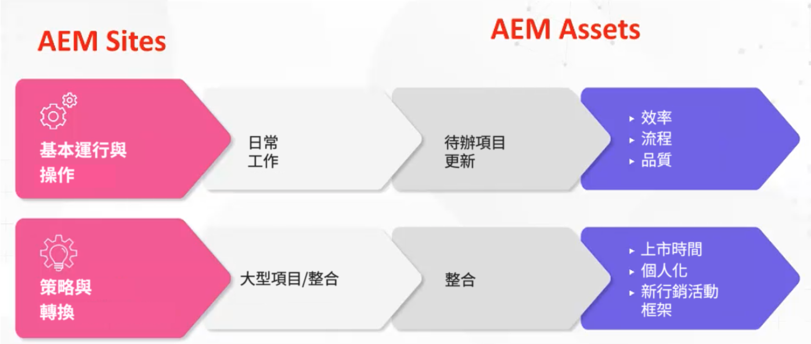

# Adobe Experience Manager (AEM) — 治理和人員配置模型與原型

Adobe身為客戶體驗的領導者，瞭解確保您擁有合適的人才和治理架構來提升營運效率，是多麼具有挑戰性。 有了Adobe備受業界肯定的治理和人員配置模式，您便擁有工具和知識，奠定堅實的內容和資產管理基礎。 在本文中，我們將討論如何讓您的Adobe Experience Manager (AEM)平台開始運轉，並讓您的努力發揮最大價值。

## 建立卓越的營運架構

為了能夠執行和操作AEM，請考慮以下元素：

* 執行策略里程碑 — 有許多策略里程碑、（個人化、多管道整合等） 除非您有適當的人員配置模式，否則無法執行此作業。
* 為數位轉型奠定基礎 — AEM通常用作組織現代化流程的第一步。 建立基礎可讓您善用AEM的完整容量。
* 使用者參與 — 建立團隊以執行戰術工作（更新工作流程、許可權、CSS等） 使用者想要的與獲得的內容之間的差距越大，他們就越會感到沮喪。 請務必讓使用者持續投資系統、投資解決方案，並擁有正確的作業模式。

那麼，什麼是正確的模式？ 要建立的角色矩陣是否正確？

由於組織差異極大，AEM設定也可能差異極大，因此需要不同的支援角色，因此沒有單一的特定答案。 每個垂直、每個產業、每個團隊結構都需要不同的實施。 但您可以建立原型來建立基準線。

## 原型

原型是與特定屬性對應的特定高階角色概念。 這進而可用來建立基本前提，協助您瞭解真正需要的模型。 請務必注意，原型不限於每個原型一個人。 例如，DAM資料庫管理員可能會有一些技術經驗。

### 作業化的資料流

有兩個作業化串流 [!DNL AEM Sites] 和 [!DNL AEM Assets]：

1. 基本執行與操作日常工作（中繼資料更新）

1. 策略和轉換工作，例如大型跨組織專案

### 高階AEM資產角色

**一般間隙：** 此基準線支援集中式與分散式模式。 如果您有分散模型，則可以抽象地使用AEM。 請注意，「產品擁有者」角色必須以創意方式使用，但您也需要有「產品擁有者」，該擁有者擁有一種資產型別的不同樣式，以及另一個擁有監督整個組織的角色。

1. 基本執行與操作角色

   * 技術資源 — 具有AEM經驗的人員瞭解許可權並可以更新中繼資料結構
   * 發行管理員
   * 產品所有者 — 此角色與解決方案一致。 有些產品擁有者可能會參與分析。
   * DAM程式庫管理員 — 他可協助引導整合框架程式。 此創意角色可能與其他角色重疊。 （注意：這個角色的人氣在過去五年裡呈現爆炸式增長。）
   * 創意

1. 策略與轉型

   * 開發團隊 — 當從事重大策略里程碑時，需要此團隊。
   * 業務架構師 — 開發需求以協助技術里程碑和策略計畫；可由額外的產品所有者補償
   * 技術架構師 — 對企業層級有所瞭解，且在組織內長期任職的人員。 此角色為DAM真相中心。

**範例情境**

1. **執行並操作：**

以下是輕量（運動服裝公司）和重量（化妝公司）情境的角色範例：

1. 淺色 — 運動服裝公司角色：

   * 2名兼職開發人員 — 兼職，離岸
   * 1名產品負責人 — 全職，在岸
   * 1 DAM資料庫管理員 — 全職，在岸
   * 1名技術架構師 — 兼職，境內
   * 1發行經理 — 兼職，在岸

1. 重型 — 化妝品公司（多品牌）

   * 3名全職開發人員 — 全職，離岸
   * 4個產品負責人 — 3個品牌特定，1個主要
   * 1 DAM資料庫管理員 — 全職，在岸
   * 每個品牌的4個主要管理員SME
   * 1名技術架構師

### 高階 [!DNL AEM Sites] 角色

1. 基本執行與操作

   **一般間隙：** CSS開發人員會為元件建立新的外觀元素。 Adobe高級商務顧問Joseph Van Buskirk建議「使用開塞元件和樣式系統。 這是推動成本節省的角色。 80%的已建立體驗應使用先前建立的或核心元件完成。」 目標是使用CSS開發人員（或前端開發團隊）以新樣式重新利用核心或自訂元件。

   角色範例：

   * CSS開發 — 透過以新樣式重新利用元件，建立體驗成品。
   * 後端開發 — 建立新元件或可擴充核心元件。 如果操作正確，此角色不應有一個以上的人員，除非需要大型動畫工作。
   * 發行管理 — 監督程式碼部署，並擔任目前的Adobe客戶團隊。
   * 產品擁有者 — 與BU共同合作，將技術和策略願景結合在一起；建立維護任務和增強功能，並擔任解決方案的企業擁有者。
   * 管理員作者 — 更新CSS外觀，並為更新及套用內容的作者提供指引。 此角色適用於工作流程設定，並建立內容作者適用的指南檔案。 注意：在6.5版中，Adobe建議使用可編輯的範本。
   * 內容作者 — 套用內容、階層式所有權，並透過CSM提供溝通問題和顧慮。

1. 策略與轉型

   角色範例：

   * 開發團隊 — 提供AEM知識，並與技術架構師一起執行新的轉型里程碑。
   * 技術架構師 — 提供整合知識、與產品所有者合作以對應技術里程碑，並提供AEM的深入技術知識。
   * 業務架構師 — 建立使用者劇本的任務，並幫助產品所有者管理技術和業務里程碑。

### 範例情境

以下是輕度與重度使用者端情境的角色範例：

1. 淺色

   * 2 CSS開發人員 — 陸上
   * 1名產品負責人 — 全職，在岸
   * 1個後端開發人員 — 離岸
   * 1名技術架構師 — 陸上
   * 1發行經理 — 兼職，在岸

1. 繁重（以行銷活動為中心）

   * 4 CSS開發人員 — 全職，在岸
   * 2名後端開發人員 — 全職在岸
   * 1名技術架構師 — 陸上
   * 1個產品所有者
   * 2位企業架構師 — 離岸

### 重要技巧

**瞭解原型**  — 慢慢開始，瞭解和分析原型。 請謹記沒有正確的模式可依循，發揮創意，靈活應變。

**瞭解您的藍圖**  — 有些組織有許多要執行的里程碑。 準備配置比您估計更多的技術資源。

**善用內部資源**  — 可能會意外出現缺口。 透過搜尋內部團隊成員，而非在組織外部進行搜尋，您或許可以更快地填滿這些成員。

如需有關治理和人員配置模型與原型更深入的討論，請收聽這個一小時的小組討論： [角色原型與建立作業架構 [!DNL AEM Assets] 和 [!DNL Sites]](https://adobecustomersuccess.adobeconnect.com/p8ml5nmy0758mp4/)

若要進一步瞭解策略與思想領導力，請前往 [客戶成功](https://experienceleague.adobe.com/docs/customer-success/customer-success/overview.html) 集線器。
