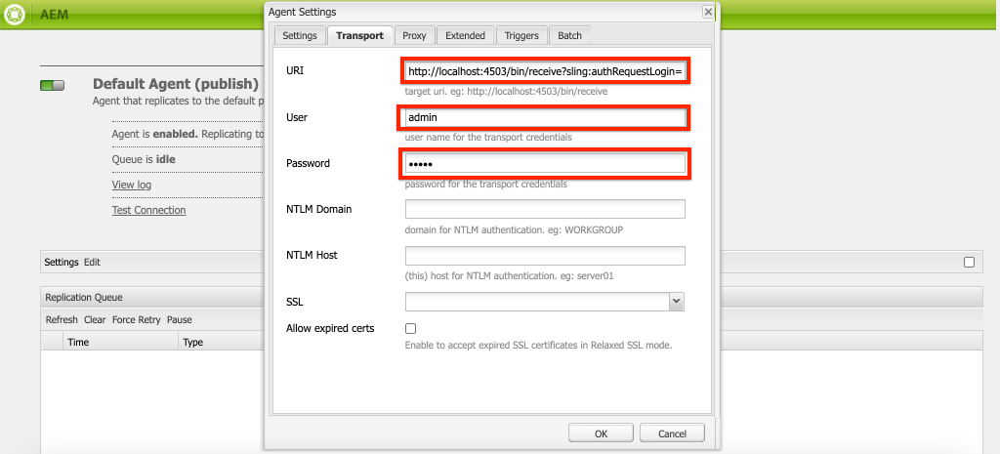

# 設定本機 AEM SDK {#set-up-local-aem-sdk}

>[!CONTEXTUALHELP]
>id="aemcloud_localdev_aemruntime"
>title="本機 AEM 執行階段"
>abstract="Adobe Experience Manager (AEM) 可透過 AEM as a Cloud Service  SDK 的 Quickstart Jar 在本機上執行。這讓開發人員在將自訂程式碼、設定和內容送交來源控制項前，即可先行部署和測試，然後再部署至 AEM as a Cloud Service 環境。"
>additional-url="https://experienceleague.adobe.com/docs/experience-manager-cloud-service/content/implementing/developing/aem-as-a-cloud-service-sdk.html" text="AEM as a Cloud Service SDK"
>additional-url="https://experience.adobe.com/#/downloads/content/software-distribution/en/aemcloud.html" text="下載 AEM as a Cloud Service SDK"

Adobe Experience Manager (AEM) 可透過 AEM as a Cloud Service  SDK 的 Quickstart Jar 在本機上執行。這讓開發人員在將自訂程式碼、設定和內容送交來源控制項前，即可先行部署和測試，然後再部署至 AEM as a Cloud Service 環境。

請注意 `~` 會用作使用者目錄的速記。 在Windows中，這相當於 `%HOMEPATH%`.

## 安裝Java™

Experience Manager是一種Java™應用程式，因此需要OracleJava™ SDK來支援開發工具。

1. [下載並安裝最新的Java™ SDK 11](https://experience.adobe.com/#/downloads/content/software-distribution/en/general.html?1_group.propertyvalues.property=.%2Fjcr%3Acontent%2Fmetadata%2Fdc%3AsoftwareType&amp;1_group.propertyvalues.operation=equals&amp;1_group.propertyvalues.0_values=software-type%3Atooling&amp;fulltext=Oracle%7E+JDK%7E+11%7E&amp;orderby=%40jcr%3Acontent%2Fjcr%3AlastModified&amp;orderby.sort=desc&amp;layout=list&amp;p=list&amp;p.offset=limit&amp;p.offset=0&amp;p.limit=14444)
1. 執行命令，確認已安裝Oracle Java™ 11 SDK：

>[!BEGINTABS]

>[!TAB macOS]

```shell
$ java --version
```

>[!TAB Windows]

```shell
$ java -version
```

>[!TAB Linux®]

```shell
$ java --version
```

>[!ENDTABS]


## 下載AEMas a Cloud ServiceSDK

AEMas a Cloud ServiceSDK (或AEM SDK)包含用於在本機執行AEM製作和發佈以進行開發的Quickstart Jar，以及相容的Dispatcher工具版本。

1. 登入 [https://experience.adobe.com/#/downloads](https://experience.adobe.com/#/downloads) 使用您的Adobe ID
   + 請注意，您的Adobe組織 __必須__ 布建AEMas a Cloud Service以下載AEMas a Cloud ServiceSDK。
1. 導覽至 __AEMas a Cloud Service__ 標籤
1. 排序依據： __發佈日期__ 在 __降序__ 訂購
1. 按一下最新的 __AEM SDK__ 結果列
1. 檢閱並接受EULA，然後點選 __下載__ 按鈕

## 從AEM SDK zip解壓縮Quickstart Jar

1. 將下載的檔案解壓縮 `aem-sdk-XXX.zip` 檔案

## 設定本機AEM Author服務{#set-up-local-aem-author-service}

本機AEM作者服務為開發人員提供本機體驗，數位行銷人員/內容作者將共用該體驗來建立和管理內容。  AEM Author Service在設計上既是製作環境，又是預覽環境，可讓您針對此環境執行功能開發的大部分驗證，使其成為本機開發流程的重要元素。

1. 建立資料夾 `~/aem-sdk/author`
1. 複製 __快速入門JAR__ 檔案到  `~/aem-sdk/author` 並將其重新命名為 `aem-author-p4502.jar`
1. 從命令列執行下列動作，啟動本機AEM Author Service：
   + `java -jar aem-author-p4502.jar`
      + 提供管理員密碼作為 `admin`. 可接受任何管理員密碼，但建議使用本機開發的預設值，以減少重新設定的需求。

   您 *無法* 啟動AEM作為Cloud Service快速入門Jar [按兩下](#troubleshooting-double-click).
1. 存取本機AEM作者服務，位於 [http://localhost:4502](http://localhost:4502) 在網頁瀏覽器中

>[!BEGINTABS]

>[!TAB macOS]

```shell
$ mkdir -p ~/aem-sdk/author
$ cp aem-sdk-Quickstart-XXX.jar ~/aem-sdk/author/aem-author-p4502.jar
$ cd ~/aem-sdk/author
$ java -jar aem-author-p4502.jar
```

>[!TAB Windows]

```shell
$ mkdir -p c:\Users\<My User>\aem-sdk\author
$ copy aem-sdk-Quickstart-XXX.jar c:\Users\<My User>\aem-sdk\author\aem-author-p4502.jar
$ cd c:\Users\<My User>\aem-sdk\author
$ java -jar aem-author-p4502.jar
```

>[!TAB Linux®]

```shell
$ mkdir -p ~/aem-sdk/author
$ cp aem-sdk-Quickstart-XXX.jar ~/aem-sdk/author/aem-author-p4502.jar
$ cd ~/aem-sdk/author
$ java -jar aem-author-p4502.jar
```

>[!ENDTABS]


## 設定本機AEM Publish服務

本機AEM Publish Service為開發人員提供AEM的本機體驗使用者將擁有的體驗，例如瀏覽存放在AEM上的網站。 本機AEM發佈服務很重要，因為它與AEM SDK的整合 [Dispatcher工具](./dispatcher-tools.md) 可讓開發人員進行煙霧測試，並微調面向最終使用者的體驗。

1. 建立資料夾 `~/aem-sdk/publish`
1. 複製 __快速入門JAR__ 檔案到  `~/aem-sdk/publish` 並將其重新命名為 `aem-publish-p4503.jar`
1. 從命令列執行下列動作，啟動本機AEM Publish Service：
   + `java -jar aem-publish-p4503.jar`
      + 提供管理員密碼作為 `admin`. 可接受任何管理員密碼，但建議使用本機開發的預設值，以減少重新設定的需求。

   您 *無法* 啟動AEM作為Cloud Service快速入門Jar [按兩下](#troubleshooting-double-click).
1. 存取本機AEM Publish Service，位於 [http://localhost:4503](http://localhost:4503) 在網頁瀏覽器中

>[!BEGINTABS]

>[!TAB macOS]

```shell
$ mkdir -p ~/aem-sdk/publish
$ cp aem-sdk-Quickstart-XXX.jar ~/aem-sdk/publish/aem-publish-p4503.jar
$ cd ~/aem-sdk/publish
$ java -jar aem-publish-p4503.jar
```

>[!TAB Windows]

```shell
$ mkdir -p c:\Users\<My User>\aem-sdk\publish
$ copy aem-sdk-Quickstart-XXX.jar c:\Users\<My User>\aem-sdk\publish\aem-publish-p4503.jar
$ cd c:\Users\<My User>\aem-sdk\publish
$ java -jar aem-publish-p4503.jar
```

>[!TAB Linux®]

```shell
$ mkdir -p ~/aem-sdk/publish
$ cp aem-sdk-Quickstart-XXX.jar ~/aem-sdk/publish/aem-publish-p4503.jar
$ cd ~/aem-sdk/publish
$ java -jar aem-publish-p4503.jar
```

>[!ENDTABS]


## 在發行前模式下設定本機AEM服務

本機AEM執行階段可以在中啟動 [發行前模式](https://experienceleague.adobe.com/docs/experience-manager-cloud-service/content/release-notes/prerelease.html?lang=zh-Hant) 允許開發人員針對AEMas a Cloud Service的下一版功能進行建置。 預先發行可透過傳遞以下訊息啟用： `-r prerelease` 引數在本機AEM執行階段第一個開頭。 這可同時用於本機AEM Author和AEM Publish服務。


>[!BEGINTABS]

>[!TAB macOS]

```shell
# For AEM Author service in prerelease mode
$ java -jar aem-author-p4502.jar -r prerelease

# For AEM Publish service in prerelease mode
$ java -jar aem-publish-p4503.jar -r prerelease
```

>[!TAB Windows]

```shell
# For AEM Author service in prerelease mode
$ java -jar aem-author-p4502.jar -r prerelease

# For AEM Publish service in prerelease mode
$ java -jar aem-publish-p4503.jar -r prerelease
```

>[!TAB Linux®]

```shell
# For AEM Author service in prerelease mode
$ java -jar aem-author-p4502.jar -r prerelease

# For AEM Publish service in prerelease mode
$ java -jar aem-publish-p4503.jar -r prerelease
```

>[!ENDTABS]

## 模擬內容發佈 {#content-distribution}

在真實的Cloud Service環境中，內容會使用從作者服務散發到發佈服務 [Sling Content Distribution](https://sling.apache.org/documentation/bundles/content-distribution.html) 和Adobe管道。 此 [Adobe管道](https://experienceleague.adobe.com/docs/experience-manager-cloud-service/core-concepts/architecture.html?lang=en#content-distribution) 是只能在雲端環境中使用的隔離微服務。

在開發期間，可能最好使用本機Author和Publish服務來模擬內容的分佈。 這可透過啟用舊版復寫代理程式來達成。

>[!NOTE]
>
復寫代理程式僅可用於本機Quickstart JAR，且僅提供內容發佈的模擬。

1. 登入 **作者** 服務並導覽至 [http://localhost:4502/etc/replication/agents.author.html](http://localhost:4502/etc/replication/agents.author.html).
1. 按一下 **預設代理程式（發佈）** 以開啟預設的復寫代理。
1. 按一下 **編輯** 以開啟代理程式的設定。
1. 在 **設定** 索引標籤中，更新下列欄位：

   + **已啟用**  — 檢查true
   + **代理使用者ID**  — 將此欄位留空

   

1. 在 **傳輸** 索引標籤中，更新下列欄位：

   + **URI** - `http://localhost:4503/bin/receive?sling:authRequestLogin=1`
   + **使用者** - `admin`
   + **密碼** - `admin`

   

1. 按一下 **確定** 以儲存設定並啟用 **預設** 復寫代理程式。
1. 您現在可以變更Author服務上的內容，並將其發佈到Publish服務。


## 快速入門Jar啟動模式

快速入門Jar的命名， `aem-<tier>_<environment>-p<port number>.jar` 指定其啟動方式。 AEM一旦在特定層、作者或發佈中啟動，就無法變更為替代層。 若要這麼做， `crx-Quickstart` 必須刪除首次執行期間產生的資料夾，並且必須再次執行Quickstart Jar。 環境和連線埠可以變更，但是它們需要停止/啟動本機AEM執行個體。

不斷變化的環境， `dev`， `stage` 和 `prod`對於開發人員來說，確保環境特定的設定可由AEM正確定義和解析。 建議主要針對預設值執行本機開發 `dev` 環境執行模式。

可用的排列如下：

| 快速入門Jar檔案名稱 | 模式說明 |
|------------------------------|-----------------------------------------------------------------------------|
| `aem-author-p4502.jar` | 在連線埠4502上以開發執行模式的作者身分 |
| `aem-author_dev-p4502.jar` | 在連線埠4502上作為開發執行模式中的作者(與 `aem-author-p4502.jar`) |
| `aem-author_stage-p4502.jar` | 作為作者，在連線埠4502上處於測試執行模式 |
| `aem-author_prod-p4502.jar` | 在連線埠4502上以生產執行模式中的作者身分 |
| `aem-publish-p4503.jar` | 在連線埠4503上以開發執行模式發佈 |
| `aem-publish_dev-p4503.jar` | 在連線埠4503上以開發執行模式發佈(與 `aem-publish-p4503.jar`) |
| `aem-publish_stage-p4503.jar` | 在連線埠4503上以測試執行模式發佈 |
| `aem-publish_prod-p4503.jar` | 在連線埠4503上以生產執行模式作為發佈 |

請注意，連線埠號碼可以是本機開發電腦上任何可用的連線埠，不過依照慣例而定：

+ 連線埠 __4502__ 用於 __本機AEM作者服務__
+ 連線埠 __4503__ 用於 __本機AEM Publish服務__

變更這些專案可能需要調整AEM SDK設定

## 正在停止本機AEM執行階段

若要停止本機AEM執行階段(AEM製作或發佈服務)，請開啟用來啟動AEM執行階段的命令列視窗，然後點選 `Ctrl-C`. 等待AEM關閉。 當關機程式完成時，命令列提示字元可用。

## 選擇性本機AEM執行階段設定工作

+ __OSGi設定環境變數和機密變數__ 為 [為AEM本機執行階段特別設定](https://experienceleague.adobe.com/docs/experience-manager-cloud-service/implementing/deploying/configuring-osgi.html#local-development)，而不需使用aio CLI管理它們。

## 何時更新Quickstart Jar

至少在每月的最後一個星期四或之後不久更新AEM SDK，這是AEMas a Cloud Service「功能發行」的發行節奏。

>[!WARNING]
>
將快速入門Jar更新為新版本需要取代整個本機開發環境，導致遺失本機AEM存放庫中的所有程式碼、設定和內容。 確保任何不應銷毀的程式碼、設定或內容已安全地提交至Git，或從本機AEM執行個體匯出為AEM套件。

### 升級AEM SDK時如何避免內容遺失

升級AEM SDK實際上會建立全新的AEM執行階段，包括新的存放庫，這表示對先前AEM SDK的存放庫所做的任何變更都會遺失。 以下是協助在AEM SDK升級之間儲存內容的可行策略，可個別或一致使用：

1. 建立專用於包含「範例」內容的內容套件，以輔助開發並在Git中進行維護。 任何應透過AEM SDK升級儲存的內容將儲存在此套件中，並在升級AEM SDK後重新部署。
1. 使用 [oak-upgrade](https://jackrabbit.apache.org/oak/docs/migration.html) 使用 `includepaths` 指示詞，將內容從先前的AEM SDK存放庫複製到新的AEM SDK存放庫。
1. 使用舊版AEM SDK上的AEM Package Manager和內容套件備份任何內容，並在新的AEM SDK上重新安裝它們。

請記住，在AEM SDK升級之間使用上述方法來維護程式碼，表示開發反模式。 非一次性程式碼應源自於您的開發IDE，並透過部署流入AEM SDK。

## 疑難排解

### 連按兩下Quickstart Jar檔案會導致錯誤{#troubleshooting-double-click}

連按兩下Quickstart Jar以啟動時，會顯示錯誤強制回應視窗，防止AEM在本機啟動。


這是因為AEMas a Cloud Service快速入門Jar不支援按兩下Quickstart Jar以在本機啟動AEM。 而是必須從該命令列執行Jar檔案。

若要啟動AEM Author服務， `cd` 進入包含Quickstart Jar的目錄並執行命令：

>[!BEGINTABS]

>[!TAB macOS]

```shell
$ java -jar aem-author-p4502.jar
```

>[!TAB Windows]

```shell
$ java -jar aem-author-p4502.jar
```

>[!TAB Linux®]

```shell
$ java -jar aem-author-p4502.jar
```

>[!ENDTABS]

或者，若要啟動AEM發佈服務， `cd` 進入包含Quickstart Jar的目錄並執行命令：

>[!BEGINTABS]

>[!TAB macOS]

```shell
$ java -jar aem-publish-p4503.jar
```

>[!TAB Windows]

```shell
$ java -jar aem-publish-p4503.jar
```

>[!TAB Linux®]

```shell
$ java -jar aem-publish-p4503.jar
```

>[!ENDTABS]

### 從命令列啟動「快速入門Jar」會立即中止{#troubleshooting-java-8}

從命令列啟動「快速入門Jar」時，程式會立即中止，AEM服務不會啟動，並出現以下錯誤：

```shell
➜  ~/aem-sdk/author: java -jar aem-author-p4502.jar
Loading quickstart properties: default
Loading quickstart properties: instance
java.lang.Exception: Quickstart requires a Java Specification 11 VM, but your VM (Java HotSpot(TM) 64-Bit Server VM / Oracle Corporation) reports java.specification.version=1.8
  at com.adobe.granite.quickstart.base.impl.Main.checkEnvironment(Main.java:1046)
  at com.adobe.granite.quickstart.base.impl.Main.<init>(Main.java:646)
  at com.adobe.granite.quickstart.base.impl.Main.main(Main.java:981)
Quickstart: aborting
```

這是因為AEMas a Cloud Service需要Java™ SDK 11，而您執行的是其他版本，很可能是Java™ 8。 若要解決此問題，請下載並安裝 [oracleJava™ SDK 11](https://experience.adobe.com/#/downloads/content/software-distribution/en/general.html?1_group.propertyvalues.property=.%2Fjcr%3Acontent%2Fmetadata%2Fdc%3AsoftwareType&amp;1_group.propertyvalues.operation=equals&amp;1_group.propertyvalues.0_values=software-type%3Atooling&amp;fulltext=Oracle%7E+JDK%7E+11%7E&amp;orderby=%40jcr%3Acontent%2Fjcr%3AlastModified&amp;orderby.sort=desc&amp;layout=list&amp;p=list&amp;p.offset=limit&amp;p.offset=0&amp;p.limit=14444).

安裝OracleJava™ 11 SDK後，從命令列執行命令，確認其為使用中版本：

>[!BEGINTABS]

>[!TAB macOS]

```shell
$ java --version
```

>[!TAB Windows]

```shell
$ java -version
```

>[!TAB Linux®]

```shell
$ java --version
```

>[!ENDTABS]

## 其他資源

+ [下載AEM SDK](https://experience.adobe.com/#/downloads)
+ [AdobeCloud Manager](https://my.cloudmanager.adobe.com/)
+ [下載Docker](https://www.docker.com/)
+ [Experience ManagerDispatcher檔案](https://experienceleague.adobe.com/docs/experience-manager-dispatcher/using/dispatcher.html)
