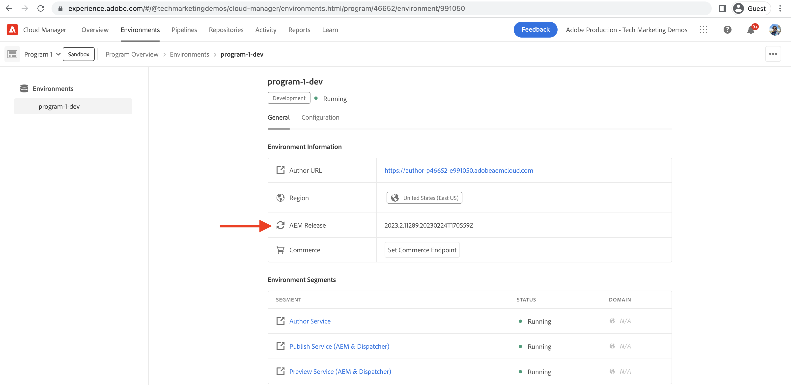

# 設定本地Dispatcher工具 {#set-up-local-dispatcher-tools}

>[!CONTEXTUALHELP]
>id="aemcloud_localdev_dispatcher"
>title="本機 Dispatcher 工具"
>abstract="Dispatcher 是整個 Experience Manager 架構的組成部分，應該是本機開發設定的一部分。AEM as a Cloud Service SDK 包括建議的 Dispatcher 工具版本，該版本有助於在本機設定、驗證和模擬 Dispatcher。"
>additional-url="https://experienceleague.adobe.com/docs/experience-manager-cloud-service/content/implementing/content-delivery/disp-overview.html" text="雲端中的 Dispatcher"
>additional-url="https://experience.adobe.com/#/downloads/content/software-distribution/en/aemcloud.html" text="下載 AEM as a Cloud Service SDK"

Adobe Experience Manager(AEM)的Dispatcher是Apache HTTP Web伺服器模組，在CDN和AEM發佈層之間提供安全和效能層。 Dispatcher 是整個 Experience Manager 架構的組成部分，應該是本機開發設定的一部分。

AEM as a Cloud Service SDK 包括建議的 Dispatcher 工具版本，該版本有助於在本機設定、驗證和模擬 Dispatcher。Dispatcher Tools包括：

+ 位於以下位置的一組基準Apache HTTP Web伺服器和Dispatcher配置檔案 `.../dispatcher-sdk-x.x.x/src`
+ 配置驗證程式CLI工具，位於 `.../dispatcher-sdk-x.x.x/bin/validate`
+ 配置層代CLI工具，位於 `.../dispatcher-sdk-x.x.x/bin/validator`
+ 配置部署CLI工具，位於 `.../dispatcher-sdk-x.x.x/bin/docker_run`
+ 不可變的配置檔案覆蓋位於 `.../dispatcher-sdk-x.x.x/bin/update_maven`
+ 使用Dispatcher模組運行Apache HTTP Web伺服器的Docker映像

請注意 `~` 用作用戶目錄的簡寫。 在Windows中，這相當於 `%HOMEPATH%`。

>[!NOTE]
>
> 本頁的視頻在macOS錄制。 Windows用戶可以隨後操作，但使用與每個視頻相同的Dispatcher Tools Windows命令。

## 必備條件

1. Windows用戶必須使用Windows 10 Professional（或支援Docker的版本）
1. 安裝 [Experience Manager發佈快速啟動Jar](./aem-runtime.md) 在本地開發機上。

+ （可選）安裝最新 [AEM參考網站](https://github.com/adobe/aem-guides-wknd/releases) 本地AEM發佈服務。 本教程使用此網站來直觀顯示正在工作的Dispatcher。

1. 安裝並啟動最新版本的 [多克](https://www.docker.com/) (Docker Desktop 2.2.0.5+ / Docker Engine v19.03.9+)。

## 下載Dispatcher Tools(作為SDK的一AEM部分)

as a Cloud ServiceAEMSDK(或AEMSDK)包含Dispatcher Tools，用於在本地運行Apache HTTP Web伺服器以便進行開發，以及相容的QuickStart Jar。

如果AEMas a Cloud ServiceSDK已下載到 [設定本地運AEM行時](./aem-runtime.md)，不需要重新下載。

1. 登錄到 [experience.adobe.com/#/下載](https://experience.adobe.com/#/downloads/content/software-distribution/en/aemcloud.html?fulltext=AEM*+SDK*&amp;1_group.propertyvalues.property=。%2Fjcr%3內容%2Fmetadata%2Fdc%3SoftwareType&amp;1_group.propertyvalues.operation=等於&amp;1_group.propertyvalues.0_values=軟體類型%3Atoling&amp;orderby=%40jcr%3Acont%2Fjcr%3AlastModified&amp;orderby.sort.st&amp;rded&amp;lay=list&amp;p.offset=0&amp;p.limit=1) 你的Adobe ID
   + 您的Adobe組織 __必須__ 已設定AEMas a Cloud Service以下載AEMas a Cloud ServiceSDK
1. 按一下最新 __SDKAEM__ 要下載的結果行

## 從SDK zip提取DispatcherAEM Tools

>[!TIP]
>
> Windows用戶在包含本地Dispatcher工具的資料夾的路徑中不能有任何空格或特殊字元。 如果路徑中存在空格，則 `docker_run.cmd` 失敗。

Dispatcher Tools的版本與SDK的版本AEM不同。 確保通過與as a Cloud Service版本匹配的AEMSDK版本提供Dispatcher ToolsAEM版本。

1. 解壓縮下載的 `aem-sdk-xxx.zip` 檔案
1. 將Dispatcher工具解包到 `~/aem-sdk/dispatcher`

+ 窗口：解壓縮 `aem-sdk-dispatcher-tools-x.x.x-windows.zip` 入 `C:\Users\<My User>\aem-sdk\dispatcher` （根據需要建立缺少的資料夾）
+ macOSLinux®:執行附帶的Shell指令碼 `aem-sdk-dispatcher-tools-x.x.x-unix.sh` 解壓縮Dispatcher Tools
   + `chmod a+x aem-sdk-dispatcher-tools-x.x.x-unix.sh && ./aem-sdk-dispatcher-tools-x.x.x-unix.sh`

下面發出的所有命令都假定當前工作目錄包含正在擴展的Dispatcher Tools內容。

>[!VIDEO](https://video.tv.adobe.com/v/30601?quality=12&learn=on)

*這段視頻用macOS做說明。 可以使用等效的Windows/Linux命令來獲得類似的結果。*

## 瞭解Dispatcher配置檔案

>[!TIP]
> Experience Manager從 [馬文AEM原型計畫](https://github.com/adobe/aem-project-archetype) 已預填充這組Dispatcher配置檔案，因此無需從Dispatcher Tools src資料夾進行複製。

Dispatcher Tools提供一組Apache HTTP Web伺服器和Dispatcher配置檔案，這些配置檔案定義了所有環境的行為，包括本地開發。

這些檔案將複製到Experience ManagerMaven項目中 `dispatcher/src` 資料夾。

在解壓縮的Dispatcher Tools中，可獲得配置檔案的完整說明，如 `dispatcher-sdk-x.x.x/docs/Config.html`。

## 驗證配置

（可選）Dispatcher和Apache Web伺服器配置(通過 `httpd -t`)可使用 `validate` 指令碼(不要與 `validator` 可執行)。 的 `validate` 指令碼提供了一種方便的運行方法 [三階段](https://experienceleague.adobe.com/docs/experience-manager-cloud-service/content/implementing/content-delivery/validation-debug.html?lang=en) 的 `validator`。

+ 使用狀況:
   + Windows: `bin\validate src`
   + macOSLinux®: `./bin/validate.sh ./src`

## 在本地運行Dispatcher

使用AEMDocker對 `src` Dispatcher和Apache Web伺服器配置檔案。

+ 使用狀況:
   + Windows: `bin\docker_run <src-folder> <aem-publish-host>:<aem-publish-port> <dispatcher-port>`
   + macOSLinux®: `./bin/docker_run.sh <src-folder> <aem-publish-host>:<aem-publish-port> <dispatcher-port>`

的 `<aem-publish-host>` 可以設定為 `host.docker.internal`, Docker在解析為主機IP的容器中提供了特殊的DNS名稱。 如果 `host.docker.internal` 不解析，請參閱 [故障排除](#troubleshooting-host-docker-internal) 的下界。

例如，使用Dispatcher Tools提供的預設配置檔案啟動Dispatcher Docker容器：

啟動Dispatcher Docker容器，提供Dispatcher配置src資料夾的路徑：

+ Windows: `bin\docker_run src host.docker.internal:4503 8080`
+ macOSLinux®: `./bin/docker_run.sh ./src host.docker.internal:4503 8080`

通AEM過Dispatcher（位於）提供本地運行於埠4503的as a Cloud ServiceSDK發佈服務 `http://localhost:8080`。

要針對Experience Manager項目的Dispatcher配置運行Dispatcher Tools，請指向項目 `dispatcher/src` 的子菜單。

+ Windows:

   ```shell
   $ bin\docker_run <User Directory>/code/my-project/dispatcher/src host.docker.internal:4503 8080
   ```

+ macOSLinux®:

   ```shell
   $ ./bin/docker_run.sh ~/code/my-project/dispatcher/src host.docker.internal:4503 8080
   ```

## Dispatcher Tools日誌

在本地開發過程中，Dispatcher日誌有助於瞭解HTTP請求是否被阻止以及阻止的原因。 可以通過預先執行 `docker_run` 環境參數。

Dispatcher Tools日誌在 `docker_run` 。

用於調試Dispatcher的有用參數包括：

+ `DISP_LOG_LEVEL=Debug` 將Dispatcher模組日誌記錄設定為「調試」級別
   + 預設值為: `Warn`
+ `REWRITE_LOG_LEVEL=Debug` 將Apache HTTP Web伺服器重寫模組日誌記錄設定為調試級別
   + 預設值為: `Warn`
+ `DISP_RUN_MODE` 設定Dispatcher環境的「運行模式」，並載入相應的運行模式Dispatcher配置檔案。
   + 預設為 `dev`
+ 有效值： `dev`。 `stage`或 `prod`

可以將一個或多個參數傳遞到 `docker_run`

+ Windows:

```shell
$ DISP_LOG_LEVEL=Debug REWRITE_LOG_LEVEL=Debug bin\docker_run <User Directory>/code/my-project/dispatcher/src host.docker.internal:4503 8080
```

+ macOSLinux®:

```shell
$ DISP_LOG_LEVEL=Debug REWRITE_LOG_LEVEL=Debug ./bin/docker_run.sh ~/code/my-project/dispatcher/src host.docker.internal:4503 8080
```

### 日誌檔案訪問

可以在Docker容AEM器中直接訪問Apache Web伺服器和Dispatcher日誌：

+ [訪問Docker容器中的日誌](../debugging/aem-sdk-local-quickstart/logs.md#dispatcher-tools-access-logs)
+ [將Docker日誌複製到本地檔案系統](../debugging/aem-sdk-local-quickstart/logs.md#dispatcher-tools-copy-logs)

## 何時更新Dispatcher工具{#dispatcher-tools-version}

Dispatcher Tools版本的增量比Experience Manager的增量更少，因此Dispatcher Tools在本地開發環境中需要的更新更少。

建議的Dispatcher Tools版本是與與Experience Manageras a Cloud Service版AEM本匹配的as a Cloud ServiceSDK捆綁的版本。 可以通AEM過 [雲管理器](https://my.cloudmanager.adobe.com/)。

+ __雲管理器>環境__，按指定的環境 __發AEM行__ 標籤



*請注意，Dispatcher Tools版本與Experience Manager版本不匹配。*

## 如何更新Apache和Dispatcher配置的基線集

Apache和Dispatcher配置的基準集定期增強，並隨as a Cloud ServiceSDK版本AEM一起發佈。 最好將基線配置增強功能納入您的項目AEM並避免 [本地驗證](#validate-configurations) 和Cloud Manager管道故障。 使用 `update_maven.sh` 指令碼 `.../dispatcher-sdk-x.x.x/bin` 的子菜單。

>[!VIDEO](https://video.tv.adobe.com/v/3416744?quality=12&learn=on)

*這段視頻用macOS做說明。 可以使用等效的Windows/Linux命令來獲得類似的結果。*


假設您以前AEM使用 [項AEM目原型](https://github.com/adobe/aem-project-archetype)，基線Apache和Dispatcher配置是當前配置。 使用這些基線配置，通過重複使用和複製檔案(如 `*.vhost`。 `*.conf`。 `*.farm` 和 `*.any` 從 `dispatcher/src/conf.d` 和 `dispatcher/src/conf.dispatcher.d` 資料夾。 您的本地Dispatcher驗證和Cloud Manager管道工作正常。

同時，基線Apache和Dispatcher配置因新功能、安全修復和優化等各種原因而得到增強。 它們通過較新版本的Dispatcher Tools(Dispatcher Tools)發佈，作為as a Cloud Service版本的AEM一部分。

現在，在根據最新的Dispatcher Tools版本驗證項目特定的Dispatcher配置時，它們開始失敗。 要解決此問題，需要使用以下步驟更新基線配置：

+ 驗證驗證是否針對最新的Dispatcher Tools版本失敗

   ```shell
   $ ./bin/validate.sh ${YOUR-AEM-PROJECT}/dispatcher/src
   
   ...
   Phase 3: Immutability check
   empty mode param, assuming mode = 'check'
   ...
   ** error: immutable file 'conf.d/available_vhosts/default.vhost' has been changed!
   ```

+ 使用 `update_maven.sh` 指令碼

   ```shell
   $ ./bin/update_maven.sh ${YOUR-AEM-PROJECT}/dispatcher/src
   
   ...
   Updating dispatcher configuration at folder 
   running in 'extract' mode
   running in 'extract' mode
   reading immutable file list from /etc/httpd/immutable.files.txt
   preparing 'conf.d/available_vhosts/default.vhost' immutable file extraction
   ...
   immutable files extraction COMPLETE
   fd72f4521fa838daaaf006bb8c9c96ed33a142a2d63cc963ba4cc3dd228948fe
   Cloud manager validator 2.0.53
   ```

+ 驗證更新的不可變檔案，如 `dispatcher_vhost.conf`。 `default.vhost`, `default.farm` 如果需要，請對從這些檔案派生的自定義檔案進行相關更改。

+ 重新驗證配置，應通過

```shell
$ ./bin/validate.sh ${YOUR-AEM-PROJECT}/dispatcher/src

...
checking 'conf.dispatcher.d/renders/default_renders.any' immutability (if present)
checking existing 'conf.dispatcher.d/renders/default_renders.any' for changes
checking 'conf.dispatcher.d/virtualhosts/default_virtualhosts.any' immutability (if present)
checking existing 'conf.dispatcher.d/virtualhosts/default_virtualhosts.any' for changes
no immutable file has been changed - check is SUCCESSFUL
Phase 3 finished
```

+ 在本地驗證更改後，提交更新的配置檔案

## 疑難排解

### docker_run導致「等到host.docker.internal可用」消息{#troubleshooting-host-docker-internal}

的 `host.docker.internal` 是提供給Docker的主機名，它包含解析到主機的主機名。 每個docs.docker.com([macOS](https://docs.docker.com/desktop/networking/)。 [窗口](https://docs.docker.com/desktop/networking/)):

> 從Docker 18.03開始，建議連接到特殊的DNS名稱host.docker.internal，該名稱解析為主機使用的內部IP地址

當 `bin/docker_run src host.docker.internal:4503 8080` 結果顯示消息 __等待主機.docker.internal可用__，則：

1. 確保已安裝的Docker版本為18.03或更高版本
2. 您可能設定了阻止註冊/解析的本地電腦 `host.docker.internal` 名稱。 改用本地IP。
   + Windows:
   + 從命令提示符執行 `ipconfig`，並記錄主機的 __IPv4地址__ 主機。
   + 然後，執行 `docker_run` 使用此IP地址：
      `bin\docker_run src <HOST IP>:4503 8080`
   + macOSLinux®:
   + 從終端執行 `ifconfig` 並記錄主機 __內__ IP地址，通常 __en0__ 設備。
   + 然後執行 `docker_run` 使用主機IP地址：
      `bin/docker_run.sh src <HOST IP>:4503 8080`

#### 示例錯誤

```shell
$ docker_run src host.docker.internal:4503 8080

Running script /docker_entrypoint.d/10-check-environment.sh
Running script /docker_entrypoint.d/20-create-docroots.sh
Running script /docker_entrypoint.d/30-wait-for-backend.sh
Waiting until host.docker.internal is available
```

## 其他資源

+ [下載AEMSDK](https://experience.adobe.com/#/downloads)
+ [Adobe雲管理器](https://my.cloudmanager.adobe.com/)
+ [下載Docker](https://www.docker.com/)
+ [下載AEM參考網站(WKND)](https://github.com/adobe/aem-guides-wknd/releases)
+ [Experience Manager調度程式文檔](https://experienceleague.adobe.com/docs/experience-manager-dispatcher/using/dispatcher.html?lang=zh-Hant)
