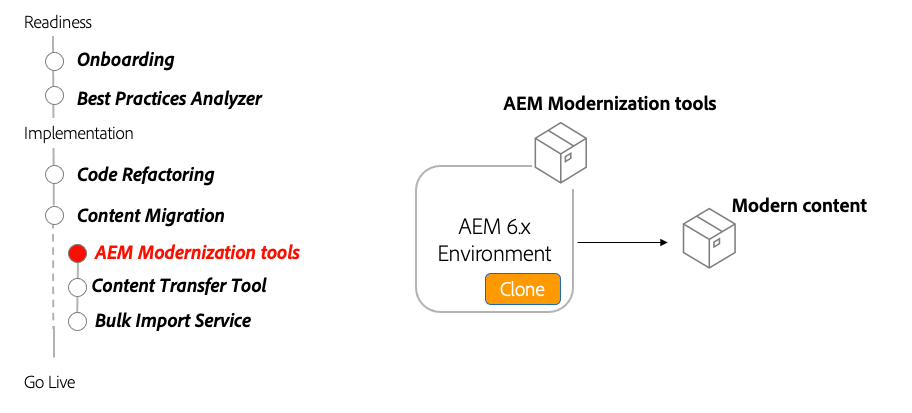

# AEM 現代化工具

瞭解如何AEM使用現代化工具來升級現有的AEM Sites內容，使其與as a Cloud ServiceAEM相容並與最佳做法保持一致。

>[!VIDEO](https://video.tv.adobe.com/v/336965/?quality=12&learn=on)

## 使用AEM現代化工具

現AEM代化工具會自AEM動轉換由舊式靜態模板、基礎元件和parsys組成的現有頁面，以使用現代方法，如可編輯模板、核心WCM元件AEM和佈局容器。

## 關鍵活動

+ 克隆AEM6.x生產以針對
+ 下載並安裝 [最新AEM的現代化工具](https://github.com/adobe/aem-modernize-tools/releases/latest) 通過包AEM管理器在6.x生產克隆上

+ [頁面結構轉換器](https://opensource.adobe.com/aem-modernize-tools/pages/structure/about.html) 使用佈局容器將現有頁面內容從靜態模板更新到映射的可編輯模板
   + 使用OSGi配置定義轉換規則
   + 針對現有頁運行頁面結構轉換器

+ [元件轉換器](https://opensource.adobe.com/aem-modernize-tools/pages/component/about.html) 使用佈局容器將現有頁面內容從靜態模板更新到映射的可編輯模板
   + 通過JCR節點定義/XML定義轉換規則
   + 針對現有頁面運行元件轉換器工具

+ [策略導入程式](https://opensource.adobe.com/aem-modernize-tools/pages/policy/about.html) 通過設計配置建立策略
   + 使用JCR節點定義/XML定義轉換規則
   + 根據現有設計定義運行策略導入程式
   + 將導入的策略應AEM用於元件和容器

## 動手練習

通過嘗試通過實際操作所學到的知識來應用您的知識。

在嘗試動手練習之前，請確保您已觀看並瞭解上面的視頻，以及以下資料：

+ [對as a Cloud Service的不AEM同思考](./introduction.md)
+ [資料庫現代化](./repository-modernization.md)
+ [可變和不可變內容](../../developing/basics/mutable-immutable.md)
+ [AEM項目結構](https://experienceleague.adobe.com/docs/experience-manager-cloud-service/implementing/developing/aem-project-content-package-structure.html)

另外，確保您已完成以前的動手練習：

+ [BPA和CAM的親身練習](./bpa-and-cam.md#hands-on-exercise)

<table style="border-width:0">
    <tr>
        <td style="width:150px">
                    
        </td>
        <td style="width:100%;margin-bottom:1rem;">
            
現代化實AEM踐

            

                探索使AEM用現代化工具更新舊版WKND站點，以符合as a Cloud Service的最AEM佳做法。
            

            <a  rel="noreferrer"
                target="_blank"
                href="https://github.com/adobe/aem-cloud-engineering-video-series-exercises/tree/session2-migration#bootcamp---session-2-migration-methodology" class="spectrum-Button spectrum-Button--primary spectrum-Button--sizeM">
                試用現代AEM化工具
            </a>
        </td>
    </tr>
</table>

## 其他資源

+ [下載AEM現代化工具](https://github.com/adobe/aem-modernize-tools/releases/latest)
+ [現代化工AEM具文檔](https://opensource.adobe.com/aem-modernize-tools/)
+ [AEMGems — 介紹現代化AEM套件](https://helpx.adobe.com/experience-manager/kt/eseminars/gems/Introducing-the-AEM-Modernization-Suite.html)

1. 在本地SDK上部署新近現代化的wknd-legacyAEM站點。 請AEM求可從以下位置下載：
+ [軟體分發門戶](https://experience.adobe.com/#/downloads/content/software-distribution/en/general.html)。
