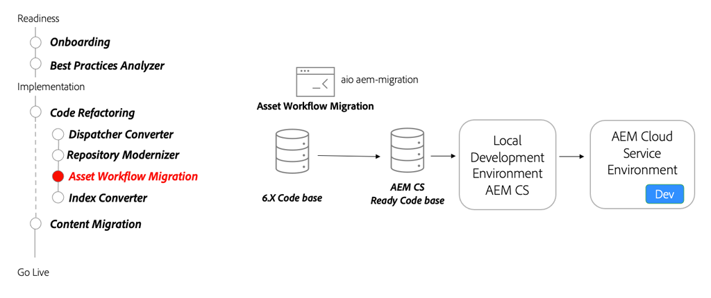

# AEM Assets Microservices — 轉移至AEMas a Cloud Service

了解AEM Assets as a Cloud Service的asset compute微服務可如何讓您自動且有效率地產生資產的任何轉譯，取代傳統AEM工作流程的這個角色。

>[!VIDEO](https://video.tv.adobe.com/v/336990/?quality=12&learn=on)

## 工作流程移轉工具

作為重構程式碼基底的一部分，請使用 [資產工作流程移轉工具](https://experienceleague.adobe.com/docs/experience-manager-cloud-service/moving/refactoring-tools/asset-workflow-migration-tool.html) 移轉現有工作流程，以使用AEM as a Cloud Service中的Asset compute微服務。

### 關鍵活動

* 使用 [Adobe I/O工作流遷移程式](https://github.com/adobe/aio-cli-plugin-aem-cloud-service-migration#command-aio-aem-migrationworkflow-migrator) 工具來移轉資產處理工作流程，以使用Asset compute微服務。
* 設定 [本地開發環境](https://experienceleague.adobe.com/docs/experience-manager-learn/cloud-service/local-development-environment-set-up/overview.html) 並部署更新的工作流程。 複雜的工作流程可能需要手動調整。
* 繼續使用AEM SDK在本機開發環境中反覆查詢，直到更新的工作流程符合功能比對。
* 將更新的程式碼基底部署至AEMas a Cloud Service開發環境，並繼續驗證。

