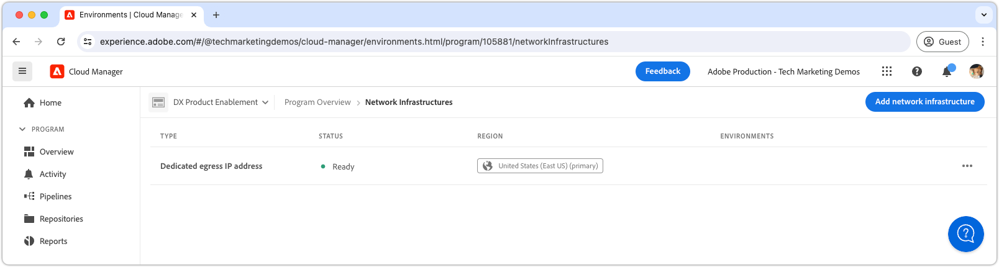

# 專用輸出 IP 位址

瞭解如何設定及使用專用輸出IP位址，此位址允許來自AEM的輸出連線源自於專用IP。

## 什麼是專用輸出IP位址？

專用輸出IP位址允許來自AEM as a Cloud Service的請求使用專用IP位址，允許外部服務根據此IP位址篩選傳入請求。 如同[彈性輸出埠](./flexible-port-egress.md)，專用輸出IP可讓您在非標準連線埠上輸出。

Cloud Manager程式只能有&#x200B;__單一__&#x200B;網路基礎結構型別。 在執行下列命令之前，請確定專用輸出IP位址是您AEM as a Cloud Service最[適當的網路基礎建設型別](./advanced-networking.md)。

>[!MORELIKETHIS]
>
> 如需專用輸出IP位址的詳細資訊，請參閱AEM as a Cloud Service [進階網路組態檔案](https://experienceleague.adobe.com/en/docs/experience-manager-cloud-service/content/security/configuring-advanced-networking)。

## 先決條件

使用Cloud Manager API設定專用輸出IP位址時，需要下列專案：

+ 具有[Cloud Manager企業所有者許可權的Cloud Manager API](https://developer.adobe.com/experience-cloud/cloud-manager/guides/getting-started/permissions/)
+ 存取[Cloud Manager API驗證認證](https://developer.adobe.com/experience-cloud/cloud-manager/guides/getting-started/create-api-integration/)
   + 組織ID （亦稱為IMS組織ID）
   + 使用者端ID （亦稱為API金鑰）
   + 存取權杖（亦稱為持有人權杖）
+ Cloud Manager計畫ID
+ Cloud Manager環境ID

如需詳細資訊，[請檢閱如何設定、設定和取得Cloud Manger API認證](https://experienceleague.adobe.com/en/docs/experience-manager-learn/cloud-service/developing/extensibility/app-builder/server-to-server-auth)，以使用這些認證進行Cloud Manager API呼叫。

本教學課程使用`curl`來進行Cloud Manager API設定。 提供的`curl`命令採用Linux/macOS語法。 如果使用Windows命令提示字元，請將`\`分行符號取代為`^`。

## 在程式上啟用專用輸出IP位址

首先，在AEM as a Cloud Service上啟用並設定專用輸出IP位址。

>[!BEGINTABS]

>[!TAB Cloud Manager]

專用輸出IP位址可使用Cloud Manager啟用。 下列步驟概述如何使用Cloud Manager在AEM as a Cloud Service上啟用專用輸出IP位址。

1. 以Cloud Manager業務負責人身分登入[Adobe Experience Manager Cloud Manager](https://experience.adobe.com/cloud-manager/)。
1. 導覽至所需的計畫。
1. 在左側功能表中，瀏覽至&#x200B;__服務>網路基礎結構__。
1. 選取&#x200B;__新增網路基礎結構__&#x200B;按鈕。

   

1. 在&#x200B;__新增網路基礎結構__&#x200B;對話方塊中，選取&#x200B;__專用輸出IP位址__&#x200B;選項，然後選取&#x200B;__區域__&#x200B;以建立專用輸出IP位址。

   

1. 選取&#x200B;__儲存__&#x200B;以確認新增專用輸出IP位址。

   

1. 等候網路基礎結構建立並標示為&#x200B;__就緒__。 此程式最多可能需要1小時。

   

在建立專用輸出IP位址後，您現在可以使用Cloud Manager API進行設定，如下所述。

>[!TAB Cloud Manager API]

專用輸出IP位址可使用Cloud Manager API啟用。 下列步驟概述如何使用Cloud Manager API在AEM as a Cloud Service上啟用專用輸出IP位址。


1. 首先，使用Cloud Manager API [listRegions](https://developer.adobe.com/experience-cloud/cloud-manager/reference/api/)作業，判斷需要進階網路的地區。 進行後續Cloud Manager API呼叫需要`region name`。 通常會使用生產環境所在的區域。

   在[環境的詳細資料](https://experienceleague.adobe.com/en/docs/experience-manager-cloud-service/content/implementing/using-cloud-manager/manage-environments)底下的[Cloud Manager](https://my.cloudmanager.adobe.com)中尋找您的AEM as a Cloud Service環境地區。 Cloud Manager中顯示的地區名稱可以[對應到Cloud Manager API中使用的地區代碼](https://developer.adobe.com/experience-cloud/cloud-manager/guides/api-usage/creating-programs-and-environments/#creating-aem-cloud-service-environments)。

   __listRegions HTTP要求__

   ```shell
   $ curl -X GET https://cloudmanager.adobe.io/api/program/{programId}/regions \
       -H 'x-gw-ims-org-id: <ORGANIZATION_ID>' \
       -H 'x-api-key: <CLIENT_ID>' \
       -H 'Authorization: Bearer <ACCESS_TOKEN>' \
       -H 'Content-Type: application/json' 
   ```

2. 使用Cloud Manager API [createNetworkInfrastructure](https://developer.adobe.com/experience-cloud/cloud-manager/reference/api/)作業，為Cloud Manager程式啟用專用輸出IP位址。 使用從Cloud Manager API `listRegions`作業取得的適當`region`程式碼。

   __createNetworkInfrastructure HTTP要求__

   ```shell
   $ curl -X POST https://cloudmanager.adobe.io/api/program/{programId}/networkInfrastructures \
       -H 'x-gw-ims-org-id: <ORGANIZATION_ID>' \
       -H 'x-api-key: <CLIENT_ID>' \
       -H 'Authorization: Bearer <ACCESS_TOKEN>' \
       -H 'Content-Type: application/json' \
       -d '{ "kind": "dedicatedEgressIp", "region": "va7" }'
   ```

   等待15分鐘，讓Cloud Manager程式布建網路基礎結構。

3. 檢查程式是否已使用Cloud Manager API [getNetworkInfrastructure](https://developer.adobe.com/experience-cloud/cloud-manager/reference/api/#operation/getNetworkInfrastructure)作業，使用先前步驟中從`createNetworkInfrastructure` HTTP要求傳回的`id`，完成&#x200B;__專用輸出IP位址__&#x200B;設定。

   __getNetworkInfrastructure HTTP要求__

   ```shell
   $ curl -X GET https://cloudmanager.adobe.io/api/program/{programId}/networkInfrastructure/{networkInfrastructureId} \
       -H 'x-gw-ims-org-id: <ORGANIZATION_ID>' \
       -H 'x-api-key: <CLIENT_ID>' \
       -H 'Authorization: Bearer <ACCESS_TOKEN>' \
       -H 'Content-Type: application/json'
   ```

   確認HTTP回應包含&#x200B;__就緒__&#x200B;的&#x200B;__狀態__。 如果尚未準備就緒，請每隔幾分鐘重新檢查一次狀態。

在建立專用輸出IP位址後，您現在可以使用Cloud Manager API進行設定，如下所述。

>[!ENDTABS]


## 為每個環境設定專用輸出IP位址代理

1. 使用Cloud Manager API [enableEnvironmentAdvancedNetworkingConfiguration](https://developer.adobe.com/experience-cloud/cloud-manager/reference/api/)作業，在每個AEM as a Cloud Service環境中設定&#x200B;__專用輸出IP位址__&#x200B;設定。

   __enableEnvironmentAdvancedNetworkingConfiguration HTTP要求__

   ```shell
   $ curl -X PUT https://cloudmanager.adobe.io/api/program/{programId}/environment/{environmentId}/advancedNetworking \
       -H 'x-gw-ims-org-id: <ORGANIZATION_ID>' \
       -H 'x-api-key: <CLIENT_ID>' \
       -H 'Authorization: Bearer <ACCESS_TOKEN>' \
       -H 'Content-Type: application/json' \
       -d @./dedicated-egress-ip-address.json
   ```

   在`dedicated-egress-ip-address.json`中定義JSON引數，並透過`... -d @./dedicated-egress-ip-address.json`提供給curl。

   [下載範例dedicated-egress-ip-address.json](./assets/dedicated-egress-ip-address.json)。 這個檔案只是範例。 根據[enableEnvironmentAdvancedNetworkingConfiguration](https://developer.adobe.com/experience-cloud/cloud-manager/reference/api/)中記錄的選用/必要欄位，視需要設定您的檔案。

   ```json
   {
       "nonProxyHosts": [
           "example.net",
           "*.example.org",
       ],
       "portForwards": [
           {
               "name": "mysql.example.com",
               "portDest": 3306,
               "portOrig": 30001
           },
           {
               "name": "smtp.sendgrid.net",
               "portDest": 465,
               "portOrig": 30002
           }
       ]
   }
   ```

   專用輸出IP位址設定的HTTP簽章僅與[彈性輸出連線埠](./flexible-port-egress.md#enable-dedicated-egress-ip-address-per-environment)不同，因為它也支援選用的`nonProxyHosts`設定。

   `nonProxyHosts`宣告了一組主機，應該透過預設共用IP位址範圍而不是專用輸出IP路由連線埠80或443。 `nonProxyHosts`可能很有用，因為通過共用IP的流量已由Adobe自動最佳化。

   對於每個`portForwards`對應，進階網路會定義下列轉送規則：

   | Proxy主機 | Proxy連線埠 |  | 外部主機 | 外部連線埠 |
   |---------------------------------|----------|----------------|------------------|----------|
   | `AEM_PROXY_HOST` | `portForwards.portOrig` | → | `portForwards.name` | `portForwards.portDest` |

1. 對於每個環境，請使用Cloud Manager API [getEnvironmentAdvancedNetworkingConfiguration](https://developer.adobe.com/experience-cloud/cloud-manager/reference/api/)作業來驗證輸出規則是否有效。

   __getEnvironmentAdvancedNetworkingConfiguration HTTP要求__

   ```shell
   $ curl -X GET https://cloudmanager.adobe.io/api/program/{programId}/environment/{environmentId}/advancedNetworking \
       -H 'x-gw-ims-org-id: <ORGANIZATION_ID>' \
       -H 'x-api-key: <CLIENT_ID>' \
       -H 'Authorization: <YOUR_TOKEN>' \
       -H 'Content-Type: application/json'
   ```

1. 可以使用Cloud Manager API [enableEnvironmentAdvancedNetworkingConfiguration](https://developer.adobe.com/experience-cloud/cloud-manager/reference/api/)作業更新專用輸出IP位址設定。 請記住，`enableEnvironmentAdvancedNetworkingConfiguration`是`PUT`作業，因此每次呼叫此作業時，都必須提供所有規則。

1. 在主機`p{programId}.external.adobeaemcloud.com`上使用DNS解析程式（例如[DNSChecker.org](https://dnschecker.org/)），或從命令列執行`dig`，取得&#x200B;__專用輸出IP位址__。

   ```shell
   $ dig +short p{programId}.external.adobeaemcloud.com
   ```

   主機名稱不可以是`pinged`，因為它是輸出，_不是_&#x200B;和輸入。

   請注意，專用輸出IP位址由方案中的所有AEM as a Cloud Service環境共用。

1. 現在，您可以在自訂AEM程式碼和設定中使用專用輸出IP位址。 使用專用輸出IP位址時，AEM as a Cloud Service連線的外部服務通常設定為只允許來自此專用IP位址的流量。

## 透過專用輸出IP位址連線到外部服務

在啟用專用輸出IP位址的情況下，AEM程式碼和設定可以使用專用輸出IP來呼叫外部服務。 AEM處理外部呼叫的方式有兩種：

1. 對外部服務的HTTP/HTTPS呼叫
   + 包括對標準80或443連線埠以外的連線埠上執行的服務發出的HTTP/HTTPS呼叫。
1. 對外部服務的非HTTP/HTTPS呼叫
   + 包括任何非HTTP呼叫，例如與郵件伺服器、SQL資料庫或服務之間的連線，這些服務會在其他非HTTP/HTTPS通訊協定上執行。

預設允許來自標準連線埠(80/443)上AEM的HTTP/HTTPS請求，但如果未依照以下所述正確設定，則這些請求不會使用專用輸出IP位址。

>[!TIP]
>
> 請參閱AEM as a Cloud Service的專用輸出IP位址檔案，以取得[完整的路由規則集](https://experienceleague.adobe.com/en/docs/experience-manager-cloud-service/content/security/configuring-advanced-networking)。


### HTTP/HTTPS

從AEM建立HTTP/HTTPS連線時，若使用專用輸出IP位址，HTTP/HTTPS連線會自動使用專用輸出IP位址代理出AEM。 不需要其他程式碼或設定即可支援HTTP/HTTPS連線。

#### 程式碼範例

<table>
<tr>
<td>
    <a  href="./examples/http-dedicated-egress-ip-vpn.md"></a>
    <div><strong><a href="./examples/http-dedicated-egress-ip-vpn.md">HTTP/HTTPS</a></strong></div>
    <p>
        Java™程式碼範例使用HTTP/HTTPS通訊協定，從AEM as a Cloud Service建立HTTP/HTTPS連線至外部服務。
    </p>
</td>   
<td></td>   
<td></td>   
</tr>
</table>

### 與外部服務的非HTTP/HTTPS連線

建立非HTTP/HTTPS連線時(例如 AEM SQL、SMTP等)，必須透過AEM提供的特殊主機名稱進行連線。

| 變數名稱 | 使用 | Java™程式碼 | OSGi設定 |
| - |  - | - | - |
| `AEM_PROXY_HOST` | 非HTTP/HTTPS連線的Proxy主機 | `System.getenv("AEM_PROXY_HOST")` | `$[env:AEM_PROXY_HOST]` |


接著會透過`AEM_PROXY_HOST`與對應的連線埠(`portForwards.portOrig`)呼叫與外部服務的連線，AEM會路由傳送到對應的外部主機名稱(`portForwards.name`)與連線埠(`portForwards.portDest`)。

| Proxy主機 | Proxy連線埠 |  | 外部主機 | 外部連線埠 |
|---------------------------------|----------|----------------|------------------|----------|
| `AEM_PROXY_HOST` | `portForwards.portOrig` | → | `portForwards.name` | `portForwards.portDest` |

#### 程式碼範例

<table><tr>
   <td>
      <a  href="./examples/sql-datasourcepool.md"></a>
      <div>使用JDBC DataSourcePool的<strong><a href="./examples/sql-datasourcepool.md">SQL連線</a></strong></div>
      <p>
            Java™程式碼範例透過設定AEM的JDBC資料來源集區來連線到外部SQL資料庫。
      </p>
    </td>   
   <td>
      <a  href="./examples/sql-java-apis.md"></a>
      <div>使用Java™ API的<strong><a href="./examples/sql-java-apis.md">SQL連線</a></strong></div>
      <p>
            Java™程式碼範例使用Java™的SQL API連線至外部SQL資料庫。
      </p>
    </td>   
   <td>
      <a  href="./examples/email-service.md"></a>
      <div><strong><a href="./examples/email-service.md">電子郵件服務</a></strong></div>
      <p>
        使用AEM連線至外部電子郵件服務的OSGi設定範例。
      </p>
    </td>   
</tr></table>
