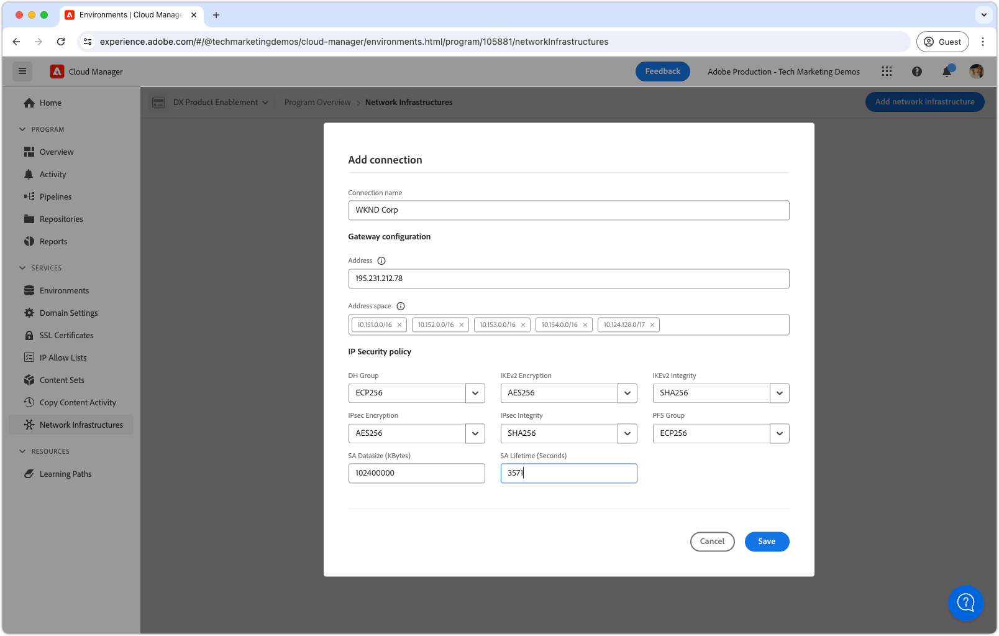
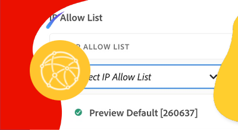

# 虛擬私人網路 (VPN)

瞭解如何將AEM as a Cloud Service與您的VPN連線，以在AEM和內部服務之間建立安全的通訊通道。

## 什麼是虛擬私人網路？

虛擬私人網路(VPN)可讓AEM as a Cloud Service客戶將Cloud Manager程式內的&#x200B;**AEM環境**&#x200B;連線至現有的[支援](https://experienceleague.adobe.com/en/docs/experience-manager-cloud-service/content/security/configuring-advanced-networking)個VPN。 VPN可在AEM as a Cloud Service與客戶網路內的服務之間提供安全且受控制的連線。

Cloud Manager程式只能有&#x200B;__單一__&#x200B;網路基礎結構型別。 在執行下列命令之前，請確定虛擬私人網路是您AEM as a Cloud Service最[適當的網路基礎建設型別](https://experienceleague.adobe.com/en/docs/experience-manager-cloud-service/content/security/configuring-advanced-networking)。

>[!NOTE]
>
>請注意，不支援將組建環境從Cloud Manager連線至VPN。 如果您必須從私人存放庫存取二進位成品，您必須使用公用網際網路[上可用的URL （如此處](https://experienceleague.adobe.com/en/docs/experience-manager-cloud-service/content/implementing/using-cloud-manager/create-application-project/setting-up-project)所述）來設定安全且受密碼保護的存放庫。

>[!MORELIKETHIS]
>
> 閱讀AEM as a Cloud Service [進階網路組態檔案](https://experienceleague.adobe.com/en/docs/experience-manager-cloud-service/content/security/configuring-advanced-networking)，以取得有關虛擬私人網路的詳細資訊。

## 先決條件

使用Cloud Manager API設定虛擬私人網路時，需要下列專案：

+ 具有[Cloud Manager企業所有者許可權](https://developer.adobe.com/experience-cloud/cloud-manager/guides/getting-started/permissions/)的Adobe帳戶
+ 存取[Cloud Manager API的驗證認證](https://developer.adobe.com/experience-cloud/cloud-manager/guides/getting-started/create-api-integration/)
   + 組織ID （亦稱為IMS組織ID）
   + 使用者端ID （亦稱為API金鑰）
   + 存取權杖（亦稱為持有人權杖）
+ Cloud Manager計畫ID
+ Cloud Manager環境ID
+ **路由式**&#x200B;虛擬私人網路，可存取所有必要的連線引數。

如需更多詳細資訊，請觀看以下逐步解說，瞭解如何設定、設定和取得Cloud Manger API認證，以及如何使用這些認證進行Cloud Manager API呼叫。

>[!VIDEO](https://video.tv.adobe.com/v/342235?quality=12&learn=on)

本教學課程使用`curl`來進行Cloud Manager API設定。 提供的`curl`命令採用Linux/macOS語法。 如果使用Windows命令提示字元，請將`\`分行符號取代為`^`。

## 為每個程式啟用虛擬私人網路

首先在AEM as a Cloud Service上啟用「虛擬私人網路」 。


>[!BEGINTABS]

>[!TAB Cloud Manager]

彈性連線埠輸出可使用Cloud Manager啟用。 下列步驟概述如何使用Cloud Manager在AEM as a Cloud Service上啟用彈性連線埠輸出。

1. 以Cloud Manager業務負責人身分登入[Adobe Experience Manager Cloud Manager](https://experience.adobe.com/cloud-manager/)。
1. 導覽至所需的計畫。
1. 在左側功能表中，瀏覽至&#x200B;__服務>網路基礎結構__。
1. 選取&#x200B;__新增網路基礎結構__&#x200B;按鈕。

   

1. 在&#x200B;__新增網路基礎結構__&#x200B;對話方塊中，選取&#x200B;__虛擬私人網路__&#x200B;選項。 填寫欄位並選取&#x200B;__繼續__。 請與貴組織的網路管理員合作，以取得正確的值。

   

1. 至少建立一個VPN連線。 為連線指定有意義的名稱，並選取&#x200B;__新增連線__&#x200B;按鈕。

   

1. 設定VPN連線。 請與貴組織的網路管理員合作，以取得正確的值。 選取&#x200B;__儲存__&#x200B;以確認新增連線。

   

1. 如果需要多個VPN連線，視需要提供更多的連線。 新增所有VPN連線時，請選取&#x200B;__繼續__。

   

1. 選取&#x200B;__儲存__&#x200B;以確認新增VPN及所有已設定的連線。

   

1. 等候網路基礎結構建立並標示為&#x200B;__就緒__。 此程式最多可能需要1小時。

   

建立VPN後，您現在可以使用Cloud Manager API進行設定，如下所述。

>[!TAB Cloud Manager API]

可使用Cloud Manager API來啟用虛擬私人網路。 下列步驟概述如何使用Cloud Manager API在AEM as a Cloud Service上啟用VPN。

1. 首先，使用Cloud Manager API [listRegions](https://developer.adobe.com/experience-cloud/cloud-manager/reference/api/)作業來決定需要進階網路的地區。 進行後續Cloud Manager API呼叫需要`region name`。 通常會使用生產環境所在的區域。

   在[環境的詳細資料](https://experienceleague.adobe.com/en/docs/experience-manager-cloud-service/content/implementing/using-cloud-manager/manage-environments)底下的[Cloud Manager](https://my.cloudmanager.adobe.com)中尋找您的AEM as a Cloud Service環境地區。 Cloud Manager中顯示的地區名稱可以[對應到Cloud Manager API中使用的地區代碼](https://developer.adobe.com/experience-cloud/cloud-manager/guides/api-usage/creating-programs-and-environments/#creating-aem-cloud-service-environments)。

   __listRegions HTTP要求__

   ```shell
   $ curl -X GET https://cloudmanager.adobe.io/api/program/{programId}/regions \
       -H 'x-gw-ims-org-id: <ORGANIZATION_ID>' \
       -H 'x-api-key: <CLIENT_ID>' \
       -H 'Authorization: Bearer <ACCESS_TOKEN>' \
       -H 'Content-Type: application/json'
   ```

1. 使用Cloud Manager API [createNetworkInfrastructure](https://developer.adobe.com/experience-cloud/cloud-manager/reference/api/)作業，為Cloud Manager程式啟用虛擬私人網路。 使用從Cloud Manager API `listRegions`作業取得的適當`region`程式碼。

   __createNetworkInfrastructure HTTP要求__

   ```shell
   $ curl -X POST https://cloudmanager.adobe.io/api/program/{programId}/networkInfrastructures \
       -H 'x-gw-ims-org-id: <ORGANIZATION_ID>' \
       -H 'x-api-key: <CLIENT_ID>' \
       -H 'Authorization: Bearer <ACCESS_TOKEN>' \
       -H 'Content-Type: application/json'
       -d @./vpn-create.json
   ```

   在`vpn-create.json`中定義JSON引數，並透過`... -d @./vpn-create.json`提供給curl。

   [下載範例vpn-create.json](./assets/vpn-create.json)。  這個檔案只是範例。 根據[enableEnvironmentAdvancedNetworkingConfiguration](https://developer.adobe.com/experience-cloud/cloud-manager/reference/api/)中記錄的選用/必要欄位，視需要設定您的檔案。

   ```json
   {
       "kind": "vpn",
       "region": "va7",
       "addressSpace": [
           "10.104.182.64/26"
       ],
       "dns": {
           "resolvers": [
               "10.151.201.22",
               "10.151.202.22",
               "10.154.155.22"
           ],
           "domains": [
               "wknd.site",
               "wknd.com"
           ]
       },
       "connections": [{
           "name": "connection-1",
           "gateway": {
               "address": "195.231.212.78",
               "addressSpace": [
                   "10.151.0.0/16",
                   "10.152.0.0/16",
                   "10.153.0.0/16",
                   "10.154.0.0/16",
                   "10.142.0.0/16",
                   "10.143.0.0/16",
                   "10.124.128.0/17"
               ]
           },
           "sharedKey": "<secret_shared_key>",
           "ipsecPolicy": {
               "dhGroup": "ECP256",
               "ikeEncryption": "AES256",
               "ikeIntegrity": "SHA256",
               "ipsecEncryption": "AES256",
               "ipsecIntegrity": "SHA256",
               "pfsGroup": "ECP256",
               "saDatasize": 102400000,
               "saLifetime": 3600
           }
       }]
   }
   ```

   等待45到60分鐘，讓Cloud Manager計畫布建網路基礎結構。

1. 檢查環境是否已使用先前步驟中從`createNetworkInfrastructure` HTTP要求傳回的`id`，使用Cloud Manager API [getNetworkInfrastructure](https://developer.adobe.com/experience-cloud/cloud-manager/reference/api/#operation/getNetworkInfrastructure)作業，完成&#x200B;__虛擬私人網路__&#x200B;設定。

   __getNetworkInfrastructure HTTP要求__

   ```shell
   $ curl -X GET https://cloudmanager.adobe.io/api/program/{programId}/networkInfrastructure/{networkInfrastructureId} \
       -H 'x-gw-ims-org-id: <ORGANIZATION_ID>' \
       -H 'x-api-key: <CLIENT_ID>' \
       -H 'Authorization: <YOUR_BEARER_TOKEN>' \
       -H 'Content-Type: application/json'
   ```

   確認HTTP回應包含&#x200B;__就緒__&#x200B;的&#x200B;__狀態__。 如果尚未準備就緒，請每隔幾分鐘重新檢查一次狀態。


建立VPN後，您現在可以使用Cloud Manager API進行設定，如下所述。

>[!ENDTABS]

## 為每個環境設定虛擬私人網路代理

1. 使用Cloud Manager API [enableEnvironmentAdvancedNetworkingConfiguration](https://developer.adobe.com/experience-cloud/cloud-manager/reference/api/)作業，在每個AEM as a Cloud Service環境中啟用並設定&#x200B;__虛擬私人網路__&#x200B;設定。

   __enableEnvironmentAdvancedNetworkingConfiguration HTTP要求__

   ```shell
   $ curl -X PUT https://cloudmanager.adobe.io/api/program/{programId}/environment/{environmentId}/advancedNetworking \
       -H 'x-gw-ims-org-id: <ORGANIZATION_ID>' \
       -H 'x-api-key: <CLIENT_ID>' \
       -H 'Authorization: Bearer <ACCESS_TOKEN>' \
       -H 'Content-Type: application/json' \
       -d @./vpn-configure.json
   ```

   在`vpn-configure.json`中定義JSON引數，並透過`... -d @./vpn-configure.json`提供給curl。

[下載範例vpn-configure.json](./assets/vpn-configure.json)

   ```json
   {
       "nonProxyHosts": [
           "example.net",
           "*.example.org"
       ],
       "portForwards": [
           {
               "name": "mysql.example.com",
               "portDest": 3306,
               "portOrig": 30001
           },
           {
               "name": "smtp.sendgrid.com",
               "portDest": 465,
               "portOrig": 30002
           }
       ]
   }
   ```

   `nonProxyHosts`宣告了一組主機，應該透過預設共用IP位址範圍而不是專用輸出IP路由連線埠80或443。 `nonProxyHosts`可能很有用，因為通過共用IP的流量已由Adobe自動最佳化。

   對於每個`portForwards`對應，進階網路會定義下列轉送規則：

   | Proxy主機 | Proxy連線埠 |  | 外部主機 | 外部連線埠 |
   |---------------------------------|----------|----------------|------------------|----------|
   | `AEM_PROXY_HOST` | `portForwards.portOrig` | → | `portForwards.name` | `portForwards.portDest` |

   如果您的AEM部署&#x200B;__僅__&#x200B;需要外部服務的HTTP/HTTPS連線，請將`portForwards`陣列保留空白，因為這些規則僅對非HTTP/HTTPS要求是必要的。


2. 對於每個環境，請使用Cloud Manager API的[getEnvironmentAdvancedNetworkingConfiguration](https://developer.adobe.com/experience-cloud/cloud-manager/reference/api/)作業來驗證VPN路由規則是否有效。

   __getEnvironmentAdvancedNetworkingConfiguration HTTP要求__

   ```shell
   $ curl -X GET https://cloudmanager.adobe.io/api/program/{programId}/environment/{environmentId}/advancedNetworking \
       -H 'x-gw-ims-org-id: <ORGANIZATION_ID>' \
       -H 'x-api-key: <CLIENT_ID>' \
       -H 'Authorization: Bearer <ACCESS_TOKEN>' \
       -H 'Content-Type: application/json'
   ```

3. 可使用Cloud Manager API的[enableEnvironmentAdvancedNetworkingConfiguration](https://developer.adobe.com/experience-cloud/cloud-manager/reference/api/)作業更新虛擬私人網路Proxy設定。 請記住，`enableEnvironmentAdvancedNetworkingConfiguration`是`PUT`作業，因此每次呼叫此作業時，都必須提供所有規則。

4. 現在，您可以在自訂AEM程式碼和設定中使用虛擬私人網路輸出設定。

## 透過虛擬私人網路連線到外部服務

啟用「虛擬私人網路」後，AEM程式碼和設定便可使用它們透過VPN呼叫外部服務。 AEM處理外部呼叫的方式有兩種：

1. 對外部服務的HTTP/HTTPS呼叫
   + 包括對標準80或443連線埠以外的連線埠上執行的服務發出的HTTP/HTTPS呼叫。
1. 對外部服務的非HTTP/HTTPS呼叫
   + 包括任何非HTTP呼叫，例如與郵件伺服器、SQL資料庫或服務之間的連線，這些服務會在其他非HTTP/HTTPS通訊協定上執行。

預設允許來自標準連線埠(80/443)上AEM的HTTP/HTTPS請求，但若未正確設定，請勿使用VPN連線，如下所述。

### HTTP/HTTPS

從AEM建立HTTP/HTTPS連線時，使用VPN時，HTTP/HTTPS連線會自動從AEM代理出去。 不需要其他程式碼或設定即可支援HTTP/HTTPS連線。

>[!TIP]
>
> 請參閱AEM as a Cloud Service的虛擬私人網路檔案，以取得[完整的路由規則集](https://experienceleague.adobe.com/en/docs/experience-manager-cloud-service/content/security/configuring-advanced-networking)。

#### 程式碼範例

<table>
<tr>
<td>
    <a  href="./examples/http-dedicated-egress-ip-vpn.md"></a>
    <div><strong><a href="./examples/http-dedicated-egress-ip-vpn.md">HTTP/HTTPS</a></strong></div>
    <p>
        Java™程式碼範例使用HTTP/HTTPS通訊協定，從AEM as a Cloud Service建立與外部服務的HTTP/HTTPS連線。
    </p>
</td>
<td></td>
<td></td>
</tr>
</table>

### 非HTTP/HTTPS連執行緒式碼範例

建立非HTTP/HTTPS連線時(例如 AEM SQL、SMTP等)，必須透過AEM提供的特殊主機名稱進行連線。

| 變數名稱 | 使用 | Java™程式碼 | OSGi設定 |
| - |  - | - | - |
| `AEM_PROXY_HOST` | 非HTTP/HTTPS連線的Proxy主機 | `System.getenv("AEM_PROXY_HOST")` | `$[env:AEM_PROXY_HOST]` |


接著會透過`AEM_PROXY_HOST`與對應的連線埠(`portForwards.portOrig`)呼叫與外部服務的連線，AEM會路由傳送到對應的外部主機名稱(`portForwards.name`)與連線埠(`portForwards.portDest`)。

| Proxy主機 | Proxy連線埠 |  | 外部主機 | 外部連線埠 |
|---------------------------------|----------|----------------|------------------|----------|
| `AEM_PROXY_HOST` | `portForwards.portOrig` | → | `portForwards.name` | `portForwards.portDest` |


#### 程式碼範例

<table><tr>
   <td>
      <a  href="./examples/sql-datasourcepool.md"></a>
      <div>使用JDBC DataSourcePool的<strong><a href="./examples/sql-datasourcepool.md">SQL連線</a></strong></div>
      <p>
            Java™程式碼範例透過設定AEM的JDBC資料來源集區來連線到外部SQL資料庫。
      </p>
    </td>
   <td>
      <a  href="./examples/sql-java-apis.md"></a>
      <div>使用Java™ API的<strong><a href="./examples/sql-java-apis.md">SQL連線</a></strong></div>
      <p>
            Java™程式碼範例使用Java™的SQL API連線至外部SQL資料庫。
      </p>
    </td>
   <td>
      <a  href="./examples/email-service.md"></a>
      <div><strong><a href="./examples/email-service.md">電子郵件服務</a></strong></div>
      <p>
        使用AEM連線至外部電子郵件服務的OSGi設定範例。
      </p>
    </td>
</tr></table>

### 限制透過VPN存取AEM as a Cloud Service

虛擬私人網路設定會限制AEM as a Cloud Service環境對VPN的存取。

#### 設定範例

<table><tr>
   <td>
      <a href="https://experienceleague.adobe.com/en/docs/experience-manager-cloud-service/content/implementing/using-cloud-manager/ip-allow-lists/apply-allow-list"></a>
      <div><strong><a href="https://experienceleague.adobe.com/en/docs/experience-manager-cloud-service/content/implementing/using-cloud-manager/ip-allow-lists/apply-allow-list">套用IP允許清單</a></strong></div>
      <p>
            設定IP允許清單，以便只有VPN流量可以存取AEM。
      </p>
    </td>
   <td>
      <a  href="https://experienceleague.adobe.com/en/docs/experience-manager-cloud-service/content/security/configuring-advanced-networking"></a>
      <div><strong><a href="https://experienceleague.adobe.com/en/docs/experience-manager-cloud-service/content/security/configuring-advanced-networking">AEM Publish的路徑型VPN存取限制</a></strong></div>
      <p>
            需要AEM Publish上特定路徑的VPN存取權。
      </p>
    </td>
   <td></td>
</tr></table>
