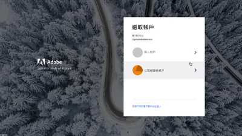

# AEM asCloud Service影片和Tutorials {#overview}

Adobe Experience Manager (AEM) 現在能以 Cloud Service 形式使用。AEMas a Cloud Service推出新一代Experience Manager產品線，以過去的投資和創新為基礎，保存並擴充所有使用案例和功能。

>[!VIDEO](https://video.tv.adobe.com/v/31085/?quality=12&learn=on)

## 新增功能

* **[Token型驗證（教學課程）](https://experienceleague.adobe.com/docs/experience-manager-learn/getting-started-with-aem-headless/authentication/overview.html)**

   *了解如何使用Token型驗證透過HTTP與AEMas a Cloud Service互動*

* **[無周邊GraphQL（教學課程）](https://experienceleague.adobe.com/docs/experience-manager-learn/getting-started-with-aem-headless/graphql/overview.html)**

   *了解如何使用AEM GraphQL API來支援外部應用程式中的體驗。*

* **[大量匯入（影片）](./migration/bulk-import.md)**

   *了解如何從Azure Blob儲存或Amazon S3將資產大量匯入至AEM*

* **[asset compute中繼資料背景工作（教學課程）](./asset-compute/advanced/metadata.md)**

   *了解如何從Asset compute背景工作將資產中繼資料寫回AEM*

* **[asset compute微服務的擴充性（教學課程）](./asset-compute/overview.md)**

   *了解如何開發Asset compute背景工作，以產生自訂資產轉譯*

## 員工精選

<table>
   <td>
      
      

         <a href="./accessing/overview.md">
         <strong>設定AEM教學課程的存取權</strong>
         </a>
      

      

         <em>在Adobe Admin Console中設定IMS使用者以存取AEM。</em>
      

   </td>   
   <td>
      
      

         <a href="./local-development-environment/overview.md">
         <strong>本機開發環境設定教學課程</strong>
         </a>
      

      

         <em>為您的本機開發電腦做好準備，以進行AEMas a Cloud Service開發！</em>
      

   </td>   
   <td>
      
      

         <a href="./debugging/aem-sdk-local-quickstart/overview.md">
         <strong>除錯AEM SDK</strong>
         </a>
      

      

         <em>探索在AEMas a Cloud ServiceSDK的本機Quickstart上用於除錯應用程式的工具。</em>
      

   </td>
</table>

## 其他資源

* [Experience League — 探索Adobe Experience Manager](https://experienceleague.adobe.com/#recommended/solutions/experience-manager)
* [Adobe Experience Manager as a Cloud Service檔案](https://experienceleague.adobe.com/docs/experience-manager-cloud-service/landing/home.html)
