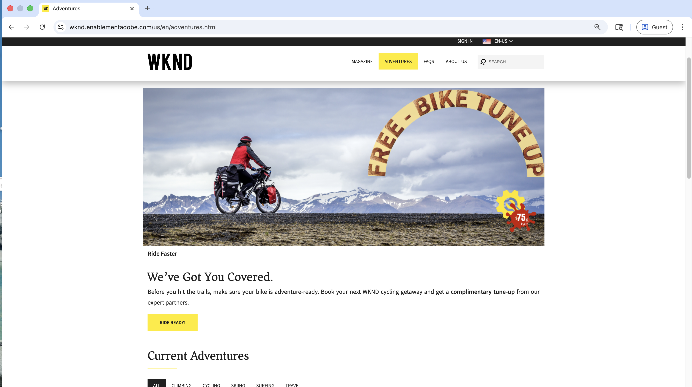
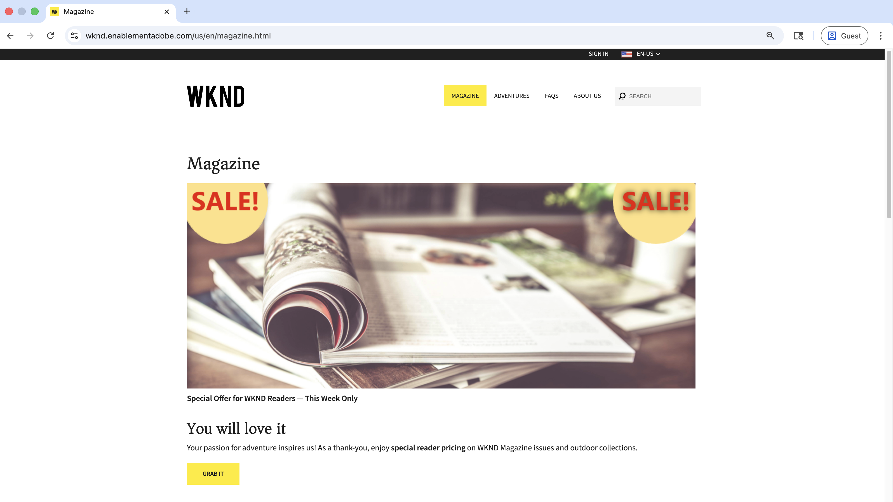
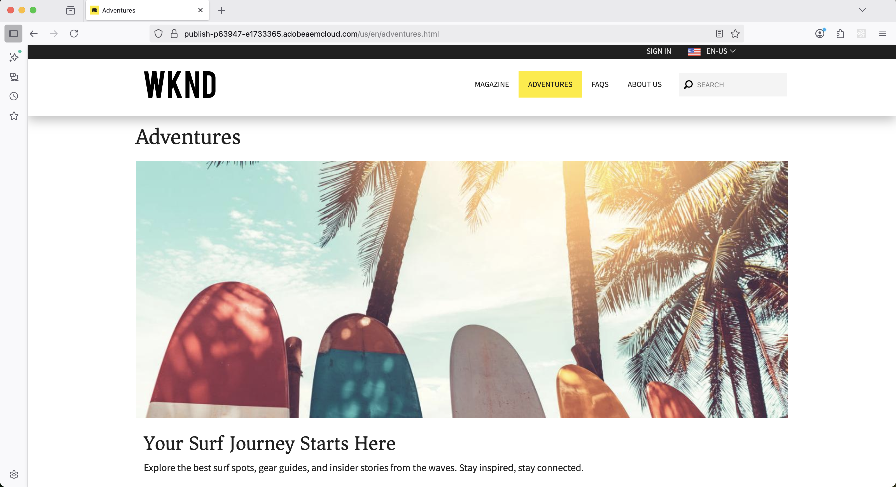

# Personalization使用案例的即時示範

請造訪[WKND啟用網站](https://wknd.enablementadobe.com/us/en.html){target="wknd"}，以檢視A/B測試、行為目標定位和已知使用者個人化的真實範例。

>[!VIDEO](https://video.tv.adobe.com/v/3476472/?captions=chi_hant&learn=on&enablevpops)

此頁面會引導您逐步示範每個個人化案例。 在您自己的AEM網站上建置這些功能之前，請先使用它來探索可行的方案。

>[!IMPORTANT]
>
> 在多個瀏覽器視窗或無痕瀏覽/私人瀏覽模式中開啟示範網站，同時體驗不同的個人化變數。
> 使用私人瀏覽模式時，Firefox和Safari可能會封鎖ECID Cookie，或者使用一般瀏覽模式或在嘗試新的個人化案例之前清除Cookie。

## 示範使用案例

[WKND Enablement網站](https://wknd.enablementadobe.com/us/en.html){target="wknd"}示範三種個人化型別：

| Personalization型別 | 您將會看到的內容 | 時程 |
|---------------------|-----------------|---------|
| **行為目標定位** | 內容會根據您的瀏覽行為和興趣進行調整。 通常稱為&#x200B;_下一頁或相同頁面個人化_ | 即時和批次 |
| **已知使用者Personalization** | 根據從多個系統上的資料建置的完整客戶設定檔，量身打造體驗。 通常稱為&#x200B;_大規模個人化_ | 即時 |
| **A/B 測試** | 測試不同的內容變數以找出績效最佳者。 通常稱為&#x200B;_實驗_ | 即時 |

## 行為定向

內容會在訪客瀏覽工作階段期間，根據訪客的動作和興趣自動調整。 這通常稱為&#x200B;_下一頁或相同頁面個人化_。

### 首頁、冒險和雜誌頁面

系統會根據您目前的瀏覽行為（即時個人化），立即顯示這些體驗。 Adobe Experience Platform Edge Network是用來進行即時個人化決策。

| 頁面 | 您將會看到的內容 | 如何測試 | 體驗 |
|------|-----------------|-------------|------------|
| [首頁](https://wknd.enablementadobe.com/us/en.html){target="wknd"} | 個人化的&#x200B;**適合全家使用的冒險英雄橫幅**&#x200B;特色是全家在湖邊騎腳踏車，推廣可建立共用記憶的引導式體驗 | 請前往[巴厘島衝浪營](https://wknd.enablementadobe.com/us/en/adventures/bali-surf-camp.html){target="wknd"}或[瑪萊美食遊](https://wknd.enablementadobe.com/us/en/adventures/gastronomic-marais-tour.html){target="wknd"}，然後返回首頁 | {width="200" zoomable="yes"} |
| [冒險](https://wknd.enablementadobe.com/us/en/adventures.html){target="wknd"} | 著重於騎行腳踏車的&#x200B;**「Free Bike Tune Up」促銷主角**，包含WKND專家合作夥伴提供的「We&#39;ve Got You Covered」訊息和免費腳踏車維護優惠 | 造訪任何與腳踏車相關的冒險活動（例如，[騎腳踏車托斯卡納](https://wknd.enablementadobe.com/us/en/adventures/cycling-tuscany.html){target="wknd"}），然後導覽至「冒險活動」頁面 | {width="200" zoomable="yes"} |
| [冒險](https://wknd.enablementadobe.com/us/en/adventures.html){target="wknd"} | 以露營為主題的&#x200B;**裝備系列英雄**&#x200B;展示重要的露營裝置（睡袋、夾克、靴子），並附上「以合適的裝備開始您的下一次冒險」訊息 | 造訪任何與露營相關的冒險活動（例如，[Yosemite Backpacking](https://wknd.enablementadobe.com/us/en/adventures/yosemite-backpacking.html){target="wknd"}），然後導覽至「冒險活動」頁面 | {width="200" zoomable="yes"} |
| [雜誌](https://wknd.enablementadobe.com/us/en/magazine.html){target="wknd"} | 時間敏感的&#x200B;**雜誌促銷活動**，包含具有顯著「SALE！」的捲動WKND雜誌 徽章和特殊閱讀器價格（適用於問題和戶外系列） | 閱讀一或多個雜誌文章（例如，[滑雪旅行](https://wknd.enablementadobe.com/us/en/magazine/ski-touring.html){target="wknd"}），然後導覽至Magazine登陸頁面 | {width="200" zoomable="yes"} |

### Adventures and Magazine頁面（批次）

這些體驗是根據歷史行為，並會在您下次造訪時或當天稍後出現（批次個人化）。 資料會經過彙總並處理進入設定檔屬性，然後啟動至Adobe Experience Platform Edge Network。

| 頁面 | 您將會看到的內容 | 如何測試 | 體驗 |
|------|-----------------|-------------|------------|
| [冒險](https://wknd.enablementadobe.com/us/en/adventures.html){target="wknd"} | 以衝浪為主題的主人公，在棕櫚樹下擺放&#x200B;**彩色衝浪板**，並提供「您的衝浪旅程從這裡開始」訊息，以及根據您的興趣策劃的衝浪目的地內容 | 造訪多個[與衝浪相關的冒險](https://wknd.enablementadobe.com/us/en/adventures.html#tabs-b4210c6ff3-item-b411b19941-tab){target="wknd"}，然後第二天返回「冒險」頁面 | {width="200" zoomable="yes"} |
| [雜誌](https://wknd.enablementadobe.com/us/en/magazine.html){target="wknd"} | **個人化雜誌訂閱優惠方案**&#x200B;以傳統大眾廂型小客車提供全球旅遊目的地，強調「您的個人化雜誌體驗」以及獨家訂閱者權益 | 閱讀3篇或更多[雜誌文章](https://wknd.enablementadobe.com/us/en/magazine.html){target="wknd"}，然後於隔天返回Magazine登陸頁面 | {width="200" zoomable="yes"} |

**深入瞭解：**&#x200B;準備好在您自己的AEM網站上實作行為鎖定目標了嗎？ 從[行為目標定位教學課程](./use-cases/behavioral-targeting.md)開始，瞭解完整的設定程式。

## 已知使用者Personalization

根據跨多個系統（包括購買歷史記錄和客戶生命週期階段）的資料建置的完整客戶設定檔提供個人化體驗。 Adobe Experience Platform Edge Network是用來進行即時個人化決策。

### 首頁主圖

WKND首頁主圖橫幅會根據已驗證的使用者設定檔進行個人化。 使用這些示範帳戶進行測試，以檢視個人化體驗：

| 頁面 | 您將會看到的內容 | 如何測試 | 設定檔內容 | 體驗 |
|------|-----------------|-------------|-----------------|------------|
| [首頁](https://wknd.enablementadobe.com/us/en.html){target="wknd"} | 滑雪用品店內展示了&#x200B;**頂級滑雪裝備，並提供「額外25%優惠」**&#x200B;促銷活動，提供專家打包秘訣，為即將到來的滑雪探險做好準備 | 使用`teddy/teddy`或`asmith/asmith`登入並重新整理頁面 | 最近購買的滑雪冒險，因此追加銷售滑雪裝備 | {width="200" zoomable="yes"} |

**深入瞭解：**&#x200B;準備好在您自己的AEM網站上實作已知使用者個人化了嗎？ 從[已知使用者Personalization教學課程](./use-cases/known-user-personalization.md)開始，瞭解完整的設定程式。

## A/B測試（實驗）

測試不同的內容變化，以確定哪些對您的業務目標執行得最好。 Adobe Target會隨機將不同的變數提供給表現較好的訪客和追蹤。 這通常稱為&#x200B;_experimentation_。

### 首頁精選文章

WKND首頁執行有效的A/B測試，其中包含三種變體的&#x200B;_Camping in Western Australia_&#x200B;精選文章。 每個訪客都會被隨機指派以檢視這些變數之一：

| 頁面 | 您將會看到的內容 | 如何測試 | 體驗 |
|------|-----------------|-------------|------------|
| [首頁](https://wknd.enablementadobe.com/us/en.html){target="wknd"} | 「我們的精選」章節中三個隨機指派的精選文章變體之一： **「離開網格：橫跨西澳洲的史詩級露營路線」**&#x200B;或&#x200B;**「漫遊荒野：西澳洲的露營冒險」** （或第三個變體），每個變體都有獨特的影像和傳訊功能，以測試哪種變體最能引起共鳴 | 使用不同的瀏覽器造訪首頁、使用無痕/私人模式或清除Cookie以檢視不同的變數 | {width="200" zoomable="yes"} |

**深入瞭解：**&#x200B;準備好在您自己的AEM網站上實作A/B測試了嗎？ 從[實驗（A/B測試）教學課程](./use-cases/experimentation.md)開始，瞭解完整的設定程式。

## 後續步驟

準備好在您自己的AEM網站上實作個人化了嗎？ 從[Personalization概觀](./overview.md)開始，瞭解完整的設定程式。

