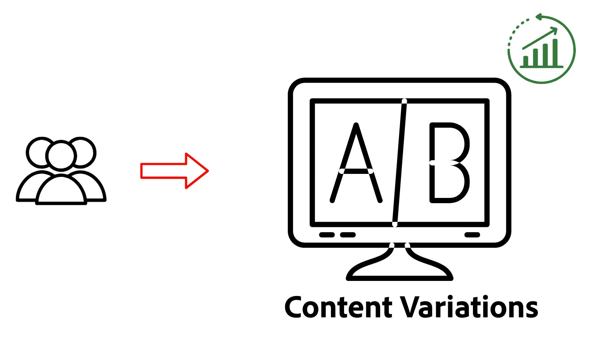

# 個人化概觀

瞭解AEM as a Cloud Service (AEMCS)如何與Adobe Target和Adobe Experience Platform (AEP)整合。 探索如何使用A/B測試、根據使用者的行為鎖定使用者，或使用客戶設定檔個人化內容，來提供個人化體驗。

## 先決條件

為了展示各種個人化案例，本教學課程使用範例[AEM WKND](https://github.com/adobe/aem-guides-wknd/)專案。 若要遵循，您需要：

- Adobe組織，具備下列存取權：
   - **AEM as a Cloud Service環境** — 建立和管理內容
   - **Adobe Target** — 撰寫及傳遞個人化體驗
   - **Adobe Experience Platform應用程式** — 管理客戶設定檔和對象
   - AEP中的&#x200B;**標籤（先前為Launch）** — 部署網頁SDK和自訂JavaScript以進行資料收集和個人化

- 對AEM元件和體驗片段的基本瞭解

- [AEM WKND](https://github.com/adobe/aem-guides-wknd/)專案已部署至您的AEM as a Cloud Service環境。

## 快速入門

在探索特定使用案例之前，請先設定AEM as a Cloud Service進行個人化。 首先，請整合Adobe Target和標籤，以使用AEP Web SDK啟用使用者端個人化。 這些基礎步驟可讓您的AEM頁面支援實驗、對象鎖定目標和即時個人化。

<!-- CARDS
{target = _self}

* ./setup/integrate-adobe-target.md
  {title = Integrate Adobe Target}
  {description = Integrate AEMCS with Adobe Target to activate personalized content as Adobe Target offers.}
  {image = ./assets/setup/integrate-target.png}
  {cta = Integrate Target}

* ./setup/integrate-adobe-tags.md
  {title = Integrate Tags}
  {description = Integrate AEMCS with Tags to inject the Web SDK and custom JavaScript for data collection and personalization.}
  {image = ./assets/setup/integrate-tags.png}
  {cta = Integrate Tags}
-->
<!-- START CARDS HTML - DO NOT MODIFY BY HAND -->

    

        

            

                <figure class="image x-is-16by9">
                    
                </figure>
            

            

                

                    

                        <a href="./setup/integrate-adobe-target.md" target="_self" rel="referrer" title="整合Adobe Target">整合Adobe Target</a>
                    

                    
將AEMCS與Adobe Target整合，以Adobe Target選件形式啟用個人化內容。

                

                <a href="./setup/integrate-adobe-target.md" target="_self" rel="referrer" class="spectrum-Button spectrum-Button--outline spectrum-Button--primary spectrum-Button--sizeM" style="align-self: flex-start; margin-top: 1rem;">
                    整合目標
                </a>
            

        

    

    

        

            

                <figure class="image x-is-16by9">
                    
                </figure>
            

            

                

                    

                        <a href="./setup/integrate-adobe-tags.md" target="_self" rel="referrer" title="整合標籤">整合標籤</a>
                    

                    
將AEMCS與標籤整合，以插入網頁SDK和自訂JavaScript，以進行資料收集和個人化。

                

                <a href="./setup/integrate-adobe-tags.md" target="_self" rel="referrer" class="spectrum-Button spectrum-Button--outline spectrum-Button--primary spectrum-Button--sizeM" style="align-self: flex-start; margin-top: 1rem;">
                    整合標籤
                </a>
            

        

    

<!-- END CARDS HTML - DO NOT MODIFY BY HAND -->

## 使用案例

探索AEMCS、Adobe Target和Adobe Experience Platform支援的下列常見個人化使用案例。

<!-- CARDS
{target = _self}

* ./use-cases/experimentation.md
  {title = Experimentation (A/B Testing)}
  {description = Learn how to test different content variations in AEMCS using Adobe Target for A/B testing.}
  {image = ./assets/use-cases/experiment/experimentation.png}
  {cta = Learn Experimentation}
-->
<!-- START CARDS HTML - DO NOT MODIFY BY HAND -->

    

        

            

                <figure class="image x-is-16by9">
                    
                </figure>
            

            

                

                    

                        <a href="./use-cases/experimentation.md" target="_self" rel="referrer" title="實驗（A/B測試）">實驗（A/B測試）</a>
                    

                    
瞭解如何使用Adobe Target測試AEMCS中的不同內容變數進行A/B測試。

                

                <a href="./use-cases/experimentation.md" target="_self" rel="referrer" class="spectrum-Button spectrum-Button--outline spectrum-Button--primary spectrum-Button--sizeM" style="align-self: flex-start; margin-top: 1rem;">
                    學習實驗
                </a>
            

        

    

<!-- END CARDS HTML - DO NOT MODIFY BY HAND -->

